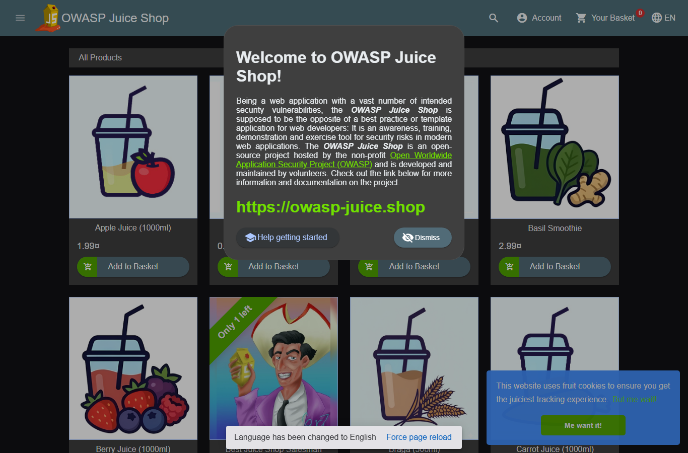

# Authorized Web Assessment Report

## Summary

- Target: `http://127.0.0.1:3000/`
- Scope origin: `http://127.0.0.1:3000`
- Mode: `passive`
- Started: `2026-06-08T15:15:01+08:00`
- Finished: `2026-06-08T15:15:23+08:00`
- Elapsed: `21.93s`
- Pages crawled: `2`
- Forms found: `0`
- API hints found: `15`
- ZAP alerts: `0`

This run is a low-risk evidence-collection helper for an authorized assessment. It performs same-origin crawling, browser screenshots, request/form/API hint inventory, security-header review, and optional ZAP spider/passive alert collection. It does not replace agent-led testing and does not run destructive payloads, web shells, password spraying, or ZAP active scan.

## Scope And Authorization

- The operator supplied `--authorized` for this local or explicitly authorized target.
- Requests were constrained to the target origin.
- Active exploitation and destructive tests were not performed by this helper.

## HTTP Baseline

- Final URL: `http://127.0.0.1:3000/`
- Status: `200`
- Server: `None`
- Content-Type: `text/html; charset=UTF-8`
- Missing security headers: `content-security-policy, referrer-policy, permissions-policy, strict-transport-security`

Security headers observed:

- `content-security-policy`: `missing`
- `x-frame-options`: `SAMEORIGIN`
- `x-content-type-options`: `nosniff`
- `referrer-policy`: `missing`
- `permissions-policy`: `missing`
- `strict-transport-security`: `missing`

## Crawled Pages

### OWASP Juice Shop

- URL: `http://127.0.0.1:3000/#/`
- Status: `200`
- Links discovered: `2`
- Forms discovered: `0`

### crawl error: Page.goto: Timeout 20000ms exceeded.
Call log:
  - navigating to "http://127.0.0.1:3000/redirect?to=https%3A%2F%2Fgithub.com%2Fjuice-shop%2Fjuice-shop", waiting until "networkidle"

- URL: `http://127.0.0.1:3000/redirect?to=https%3A%2F%2Fgithub.com%2Fjuice-shop%2Fjuice-shop`
- Status: `None`
- Links discovered: `0`
- Forms discovered: `0`

## Forms And Inputs

- No HTML forms were discovered during the bounded crawl.

## Scripts And API Surface Hints

- `http://127.0.0.1:3000/main.js`
- `http://127.0.0.1:3000/polyfills.js`
- `http://127.0.0.1:3000/scripts.js`

API hints extracted from HTML and same-origin JavaScript:

- `http://127.0.0.1:3000/api/BasketItems`
- `http://127.0.0.1:3000/api/Products`
- `http://127.0.0.1:3000/api/Quantitys`
- `http://127.0.0.1:3000/api/SecurityAnswers`
- `http://127.0.0.1:3000/api/SecurityQuestions`
- `http://127.0.0.1:3000/basket`
- `http://127.0.0.1:3000/login`
- `http://127.0.0.1:3000/order-history`
- `http://127.0.0.1:3000/rest/admin`
- `http://127.0.0.1:3000/rest/captcha`
- `http://127.0.0.1:3000/rest/country-mapping`
- `http://127.0.0.1:3000/rest/products`
- `http://127.0.0.1:3000/rest/track-order`
- `http://127.0.0.1:3000/rest/user/security-question?email=`
- `http://127.0.0.1:3000/search`

## ZAP Spider And Passive Alerts

- ZAP collection was disabled for this run.

## Findings Triage

- `Confirmed`: none from this helper alone; confirmation requires targeted reproduction.
- `Likely/Possible`: ZAP passive alerts and missing headers should be reviewed and verified.
- `Informational`: crawl inventory, forms, scripts, and screenshots.

## Recommended Next Steps

1. Review the form/API inventory and choose specific vulnerability hypotheses.
2. Confirm each ZAP passive alert manually or with a targeted browser/request harness.
3. Enable intrusive active tests only after explicit authorization, rate limits, and rollback/cleanup steps are set.
4. Add authenticated browser state if the application has login-only functionality.

## Artifacts

- `report.md`: this report
- `report.json`: machine-readable inventory data
- `screenshots/crawl/`: browser screenshots

## Limitations

- This helper is not a full penetration test by itself and should not be treated as the skill's default workflow.
- It does not bypass authentication, solve CAPTCHA/MFA, or infer business-logic vulnerabilities.
- It does not run ZAP active scan, password attacks, destructive file upload tests, command execution, or persistence.
- Single-page applications may require deeper scripted navigation for complete coverage.
