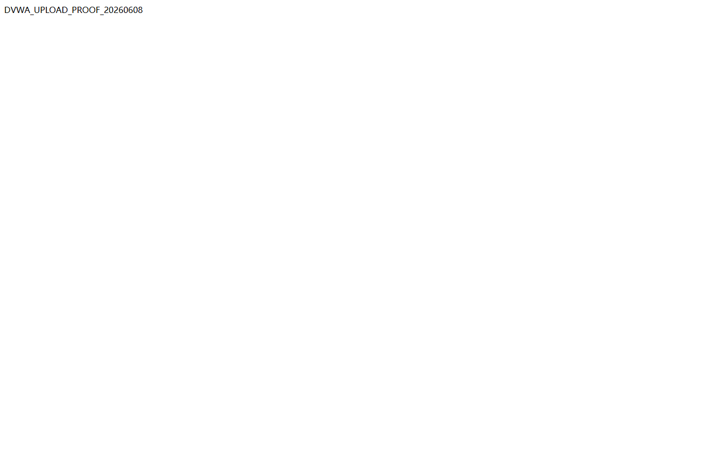
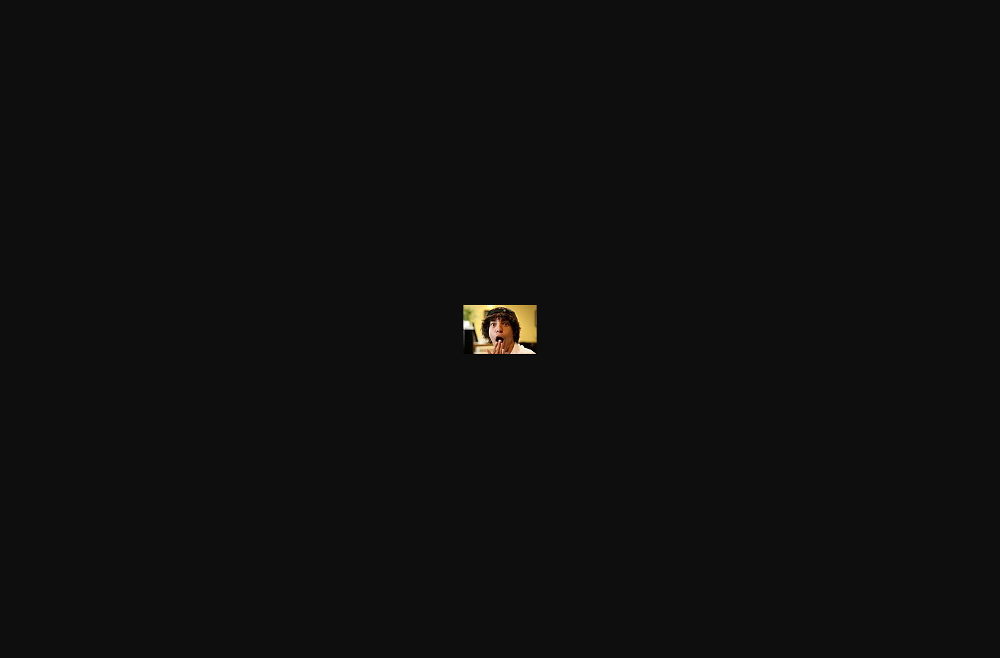

# DVWA File Upload 自动化解题报告

## 摘要

- 目标：`http://127.0.0.1/dvwa/`
- 模块：`File Upload`
- 路由：`/dvwa/vulnerabilities/upload/`
- 源码路径：`D:\phpStudy\PHPTutorial\WWW\DVWA`
- 难度递进：`low -> medium -> high -> impossible`
- 运行目录：`dvwa-results/file-upload-progression-20260608-144621`
- 运行时间：`2026-06-08T14:48:49+08:00` 至 `2026-06-08T14:48:50+08:00`，harness 耗时 `0.988s`
- 请求数：`34`
- 结论：`low` 和 `medium` 可上传并执行 echo-only PHP marker；`high` 可上传 Web 可访问的 `.php.jpg` polyglot，但当前服务器按 `image/jpeg` 提供，未执行 PHP；`impossible` 通过 token、扩展名/MIME/图片校验、随机文件名和 GD 重编码防住了本次 harmless PHP marker 测试。

本实验只在本机 DVWA 授权范围内进行。上传测试使用无害 marker：`<?php echo "DVWA_UPLOAD_PROOF_20260608"; ?>`，未使用命令执行、WebShell、反连、持久化或破坏性写入。

## 范围与环境

| 项目 | 内容 |
| --- | --- |
| DVWA URL | `http://127.0.0.1/dvwa/` |
| 登录账号 | `admin / password` |
| 模块 | `File Upload` |
| 模块路径 | `vulnerabilities/upload/` |
| 上传目录 | `D:\phpStudy\PHPTutorial\WWW\DVWA\hackable\uploads` |
| 访问前缀 | `http://127.0.0.1/dvwa/hackable/uploads/` |
| 输出语言 | `zh-CN` |
| 使用代理 | 未使用 Burp；本次用 Python/requests 与 Playwright 直接验证 |
| 主要工具 | PowerShell、`py -3.11`、Python `requests`、Playwright 截图脚本、源码审阅 |

## 难度推进表

| 难度 | 状态 | 关键成因或防护 | 请求数 | 级别耗时 | 关键证据 | 停止原因 |
| --- | --- | --- | ---: | ---: | --- | --- |
| `low` | 可利用：PHP echo 执行 | 原始文件名直接拼到 `hackable/uploads/` 并 `move_uploaded_file()`，无扩展名/MIME/内容校验 | `6` | `0.164s` | 访问 `http://127.0.0.1/dvwa/hackable/uploads/dvwa_upload_low_20260608.php` 返回 `DVWA_UPLOAD_PROOF_20260608` | 已证明 echo-only PHP 执行，清理后继续 |
| `medium` | 可利用：客户端 MIME 绕过后 PHP echo 执行 | 只信任 `$_FILES['uploaded']['type']` 为 `image/jpeg` 或 `image/png`，保留 `.php` 文件名 | `8` | `0.264s` | `text/plain` PHP 被拒绝；同一 `.php` 文件声明 `image/jpeg` 后上传并执行 marker | 已证明 MIME 信任缺陷，清理后继续 |
| `high` | 有限漏洞：Web 可访问 polyglot，未证明 PHP 执行 | 校验末尾扩展名和 `getimagesize()`；`.php` 被拒绝，无效 `.jpg` 被拒绝；真实 JPEG 后追加 PHP marker 的 `.php.jpg` 被接受 | `10` | `0.286s` | `content_type=image/jpeg`，`marker_present=True`，`php_tag_present=True`，`executed_echo_only=False` | 当前 Apache/PHP 配置未执行 `.php.jpg`，不能把它判为 PHP RCE |
| `impossible` | 防御有效 | `user_token`、扩展名/MIME/`getimagesize()` 联合校验，随机化文件名，GD 重编码剥离追加 marker | `8` | `0.185s` | 上传 polyglot 后生成 `d99a75736dcf8ec9d068b63faac18951.jpg`，访问结果 `marker_present=False`、`php_tag_present=False` | 已达到防御级别，停止递进 |

## 操作时间线

| 时间 | 难度 | 工具 | 操作 | 输出摘要 | 证据 |
| --- | --- | --- | --- | --- | --- |
| `2026-06-08T14:48:49+08:00` | setup | payload-generator | 生成本次任务专用 payload | PHP echo marker、合法 JPG、JPG+PHP polyglot | `payloads/` |
| `2026-06-08T14:48:49+08:00` | setup | Python/requests | 获取登录页并提交 DVWA 登录 | `authenticated=True` | `requests/setup-fetch-login-form.json`、`requests/setup-submit-dvwa-login.json` |
| `2026-06-08T14:48:49+08:00` | `low` | Python/requests | 设置安全等级、观察模块表单、读取源码 | 表单为 `POST multipart/form-data`，文件字段 `uploaded` | `requests/low-inspect-module-form.json` |
| `2026-06-08T14:48:49+08:00` | `low` | Python/requests | 上传 `dvwa_upload_low_20260608.php` | 上传成功并可直接访问执行 | `requests/low-upload-php-echo.json`、`requests/low-access-upload-php-echo.json` |
| `2026-06-08T14:48:49+08:00` | `low` | cleanup | 删除 proof 文件 | `deleted=True` | `requests/low-cleanup.json` |
| `2026-06-08T14:48:49+08:00` | `medium` | Python/requests | 设置安全等级、观察表单、读取源码 | 确认只检查客户端 MIME 和大小 | `requests/medium-inspect-module-form.json` |
| `2026-06-08T14:48:49+08:00` | `medium` | Python/requests | 提交 `text/plain` PHP 基线 | 返回 `Your image was not uploaded. We can only accept JPEG or PNG images.` | `requests/medium-blocked-php-text-plain.json` |
| `2026-06-08T14:48:50+08:00` | `medium` | Python/requests | 用 `image/jpeg` 声明上传 `.php` | 访问后返回 `DVWA_UPLOAD_PROOF_20260608` | `requests/medium-upload-php-echo-as-jpeg.json`、`requests/medium-access-upload-php-echo-as-jpeg.json` |
| `2026-06-08T14:48:50+08:00` | `high` | Python/requests | `.php` 和无效 `.jpg` 基线 | 均被 JPEG/PNG 检查拒绝 | `requests/high-blocked-php-extension.json`、`requests/high-blocked-jpg-extension-invalid-image.json` |
| `2026-06-08T14:48:50+08:00` | `high` | Python/requests | 上传 `dvwa_upload_high_20260608.php.jpg` polyglot | 文件可访问，marker 和 PHP tag 存在，但未执行 | `requests/high-upload-polyglot-double-extension.json`、`requests/high-access-upload-polyglot-double-extension.json` |
| `2026-06-08T14:48:50+08:00` | `impossible` | Python/requests | 设置等级、读取 token 化表单和源码 | 表单包含 `user_token` | `requests/impossible-inspect-module-form.json` |
| `2026-06-08T14:48:50+08:00` | `impossible` | Python/requests | 测试 `.php` 和 polyglot | `.php` 被拒绝；polyglot 被随机命名并重编码 | `requests/impossible-blocked-php-extension.json`、`requests/impossible-upload-polyglot-reencoded.json` |
| `2026-06-08T14:48:50+08:00` | `impossible` | Python/requests | 访问重编码文件 | `marker_present=False`、`php_tag_present=False` | `requests/impossible-access-upload-polyglot-reencoded.json` |
| `2026-06-08T14:50:05+08:00` | all | Playwright | 捕获登录态、等级页、模块页和 proof 截图 | 截图均保存到 `screenshots/` | `screenshots/proof/manifest.json` |
| `2026-06-08` | cleanup | PowerShell | 删除手工预探测残留 `3945d230292b5308f97a079c5444cd91.jpg` | 上传目录只剩 DVWA 默认 `dvwa_email.png` | 手工清理记录 |

完整操作日志见 `operation-log.jsonl`。

## 页面与请求模型

页面观察确认 `File Upload` 模块表单在所有难度中均使用：

- 路由：`POST http://127.0.0.1/dvwa/vulnerabilities/upload/`
- 表单：`enctype="multipart/form-data"`，`action="#"`，`method="POST"`
- 隐藏字段：`MAX_FILE_SIZE=100000`
- 文件字段：`uploaded`
- 提交字段：`Upload=Upload`
- `impossible` 额外字段：`user_token=<fresh token>`
- 上传成功标记：`succesfully uploaded!`
- 上传失败标记：`Your image was not uploaded.` 或 `We can only accept JPEG or PNG images.`
- 访问成功标记：`DVWA_UPLOAD_PROOF_20260608`
- PHP 执行判定：响应包含 marker、响应不包含 `<?php` 源码片段，且 `executed_echo_only=True`

`low/medium/high` 的页面表单字段一致；`impossible` 的表单字段增加 `user_token`，证据文件 `requests/impossible-inspect-module-form.json` 中记录了 token 字段存在。

## 源码分析

入口文件 `D:\phpStudy\PHPTutorial\WWW\DVWA\vulnerabilities\upload\index.php`：

- 第 `17-30` 行根据 `dvwaSecurityLevelGet()` 选择 `low.php`、`medium.php`、`high.php` 或 `impossible.php`。
- 第 `51-56` 行定义上传表单：`multipart/form-data`、`MAX_FILE_SIZE=100000`、文件字段 `uploaded`、提交字段 `Upload`。
- 第 `58-59` 行仅在 `impossible.php` 时加入 `tokenField()`。

`low.php`：

- 第 `5-6` 行将 `../../hackable/uploads/` 与 `basename($_FILES['uploaded']['name'])` 拼接。
- 第 `9` 行直接 `move_uploaded_file()`。
- 没有扩展名、MIME、内容、token 或随机文件名控制，因此 `.php` 可直接落入 Web 可访问目录。

`medium.php`：

- 第 `9-11` 行读取原始文件名、客户端提交的 MIME 类型和大小。
- 第 `14-15` 行只允许 `$_FILES['uploaded']['type']` 为 `image/jpeg` 或 `image/png`，且大小小于 `100000`。
- 第 `18` 行仍将文件移动到原始文件名路径，未限制 `.php` 扩展名。
- 因为 MIME 类型来自 multipart 请求头，可被客户端伪造，所以 `.php` 文件声明为 `image/jpeg` 后可通过。

`high.php`：

- 第 `9-12` 行读取文件名、末尾扩展名、大小和临时文件路径。
- 第 `15-17` 行要求末尾扩展名为 `jpg/jpeg/png`，大小小于 `100000`，且 `getimagesize($uploaded_tmp)` 成功。
- 第 `20` 行仍移动原始文件名，未随机化或重编码。
- 该逻辑阻止普通 `.php` 和无效 `.jpg`，但允许真实图片后追加 PHP marker 的 `.php.jpg` polyglot。当前服务器按 `.jpg` 处理，直接访问未触发 PHP 执行。

`impossible.php`：

- 第 `5` 行校验 `user_token`。
- 第 `18` 行将输出文件名改为 `md5(uniqid() . $uploaded_name) . '.' . $uploaded_ext`。
- 第 `23-26` 行同时检查扩展名、大小、客户端 MIME 和 `getimagesize()`。
- 第 `28-36` 行使用 GD 将图片重编码到临时文件。
- 第 `40-42` 行将重编码文件移动到上传目录并返回随机文件链接。
- 第 `59-60` 行重新生成 token。
- 这会剥离追加在 JPEG 后部的 PHP marker，且最终文件名不可控，不能通过本次 harmless payload 证明可执行上传。

## 假设与测试设计

本次没有直接使用公开题解或预置 helper。测试用例由页面表单和对应源码推导：

1. `low` 假设：如果服务端不校验扩展名和内容，上传 `.php` 后访问上传目录应触发 PHP 解释器。最小测试为 echo-only PHP marker。
2. `medium` 假设：如果只信任客户端 MIME，`text/plain` 应被拒绝，而同一个 `.php` 文件声明为 `image/jpeg` 应被接受并执行。
3. `high` 假设：扩展名和 `getimagesize()` 会阻止普通 PHP，但真实 JPEG 后追加 PHP marker 且命名为 `.php.jpg` 可能被存储。由于末尾扩展是 `.jpg`，需要单独验证是否执行 PHP，不能只看上传成功。
4. `impossible` 假设：token、随机文件名和 GD 重编码会让 polyglot 失去追加 PHP 内容。需要上传同类 polyglot 后访问生成文件，验证 marker 和 PHP tag 是否仍存在。

工具选择：

- Python/requests：需要登录、设置安全等级、提交 multipart 表单、读取 token、访问上传 URL、统计 marker。
- Playwright：用于自动截图登录态、安全等级页、模块页和 proof 页面。
- Burp：本次不是必须；请求形状简单且 JSON 证据已经保存，未启用代理。

## 核心 payload 与测试输入

本次 payload 均保存在 `payloads/`。

Echo-only PHP marker：

```php
<?php echo "DVWA_UPLOAD_PROOF_20260608"; ?>
```

关键测试输入：

| 难度 | 请求字段 | 文件名 | Content-Type | 目的 |
| --- | --- | --- | --- | --- |
| `low` | `MAX_FILE_SIZE=100000`, `uploaded`, `Upload=Upload` | `dvwa_upload_low_20260608.php` | `application/x-php` | 证明未校验时 PHP echo 执行 |
| `medium` | 同上 | `dvwa_upload_medium_plain_20260608.php` | `text/plain` | 失败基线，证明 MIME 检查存在 |
| `medium` | 同上 | `dvwa_upload_medium_20260608.php` | `image/jpeg` | 证明客户端 MIME 可绕过并执行 PHP |
| `high` | 同上 | `dvwa_upload_high_20260608.php` | `image/jpeg` | 失败基线，证明末尾扩展名检查存在 |
| `high` | 同上 | `dvwa_upload_high_invalid_20260608.jpg` | `image/jpeg` | 失败基线，证明 `getimagesize()` 生效 |
| `high` | 同上 | `dvwa_upload_high_20260608.php.jpg` | `image/jpeg` | 证明 polyglot 可存储、可访问，但未执行 PHP |
| `impossible` | `MAX_FILE_SIZE=100000`, `uploaded`, `Upload=Upload`, `user_token=<fresh token>` | `dvwa_upload_impossible_20260608.php` | `image/jpeg` | 失败基线 |
| `impossible` | 同上 | `dvwa_upload_impossible_20260608.php.jpg` | `image/jpeg` | 防御探针，验证重编码后 marker 被剥离 |

## 执行证据

### low

上传请求：

- 证据：`requests/low-upload-php-echo.json`
- 文件名：`dvwa_upload_low_20260608.php`
- Content-Type：`application/x-php`
- 上传响应片段：`../../hackable/uploads/dvwa_upload_low_20260608.php succesfully uploaded!`
- 上传路径：`D:\phpStudy\PHPTutorial\WWW\DVWA\hackable\uploads\dvwa_upload_low_20260608.php`
- 访问 URL：`http://127.0.0.1/dvwa/hackable/uploads/dvwa_upload_low_20260608.php`

访问验证：

- 证据：`requests/low-access-upload-php-echo.json`
- `status_code=200`
- `content_type=text/html`
- `response_len=26`
- `text_preview=DVWA_UPLOAD_PROOF_20260608`
- `marker_present=True`
- `php_tag_present=False`
- `executed_echo_only=True`

### medium

失败基线：

- 证据：`requests/medium-blocked-php-text-plain.json`
- 文件名：`dvwa_upload_medium_plain_20260608.php`
- Content-Type：`text/plain`
- 响应标记：`Your image was not uploaded. We can only accept JPEG or PNG images.`

绕过验证：

- 证据：`requests/medium-upload-php-echo-as-jpeg.json`
- 文件名：`dvwa_upload_medium_20260608.php`
- Content-Type：`image/jpeg`
- 上传响应片段：`../../hackable/uploads/dvwa_upload_medium_20260608.php succesfully uploaded!`
- 访问 URL：`http://127.0.0.1/dvwa/hackable/uploads/dvwa_upload_medium_20260608.php`
- 访问证据：`requests/medium-access-upload-php-echo-as-jpeg.json`
- `text_preview=DVWA_UPLOAD_PROOF_20260608`
- `marker_present=True`
- `php_tag_present=False`
- `executed_echo_only=True`

### high

失败基线：

- `requests/high-blocked-php-extension.json`：`dvwa_upload_high_20260608.php` 被拒绝，说明扩展名检查生效。
- `requests/high-blocked-jpg-extension-invalid-image.json`：`dvwa_upload_high_invalid_20260608.jpg` 被拒绝，说明 `getimagesize()` 内容检查生效。
- 失败响应标记均包含：`Your image was not uploaded. We can only accept JPEG or PNG images.`

Polyglot 存储验证：

- 证据：`requests/high-upload-polyglot-double-extension.json`
- 文件名：`dvwa_upload_high_20260608.php.jpg`
- Content-Type：`image/jpeg`
- Payload：`payloads/dvwa_upload_polyglot_20260608.php.jpg`
- 上传响应片段：`../../hackable/uploads/dvwa_upload_high_20260608.php.jpg succesfully uploaded!`
- 访问 URL：`http://127.0.0.1/dvwa/hackable/uploads/dvwa_upload_high_20260608.php.jpg`
- 访问证据：`requests/high-access-upload-polyglot-double-extension.json`
- `content_type=image/jpeg`
- `response_len=3588`
- `marker_present=True`
- `php_tag_present=True`
- `executed_echo_only=False`
- 结论：文件内容中仍含 marker 和 PHP tag，但服务器没有按 PHP 执行该 `.php.jpg` 文件。

### impossible

失败基线：

- 证据：`requests/impossible-blocked-php-extension.json`
- 文件名：`dvwa_upload_impossible_20260608.php`
- Content-Type：`image/jpeg`
- 表单携带：`user_token=<fresh token>`
- 响应标记：`Your image was not uploaded. We can only accept JPEG or PNG images.`

重编码防御验证：

- 上传证据：`requests/impossible-upload-polyglot-reencoded.json`
- 原始文件名：`dvwa_upload_impossible_20260608.php.jpg`
- 服务器返回随机文件：`d99a75736dcf8ec9d068b63faac18951.jpg`
- 访问 URL：`http://127.0.0.1/dvwa/hackable/uploads/d99a75736dcf8ec9d068b63faac18951.jpg`
- 访问证据：`requests/impossible-access-upload-polyglot-reencoded.json`
- `content_type=image/jpeg`
- `response_len=7821`
- `marker_present=False`
- `php_tag_present=False`
- `executed_echo_only=False`
- 响应头部特征包含 GD 重编码痕迹：`CREATOR: gd-jpeg v1.0`

## 截图证据

Playwright 自动截图已捕获登录态、安全等级页、模块页和 proof 页面。关键截图如下：

| 阶段 | 路径 |
| --- | --- |
| `low` 登录态 | `screenshots/low/authenticated-home.png` |
| `low` 安全等级页 | `screenshots/low/security-low.png` |
| `low` 模块页 | `screenshots/low/module-low.png` |
| `low` proof | `screenshots/proof/low-proof.png` |
| `medium` proof | `screenshots/proof/medium-proof.png` |
| `high` proof | `screenshots/proof/high-proof.png` |
| `impossible` proof | `screenshots/proof/impossible-proof.png` |
| proof manifest | `screenshots/proof/manifest.json` |

`low` proof：


`medium` proof：



`high` proof，图片可访问但未执行 PHP：


`impossible` proof，重编码后的图片可访问但 marker 已被剥离：



## 上传路径、访问 URL 与清理结果

| 难度 | 上传或返回路径 | 访问 URL | 清理 |
| --- | --- | --- | --- |
| `low` | `D:\phpStudy\PHPTutorial\WWW\DVWA\hackable\uploads\dvwa_upload_low_20260608.php` | `http://127.0.0.1/dvwa/hackable/uploads/dvwa_upload_low_20260608.php` | `requests/low-cleanup.json`：`deleted=True` |
| `medium` | `D:\phpStudy\PHPTutorial\WWW\DVWA\hackable\uploads\dvwa_upload_medium_20260608.php` | `http://127.0.0.1/dvwa/hackable/uploads/dvwa_upload_medium_20260608.php` | `requests/medium-cleanup.json`：`deleted=True` |
| `high` | `D:\phpStudy\PHPTutorial\WWW\DVWA\hackable\uploads\dvwa_upload_high_20260608.php.jpg` | `http://127.0.0.1/dvwa/hackable/uploads/dvwa_upload_high_20260608.php.jpg` | `requests/high-cleanup.json`：`deleted=True` |
| `impossible` | `D:\phpStudy\PHPTutorial\WWW\DVWA\hackable\uploads\d99a75736dcf8ec9d068b63faac18951.jpg` | `http://127.0.0.1/dvwa/hackable/uploads/d99a75736dcf8ec9d068b63faac18951.jpg` | `requests/impossible-cleanup.json`：`deleted=True` |
| 截图脚本临时文件 | `dvwa_upload_screen_low_20260608.php`、`dvwa_upload_screen_medium_20260608.php`、`dvwa_upload_screen_high_20260608.php.jpg`、`939badf302c5a42951036f38259d8742.jpg` | 见 `screenshots/proof/manifest.json` | manifest 中均为 `deleted=True` |
| 手工预探测残留 | `D:\phpStudy\PHPTutorial\WWW\DVWA\hackable\uploads\3945d230292b5308f97a079c5444cd91.jpg` | 本次报告收尾时删除 | 已手工删除 |

收尾核对后，上传目录只保留 DVWA 自带文件 `dvwa_email.png`。

## 计时汇总

| 项目 | 时间或耗时 |
| --- | --- |
| harness 开始 | `2026-06-08T14:48:49+08:00` |
| harness 结束 | `2026-06-08T14:48:50+08:00` |
| harness 总耗时 | `0.988s` |
| 请求总数 | `34` |
| `low` | `0.164s`，`6` 个请求 |
| `medium` | `0.264s`，`8` 个请求 |
| `high` | `0.286s`，`10` 个请求 |
| `impossible` | `0.185s`，`8` 个请求 |
| Playwright 截图生成 | `2026-06-08T14:50:05+08:00` 左右完成 |
| 报告收尾与残留清理 | `2026-06-08` 完成 |

## 结果判定

- `low`：可利用。任意 `.php` 可上传到 Web 可访问目录并由 PHP 执行。
- `medium`：可利用。服务端只信任客户端提交的 MIME 类型，攻击者可把 PHP 文件声明为 `image/jpeg`，文件名仍为 `.php`，最终可执行。
- `high`：有限漏洞。服务端阻止普通 PHP 和伪图片，但允许 `.php.jpg` polyglot 存储在 Web 可访问目录。当前服务器未执行 `.php.jpg`，因此本次不能判定为 PHP 代码执行；风险点是上传目录可公开访问并保留攻击者可控内容。
- `impossible`：本次判定为防御有效。即使上传 polyglot，服务端也随机化文件名并用 GD 重编码，访问时 marker 与 PHP tag 均不存在。

本次递进在 `impossible` 停止，因为源码和响应证据均显示 harmless PHP marker 无法保留或执行。

## 修复建议

1. 不要把用户上传文件放在可执行 Web 根目录内；上传目录应配置为静态文件目录并禁用 PHP/脚本解释。
2. 不要信任客户端 `Content-Type`；应使用服务端内容识别、扩展名白名单和文件签名校验组合。
3. 对图片类上传执行重编码，去除元数据、追加内容和 polyglot 尾部数据。
4. 使用服务器生成的随机文件名，避免保留用户提供的扩展名组合，例如 `.php.jpg`。
5. 对上传大小、图片尺寸、文件数量和账号/IP 频率做限制。
6. 在下载或展示时设置安全响应头，例如 `Content-Type`、`X-Content-Type-Options: nosniff`。
7. 对上传文件做异步安全扫描，并记录上传者、原始文件名、服务端文件名和校验摘要。
8. 保留 CSRF token，但不要把 token 当作文件上传安全控制的主要防线。

## 复现步骤

1. 登录 `http://127.0.0.1/dvwa/`，账号 `admin / password`。
2. 进入 `DVWA Security`，按 `low -> medium -> high -> impossible` 设置安全等级。
3. 访问 `http://127.0.0.1/dvwa/vulnerabilities/upload/`，确认表单字段 `MAX_FILE_SIZE=100000`、`uploaded`、`Upload=Upload`；`impossible` 额外确认 `user_token`。
4. `low` 上传 `dvwa_upload_low_20260608.php`，内容为 `<?php echo "DVWA_UPLOAD_PROOF_20260608"; ?>`，访问 `/dvwa/hackable/uploads/dvwa_upload_low_20260608.php`，预期返回 `DVWA_UPLOAD_PROOF_20260608`。
5. `medium` 先以 `text/plain` 上传 `dvwa_upload_medium_plain_20260608.php`，预期失败；再以 `image/jpeg` 上传 `dvwa_upload_medium_20260608.php`，访问 `/dvwa/hackable/uploads/dvwa_upload_medium_20260608.php`，预期返回 marker。
6. `high` 上传普通 `.php` 和无效 `.jpg`，预期失败；上传真实 JPEG 追加 PHP marker 的 `dvwa_upload_high_20260608.php.jpg`，预期上传成功但访问时为 `image/jpeg`，`executed_echo_only=False`。
7. `impossible` 携带 fresh `user_token` 上传 `.php`，预期失败；上传 `dvwa_upload_impossible_20260608.php.jpg`，预期服务器返回随机 `.jpg`，访问后 `marker_present=False`、`php_tag_present=False`。
8. 删除本次上传的 proof 文件，确认 `D:\phpStudy\PHPTutorial\WWW\DVWA\hackable\uploads` 中没有 `dvwa_upload_*_20260608*` 残留。

## 产物

| 文件 | 说明 |
| --- | --- |
| `report.md` | 本 Markdown 报告 |
| `report.json` | 机器可读运行结果、请求统计、每难度尝试与清理状态 |
| `operation-log.jsonl` | 按时间排序的操作日志 |
| `generated-harnesses/file_upload_progression_harness.py` | 本次任务专用 Python/requests harness |
| `generated-harnesses/file_upload_proof_screenshots.py` | 本次任务专用 Playwright proof 截图脚本 |
| `payloads/dvwa_upload_echo_20260608.php` | echo-only PHP marker payload |
| `payloads/dvwa_upload_polyglot_20260608.php.jpg` | JPEG + PHP marker polyglot |
| `requests/*.json` | 每次关键请求/响应摘要证据 |
| `screenshots/<difficulty>/*.png` | 登录态、安全等级页、模块页截图 |
| `screenshots/proof/*.png` | proof 或防御效果截图 |

## 实验总报告可提取信息

### 实验结论

`File Upload` 模块中，`low` 和 `medium` 可实现无害 PHP echo marker 执行；`high` 可上传 Web 可访问的 `.php.jpg` polyglot，但当前服务器未执行 PHP；`impossible` 通过 token、白名单校验、随机文件名和 GD 重编码剥离 PHP marker，本次判定为不可利用。

### 各难度漏洞成因

- `low`：`D:\phpStudy\PHPTutorial\WWW\DVWA\vulnerabilities\upload\source\low.php` 第 `5-9` 行直接拼接 `../../hackable/uploads/` 和原始文件名并移动文件，无任何校验。
- `medium`：`medium.php` 第 `14-15` 行只检查客户端提交的 `$_FILES['uploaded']['type']` 和大小，第 `18` 行仍移动原始 `.php` 文件名。
- `high`：`high.php` 第 `15-17` 行检查末尾扩展名和 `getimagesize()`，但第 `20` 行保留原始文件名，允许真实 JPEG polyglot `dvwa_upload_high_20260608.php.jpg` 存储；当前服务器未执行 `.php.jpg`。
- `impossible`：`impossible.php` 第 `5` 行检查 `user_token`，第 `18` 行随机化文件名，第 `23-26` 行校验扩展名/MIME/图片内容，第 `28-36` 行用 GD 重编码，剥离 PHP marker。

### 解题步骤

1. 登录 `http://127.0.0.1/dvwa/`，使用 `admin / password`。
2. 按 `low -> medium -> high -> impossible` 设置 DVWA Security。
3. 每个难度访问 `http://127.0.0.1/dvwa/vulnerabilities/upload/`，识别 `POST multipart/form-data`、`MAX_FILE_SIZE=100000`、`uploaded`、`Upload=Upload`，`impossible` 额外识别 `user_token`。
4. 阅读对应源码：`low.php`、`medium.php`、`high.php`、`impossible.php`。
5. 生成任务专用 harness：`generated-harnesses/file_upload_progression_harness.py`。
6. 执行正常/失败基线和最小 proof payload。
7. 访问上传文件 URL，检查 `DVWA_UPLOAD_PROOF_20260608`、`php_tag_present`、`executed_echo_only`。
8. 使用 Playwright 脚本 `generated-harnesses/file_upload_proof_screenshots.py` 保存截图。
9. 删除所有本次上传 proof 文件和手工预探测残留。

### 使用工具与操作

- `py -3.11 generated-harnesses/file_upload_progression_harness.py`：登录、设置安全等级、提交 multipart 上传、访问上传 URL、保存 `report.json`、`operation-log.jsonl` 和 `requests/*.json`。
- `py -3.11 generated-harnesses/file_upload_proof_screenshots.py`：自动截图登录态、等级页、模块页、proof 页面。
- PowerShell：核对源码、查看输出目录、清理 `D:\phpStudy\PHPTutorial\WWW\DVWA\hackable\uploads\3945d230292b5308f97a079c5444cd91.jpg`。
- Burp proxy：本次未使用，原因是 Python/requests 已完整保存请求模型和响应证据。

### 核心 payload/测试输入

- PHP marker：`<?php echo "DVWA_UPLOAD_PROOF_20260608"; ?>`
- `low`：`filename=dvwa_upload_low_20260608.php`，`Content-Type=application/x-php`，字段 `MAX_FILE_SIZE=100000&Upload=Upload`，文件字段 `uploaded`。
- `medium` 失败基线：`filename=dvwa_upload_medium_plain_20260608.php`，`Content-Type=text/plain`。
- `medium` 成功：`filename=dvwa_upload_medium_20260608.php`，`Content-Type=image/jpeg`。
- `high` 失败基线：`filename=dvwa_upload_high_20260608.php`，`Content-Type=image/jpeg`；`filename=dvwa_upload_high_invalid_20260608.jpg`，`Content-Type=image/jpeg`。
- `high` polyglot：`filename=dvwa_upload_high_20260608.php.jpg`，`Content-Type=image/jpeg`，访问结果 `marker_present=True`、`php_tag_present=True`、`executed_echo_only=False`。
- `impossible` 失败基线：`filename=dvwa_upload_impossible_20260608.php`，`Content-Type=image/jpeg`，携带 `user_token=<fresh token>`。
- `impossible` 防御探针：`filename=dvwa_upload_impossible_20260608.php.jpg`，`Content-Type=image/jpeg`，返回文件 `d99a75736dcf8ec9d068b63faac18951.jpg`，访问结果 `marker_present=False`、`php_tag_present=False`。

### 关键截图

- `screenshots/low/module-low.png`
- `screenshots/medium/module-medium.png`
- `screenshots/high/module-high.png`
- `screenshots/impossible/module-impossible.png`
- `screenshots/proof/low-proof.png`
- `screenshots/proof/medium-proof.png`
- `screenshots/proof/high-proof.png`
- `screenshots/proof/impossible-proof.png`
- `screenshots/proof/manifest.json`

### 复现步骤总结

在本机 DVWA 登录后进入 `vulnerabilities/upload/`。`low` 上传 `.php` 并访问 `/dvwa/hackable/uploads/dvwa_upload_low_20260608.php`；`medium` 将同一 `.php` 文件 multipart MIME 改为 `image/jpeg` 后上传并访问；`high` 使用真实 JPEG 追加 PHP marker 的 `.php.jpg` 验证可存储但不执行；`impossible` 携带 fresh `user_token` 上传 polyglot，验证服务器随机命名并重编码后 marker 被剥离。

### impossible/无解原因

`impossible` 不是因为难度名而判定无解，而是因为源码和响应共同证明：`checkToken()` 要求 fresh `user_token`；扩展名、客户端 MIME、大小和 `getimagesize()` 同时校验；服务器生成随机 `.jpg` 文件名；GD `imagecreatefromjpeg()`/`imagejpeg()` 重编码后访问文件时 `marker_present=False`、`php_tag_present=False`、`executed_echo_only=False`。因此本次 harmless PHP marker 无法保留或执行。

### 辅助脚本

- `dvwa-results/file-upload-progression-20260608-144621/generated-harnesses/file_upload_progression_harness.py`
- `dvwa-results/file-upload-progression-20260608-144621/generated-harnesses/file_upload_proof_screenshots.py`

### 起止时间和耗时

- 开始：`2026-06-08T14:48:49+08:00`
- 结束：`2026-06-08T14:48:50+08:00`
- harness 耗时：`0.988s`
- 请求数：`34`
- 截图生成：`2026-06-08T14:50:05+08:00`

### 人工验证关注点

- 确认访问 `low/medium` 上传 URL 时页面只显示 `DVWA_UPLOAD_PROOF_20260608`，不是显示 PHP 源码。
- 确认 `medium` 的 `text/plain` 失败和 `image/jpeg` 成功来自同一个 `.php` payload。
- 确认 `high` 的 `executed_echo_only=False`，不要误写为 PHP 代码执行。
- 确认 `impossible` 返回随机文件名，且访问结果不含 `DVWA_UPLOAD_PROOF_20260608` 或 `<?php`。
- 确认上传目录中没有本次 `dvwa_upload_*_20260608*` proof 残留。

## 限制与注意事项

- 本结论绑定当前本机 DVWA、phpStudy 和 Web 服务器解析配置；如果服务器错误地把 `.php.jpg` 当 PHP 执行，`high` 的风险等级会变化。
- 本次未启用 Burp MCP；因为请求模型简单且已由 JSON 请求证据覆盖。
- 本次 payload 只做 echo-only marker，不做命令执行或持久化，因此报告不覆盖上传后进一步利用链。
- PowerShell 控制台可能对二进制 JPEG 预览出现乱码；报告采用 ASCII marker、JSON 布尔值和源码行号作为判定依据。
