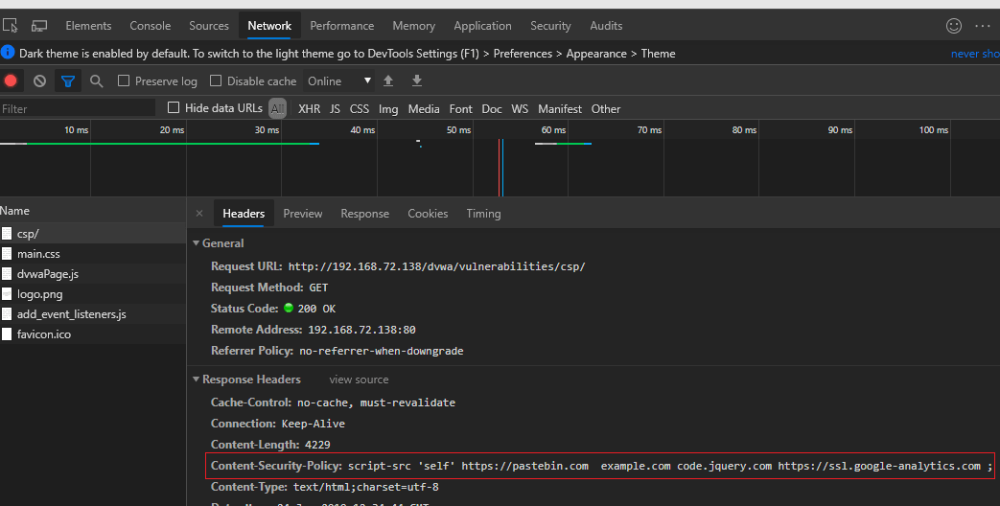
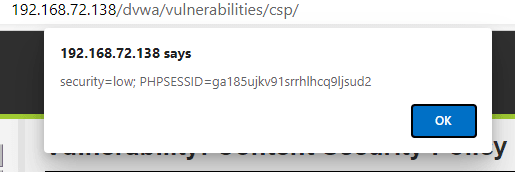
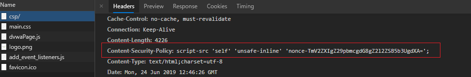
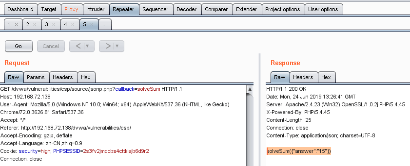
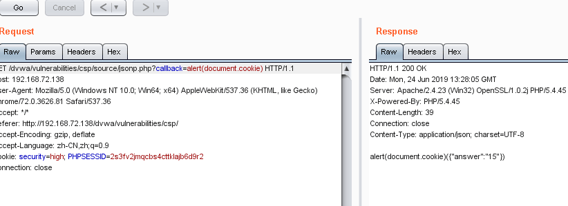
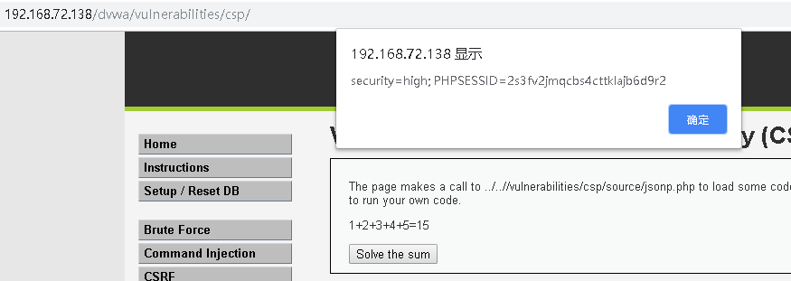

# CSP Bypass

## Sources

- GitHub WalkThrough: https://github.com/ffffffff0x/1earn/blob/master/1earn/Security/RedTeam/Web%E5%AE%89%E5%85%A8/%E9%9D%B6%E5%9C%BA/DVWA-WalkThrough.md

## DVWA Route

`vulnerabilities/csp/`

## Agent Notes

- Inspect the active Content-Security-Policy and identify allowed script sources.
- Test bypass hypotheses with controlled local payloads and browser console evidence.
- Report exact CSP directives and why the bypass did or did not work.

## Detailed Walkthrough Process

### General process

1. Open `vulnerabilities/csp/` and capture the active `Content-Security-Policy` header or meta tag.
2. List allowed script sources, inline permissions, nonce/hash requirements, and JSONP-capable domains.
3. Test whether normal inline script is blocked.
4. Build a payload only from sources allowed by the policy, such as an allowed JSONP endpoint in the lab guide context.
5. Verify execution in the browser console and report the specific CSP weakness.
6. At impossible/secure levels, show that missing unsafe directives and strict allowlists block execution.

## Suggested Test Process

1. Log in to DVWA with the user-provided account.
2. Set the requested security level through `security.php`.
3. Open the module route and inspect visible forms, hidden fields, cookies, and response text.
4. Generate a small hypothesis-driven test set before using external tools.
5. Execute tests through an agent-generated harness, browser, Burp/ZAP proxy, or module-specific CLI tool.
6. Record request evidence, response indicators, and source-code observations in the report.

## Media From Public Guides

### GitHub WalkThrough

Source image: D:\WorkSpace\综合实践5\1earn\assets\img\Security\RedTeam\Web安全\靶场\dvwa\dvwa66.png

Source image: D:\WorkSpace\综合实践5\1earn\assets\img\Security\RedTeam\Web安全\靶场\dvwa\dvwa67.png

Source image: D:\WorkSpace\综合实践5\1earn\assets\img\Security\RedTeam\Web安全\靶场\dvwa\dvwa68.png

Source image: D:\WorkSpace\综合实践5\1earn\assets\img\Security\RedTeam\Web安全\靶场\dvwa\dvwa69.png

Source image: D:\WorkSpace\综合实践5\1earn\assets\img\Security\RedTeam\Web安全\靶场\dvwa\dvwa70.png

Source image: D:\WorkSpace\综合实践5\1earn\assets\img\Security\RedTeam\Web安全\靶场\dvwa\dvwa71.png

## Source-Specific Files

- [GitHub WalkThrough split notes](./sources/github.md)
