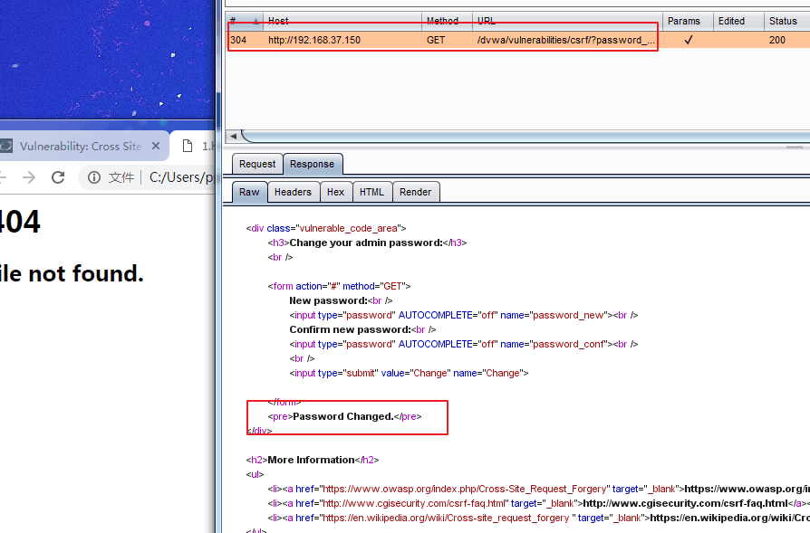
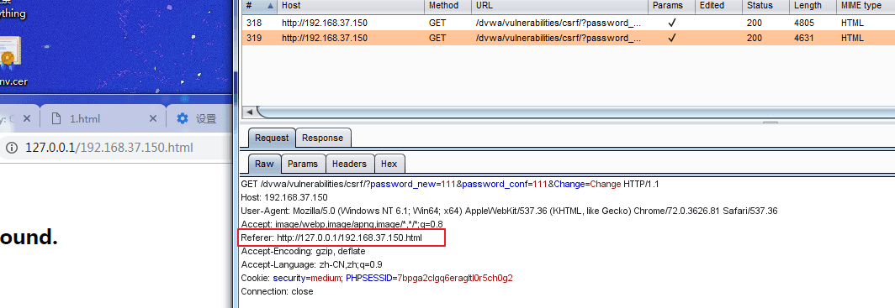
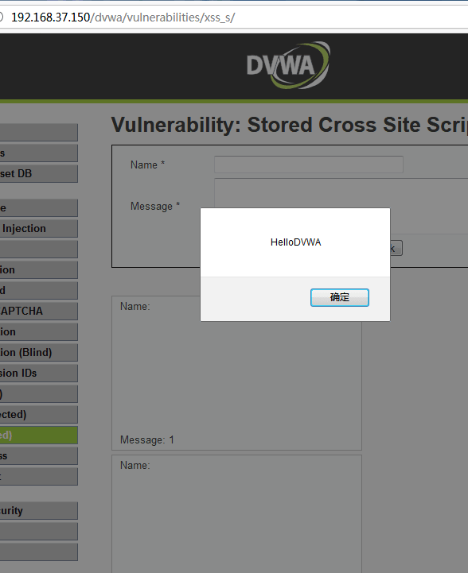

# CSRF

## Sources

- GitHub WalkThrough: https://github.com/ffffffff0x/1earn/blob/master/1earn/Security/RedTeam/Web%E5%AE%89%E5%85%A8/%E9%9D%B6%E5%9C%BA/DVWA-WalkThrough.md
- CNBlogs guide: https://www.cnblogs.com/chadlas/articles/15708801.html

## DVWA Route

`vulnerabilities/csrf/`

## Agent Notes

- Model the password-change request and check whether state change works without an anti-CSRF token.
- Use authenticated sessions and controlled local proof pages for testing.
- Higher levels add referer/token checks; record which header or token is required.

## Detailed Walkthrough Process

### Low

1. Open `vulnerabilities/csrf/` and observe the password-change form.
2. Submit a controlled new password and capture the request parameters.
3. Rebuild the request as a link or simple HTML form from another local page.
4. While authenticated to DVWA in the same browser, trigger that crafted request.
5. Attempt login with the new password to prove state change.
6. Restore the original password and report that the action lacks anti-CSRF protection.

### Medium

1. Identify any referer/origin check in source or response behavior.
2. Replay the request with and without Referer to see whether DVWA enforces a host substring check.
3. If bypassable, use a same-host or referer-shaped local proof page depending on the lab setup.
4. Record the exact header condition required.

### High

1. Inspect the form for `user_token`.
2. Confirm a direct replay without the current token fails.
3. Build the proof around first obtaining or reusing a valid token in the authenticated session.
4. Report whether token extraction is possible from same-origin pages and whether CSRF remains practical.

### Impossible

1. Confirm password change requires the current password and a valid token.
2. Attempt stale/missing token and wrong-current-password cases.
3. Report that the attack path is blocked by server-side validation.

## Suggested Test Process

1. Log in to DVWA with the user-provided account.
2. Set the requested security level through `security.php`.
3. Open the module route and inspect visible forms, hidden fields, cookies, and response text.
4. Generate a small hypothesis-driven test set before using external tools.
5. Execute tests through an agent-generated harness, browser, Burp/ZAP proxy, or module-specific CLI tool.
6. Record request evidence, response indicators, and source-code observations in the report.

## Media From Public Guides

### GitHub WalkThrough

Source image: D:\WorkSpace\综合实践5\1earn\assets\img\Security\RedTeam\Web安全\靶场\dvwa\dvwa13.png

Source image: D:\WorkSpace\综合实践5\1earn\assets\img\Security\RedTeam\Web安全\靶场\dvwa\dvwa14.png

Source image: D:\WorkSpace\综合实践5\1earn\assets\img\Security\RedTeam\Web安全\靶场\dvwa\dvwa82.png

## Source-Specific Files

- [GitHub WalkThrough split notes](./sources/github.md)
- [CNBlogs page notes](./sources/cnblogs.md)
