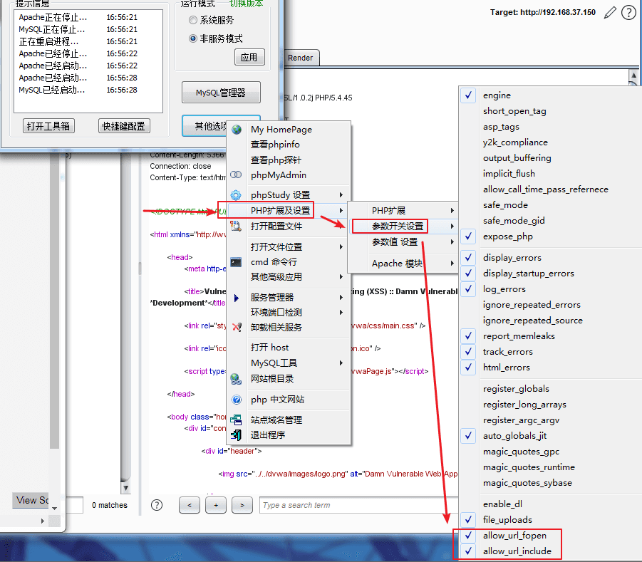
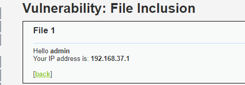
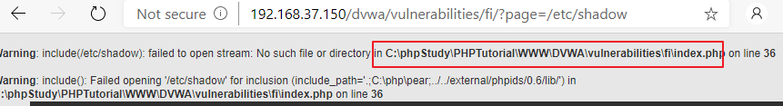
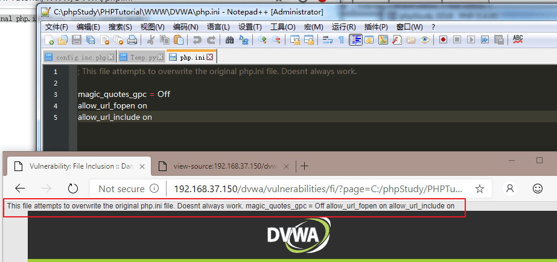
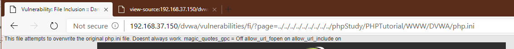
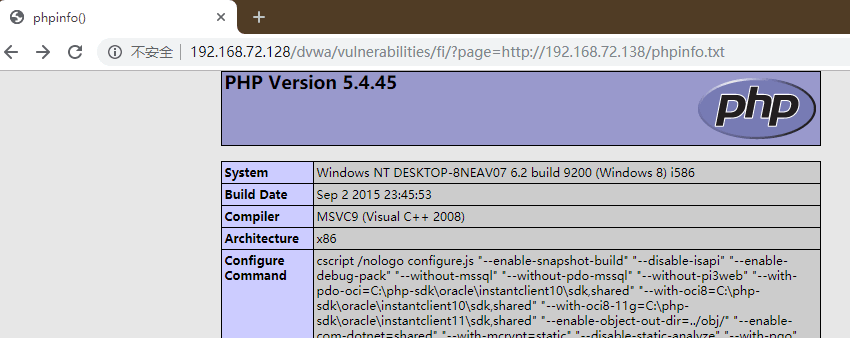
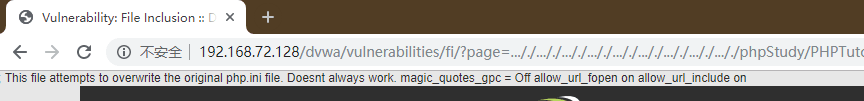
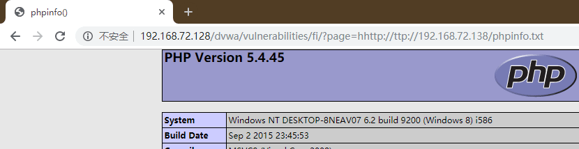
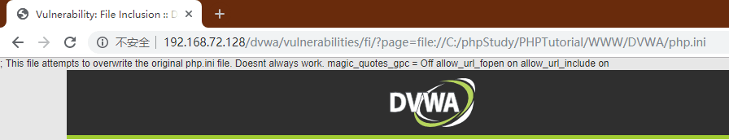

# File Inclusion

## Sources

- GitHub WalkThrough: https://github.com/ffffffff0x/1earn/blob/master/1earn/Security/RedTeam/Web%E5%AE%89%E5%85%A8/%E9%9D%B6%E5%9C%BA/DVWA-WalkThrough.md
- CNBlogs guide: https://www.cnblogs.com/chadlas/articles/15719775.html

## DVWA Route

`vulnerabilities/fi/`

## Agent Notes

- Probe the `page` parameter with safe local files first, then source files inside DVWA.
- Track whether filtering is blacklist, prefix/suffix based, or strict allowlisting.
- Record path traversal, stream wrapper, and null-byte behavior only inside the lab context.

## Detailed Walkthrough Process

### Low

1. Open `vulnerabilities/fi/` and locate the `page` parameter in navigation links.
2. Load a normal included page and record the baseline URL shape.
3. Replace `page` with a safe local file path that proves read capability, such as a DVWA source file.
4. Try relative traversal sequences to reach files outside the include directory.
5. If remote wrappers are enabled in the lab, test them only with controlled local resources.
6. Report the included file, traversal depth, and whether local/remote inclusion worked.

### Medium

1. Inspect filtering for obvious replacement of `http://`, `https://`, or `../`.
2. Test encoded traversal, doubled traversal strings, or alternative wrappers when a naive replace is present.
3. Confirm the bypass by including a harmless DVWA file.
4. Report the filter weakness and exact transformation observed.

### High

1. Expect allowlist-like behavior around filenames or prefixes.
2. Test whether `file://`, path normalization, or suffix tricks can still include unintended files.
3. Use source review to determine whether the filter checks startswith, contains, or a true allowlist.
4. Report what file classes remain reachable.

### Impossible

1. Confirm only known pages are selectable.
2. Attempt traversal and wrapper payloads and record rejection.
3. Report strict allowlisting as the effective control.

## Suggested Test Process

1. Log in to DVWA with the user-provided account.
2. Set the requested security level through `security.php`.
3. Open the module route and inspect visible forms, hidden fields, cookies, and response text.
4. Generate a small hypothesis-driven test set before using external tools.
5. Execute tests through an agent-generated harness, browser, Burp/ZAP proxy, or module-specific CLI tool.
6. Record request evidence, response indicators, and source-code observations in the report.

## Media From Public Guides

### GitHub WalkThrough

Source image: D:\WorkSpace\综合实践5\1earn\assets\img\Security\RedTeam\Web安全\靶场\dvwa\dvwa15.png

Source image: D:\WorkSpace\综合实践5\1earn\assets\img\Security\RedTeam\Web安全\靶场\dvwa\dvwa16.png

Source image: D:\WorkSpace\综合实践5\1earn\assets\img\Security\RedTeam\Web安全\靶场\dvwa\dvwa17.png

Source image: D:\WorkSpace\综合实践5\1earn\assets\img\Security\RedTeam\Web安全\靶场\dvwa\dvwa18.png

Source image: D:\WorkSpace\综合实践5\1earn\assets\img\Security\RedTeam\Web安全\靶场\dvwa\dvwa19.png

Source image: D:\WorkSpace\综合实践5\1earn\assets\img\Security\RedTeam\Web安全\靶场\dvwa\dvwa20.png

Source image: D:\WorkSpace\综合实践5\1earn\assets\img\Security\RedTeam\Web安全\靶场\dvwa\dvwa21.png

Source image: D:\WorkSpace\综合实践5\1earn\assets\img\Security\RedTeam\Web安全\靶场\dvwa\dvwa22.png

Source image: D:\WorkSpace\综合实践5\1earn\assets\img\Security\RedTeam\Web安全\靶场\dvwa\dvwa23.png

## Source-Specific Files

- [GitHub WalkThrough split notes](./sources/github.md)
- [CNBlogs page notes](./sources/cnblogs.md)
