# File Upload

## Sources

- GitHub WalkThrough: https://github.com/ffffffff0x/1earn/blob/master/1earn/Security/RedTeam/Web%E5%AE%89%E5%85%A8/%E9%9D%B6%E5%9C%BA/DVWA-WalkThrough.md
- CNBlogs guide: https://www.cnblogs.com/chadlas/articles/15720878.html

## DVWA Route

`vulnerabilities/upload/`

## Agent Notes

- Test content type, extension, server-side path, and execution behavior separately.
- Use benign proof files first; PHP execution checks should be minimal and lab-local.
- Higher levels may validate extension, MIME type, image dimensions, or re-encode files.

## Detailed Walkthrough Process

### Low

1. Open `vulnerabilities/upload/` and upload a benign text/image file to learn the destination path.
2. Check whether the server exposes the uploaded file under `hackable/uploads/`.
3. Upload a minimal PHP proof file in the lab and request it directly.
4. Confirm execution with a harmless output marker, not destructive commands.
5. Report upload path, execution path, filename handling, and absence of extension/MIME validation.

### Medium

1. Observe browser-side and server-side MIME/extension checks.
2. Test content type tampering through Burp/ZAP while keeping the filename controlled.
3. Try image extensions containing PHP content only to prove validation weakness in the lab.
4. Report whether MIME type, extension, or content was trusted.

### High

1. Expect image validation or extension allowlisting.
2. Try a valid image container with controlled metadata or extension tricks only if the lab source indicates that path.
3. Verify whether uploaded content is reprocessed, renamed, or stored safely.
4. Report which validation layer blocked or allowed execution.

### Impossible

1. Confirm the server validates type, size, extension, and image content and renames/reprocesses files.
2. Upload invalid and valid files to prove enforcement.
3. Report that execution is blocked and why.

## Suggested Test Process

1. Log in to DVWA with the user-provided account.
2. Set the requested security level through `security.php`.
3. Open the module route and inspect visible forms, hidden fields, cookies, and response text.
4. Generate a small hypothesis-driven test set before using external tools.
5. Execute tests through an agent-generated harness, browser, Burp/ZAP proxy, or module-specific CLI tool.
6. Record request evidence, response indicators, and source-code observations in the report.

## Media From Public Guides

### GitHub WalkThrough

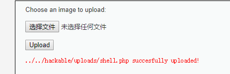

Source image: D:\WorkSpace\综合实践5\1earn\assets\img\Security\RedTeam\Web安全\靶场\dvwa\dvwa24.png

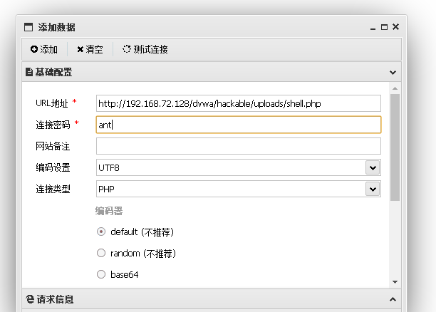

Source image: D:\WorkSpace\综合实践5\1earn\assets\img\Security\RedTeam\Web安全\靶场\dvwa\dvwa25.png

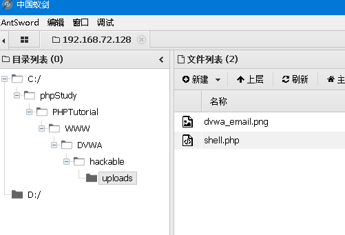

Source image: D:\WorkSpace\综合实践5\1earn\assets\img\Security\RedTeam\Web安全\靶场\dvwa\dvwa26.png

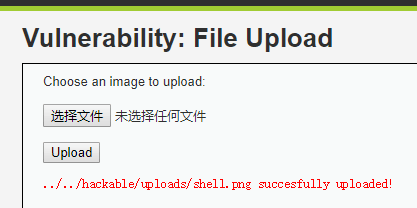

Source image: D:\WorkSpace\综合实践5\1earn\assets\img\Security\RedTeam\Web安全\靶场\dvwa\dvwa27.png

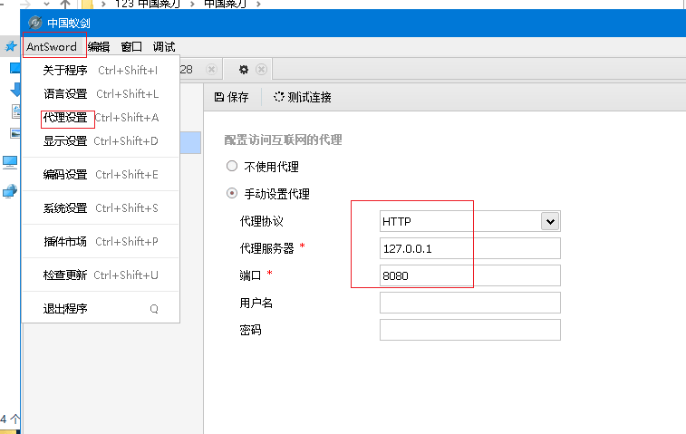

Source image: D:\WorkSpace\综合实践5\1earn\assets\img\Security\RedTeam\Web安全\靶场\dvwa\dvwa28.png

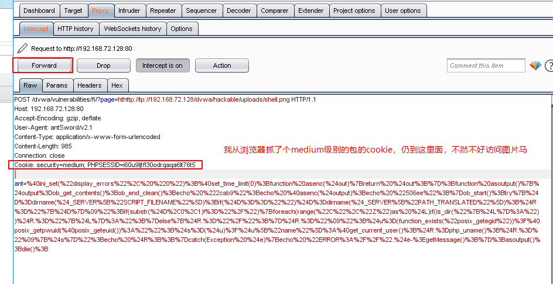

Source image: D:\WorkSpace\综合实践5\1earn\assets\img\Security\RedTeam\Web安全\靶场\dvwa\dvwa29.png

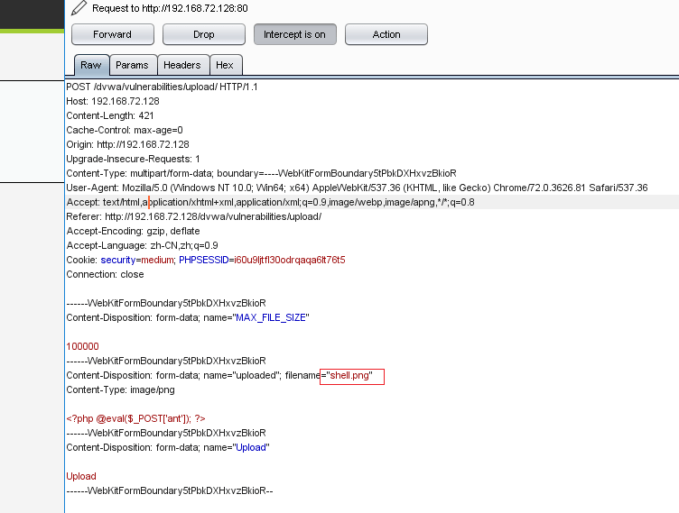

Source image: D:\WorkSpace\综合实践5\1earn\assets\img\Security\RedTeam\Web安全\靶场\dvwa\dvwa30.png

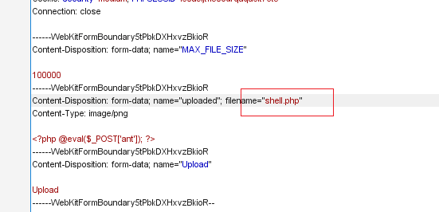

Source image: D:\WorkSpace\综合实践5\1earn\assets\img\Security\RedTeam\Web安全\靶场\dvwa\dvwa31.png

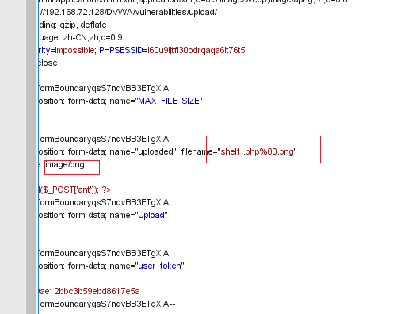

Source image: D:\WorkSpace\综合实践5\1earn\assets\img\Security\RedTeam\Web安全\靶场\dvwa\dvwa32.png

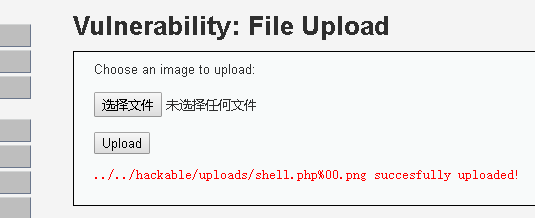

Source image: D:\WorkSpace\综合实践5\1earn\assets\img\Security\RedTeam\Web安全\靶场\dvwa\dvwa33.png

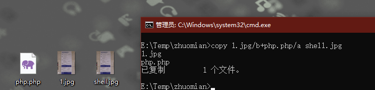

Source image: D:\WorkSpace\综合实践5\1earn\assets\img\Security\RedTeam\Web安全\靶场\dvwa\dvwa34.png

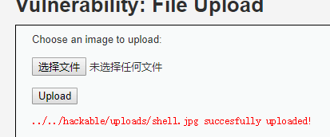

Source image: D:\WorkSpace\综合实践5\1earn\assets\img\Security\RedTeam\Web安全\靶场\dvwa\dvwa35.png

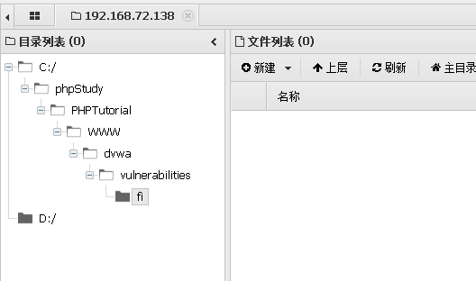

Source image: D:\WorkSpace\综合实践5\1earn\assets\img\Security\RedTeam\Web安全\靶场\dvwa\dvwa36.png

## Source-Specific Files

- [GitHub WalkThrough split notes](./sources/github.md)
- [CNBlogs page notes](./sources/cnblogs.md)
