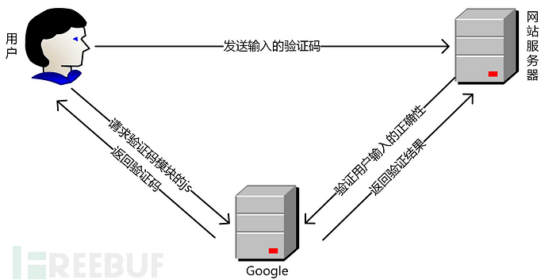
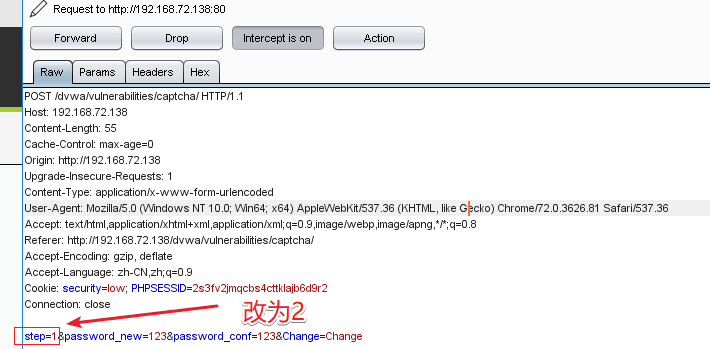
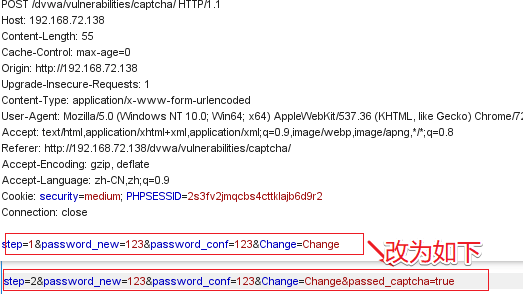
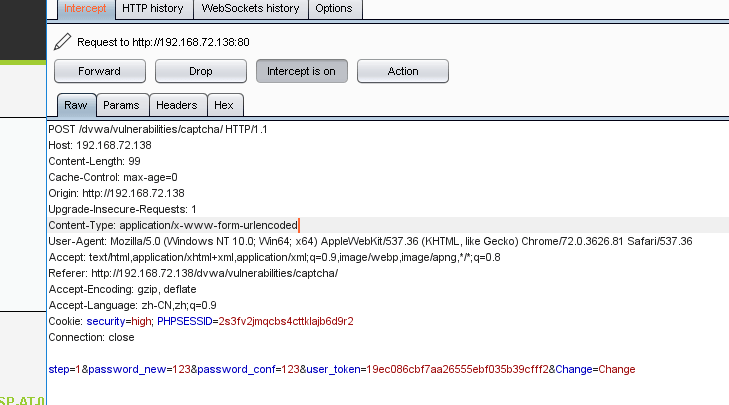
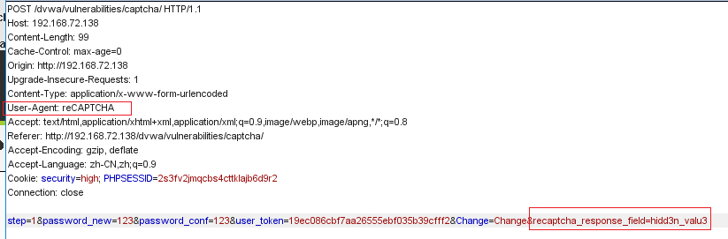

# Insecure CAPTCHA

## Sources

- GitHub WalkThrough: https://github.com/ffffffff0x/1earn/blob/master/1earn/Security/RedTeam/Web%E5%AE%89%E5%85%A8/%E9%9D%B6%E5%9C%BA/DVWA-WalkThrough.md
- CNBlogs guide: https://www.cnblogs.com/chadlas/articles/15722429.html

## DVWA Route

`vulnerabilities/captcha/`

## Agent Notes

- Observe multi-step state changes and whether captcha validation is tied to the final action.
- Replay or tamper with hidden fields only inside an authenticated DVWA session.
- Higher levels should bind validation server-side and reject stale or missing captcha proof.

## Detailed Walkthrough Process

### Low

1. Open `vulnerabilities/captcha/` and map the password-change workflow.
2. Submit the first step and observe hidden fields or step markers in the second request.
3. Replay or forge the final password-change request without solving captcha when the server trusts client-side state.
4. Log out/in or attempt the changed password to prove success.
5. Restore credentials and report that captcha is not bound to the final server-side action.

### Medium

1. Inspect which hidden field or step value indicates captcha validation.
2. Modify that value through Burp/ZAP and submit the final request.
3. Verify whether the server trusts the client-supplied validation result.
4. Report the trusted-client-state flaw.

### High

1. Identify any bypass/debug parameter or alternate branch in source.
2. Test whether special parameter values skip captcha validation.
3. Keep the proof limited to password change in the lab account.
4. Report the hidden bypass condition.

### Impossible

1. Confirm captcha validation is checked server-side at the final action.
2. Attempt missing, stale, or forged validation state.
3. Report that the state is bound correctly.

## Suggested Test Process

1. Log in to DVWA with the user-provided account.
2. Set the requested security level through `security.php`.
3. Open the module route and inspect visible forms, hidden fields, cookies, and response text.
4. Generate a small hypothesis-driven test set before using external tools.
5. Execute tests through an agent-generated harness, browser, Burp/ZAP proxy, or module-specific CLI tool.
6. Record request evidence, response indicators, and source-code observations in the report.

## Media From Public Guides

### GitHub WalkThrough

Source image: D:\WorkSpace\综合实践5\1earn\assets\img\Security\RedTeam\Web安全\靶场\dvwa\dvwa37.png

Source image: D:\WorkSpace\综合实践5\1earn\assets\img\Security\RedTeam\Web安全\靶场\dvwa\dvwa38.png

Source image: D:\WorkSpace\综合实践5\1earn\assets\img\Security\RedTeam\Web安全\靶场\dvwa\dvwa39.png

Source image: D:\WorkSpace\综合实践5\1earn\assets\img\Security\RedTeam\Web安全\靶场\dvwa\dvwa40.png

Source image: D:\WorkSpace\综合实践5\1earn\assets\img\Security\RedTeam\Web安全\靶场\dvwa\dvwa41.png

## Source-Specific Files

- [GitHub WalkThrough split notes](./sources/github.md)
- [CNBlogs page notes](./sources/cnblogs.md)
