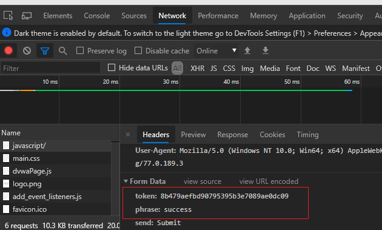
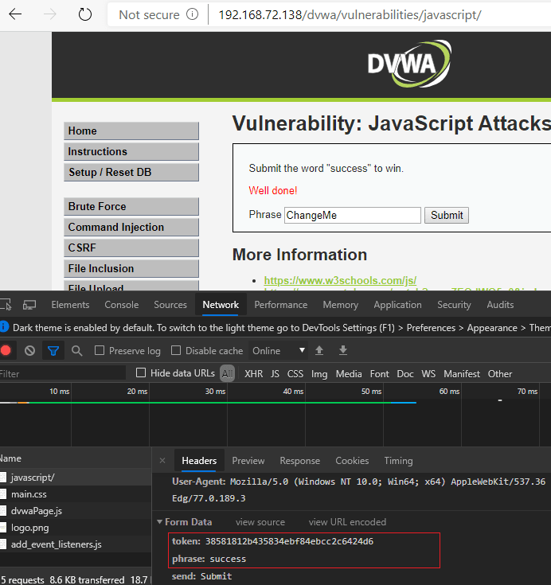

# JavaScript Attacks

## Sources

- GitHub WalkThrough: https://github.com/ffffffff0x/1earn/blob/master/1earn/Security/RedTeam/Web%E5%AE%89%E5%85%A8/%E9%9D%B6%E5%9C%BA/DVWA-WalkThrough.md

## DVWA Route

`vulnerabilities/javascript/`

## Agent Notes

- Read the page JavaScript before sending requests; identify client-side transformations.
- Reproduce transformed parameters in Python or browser devtools rather than hard-coding.
- Use source review and request evidence to explain the bypass.

## Detailed Walkthrough Process

### General process

1. Open `vulnerabilities/javascript/` and inspect the page JavaScript before submitting anything.
2. Identify client-side transformations, token construction, hashing, or parameter rewriting.
3. Reproduce the transformation manually in browser devtools or Python.
4. Submit the correctly transformed value and verify the server-side response.
5. For higher levels, read minified/obfuscated code, pretty-print it, and isolate the validation function.
6. Report the transformation path and why client-side-only protection is insufficient.

## Suggested Test Process

1. Log in to DVWA with the user-provided account.
2. Set the requested security level through `security.php`.
3. Open the module route and inspect visible forms, hidden fields, cookies, and response text.
4. Generate a small hypothesis-driven test set before using external tools.
5. Execute tests through an agent-generated harness, browser, Burp/ZAP proxy, or module-specific CLI tool.
6. Record request evidence, response indicators, and source-code observations in the report.

## Media From Public Guides

### GitHub WalkThrough

Source image: D:\WorkSpace\综合实践5\1earn\assets\img\Security\RedTeam\Web安全\靶场\dvwa\dvwa73.png

Source image: D:\WorkSpace\综合实践5\1earn\assets\img\Security\RedTeam\Web安全\靶场\dvwa\dvwa74.png

## Source-Specific Files

- [GitHub WalkThrough split notes](./sources/github.md)
