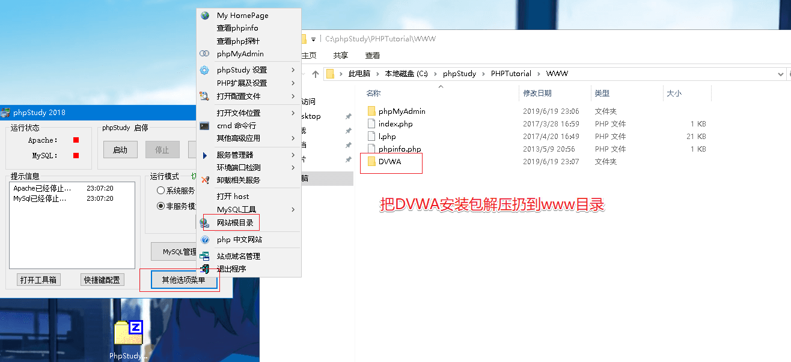
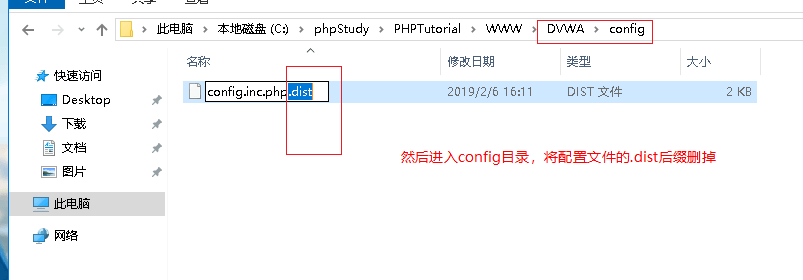
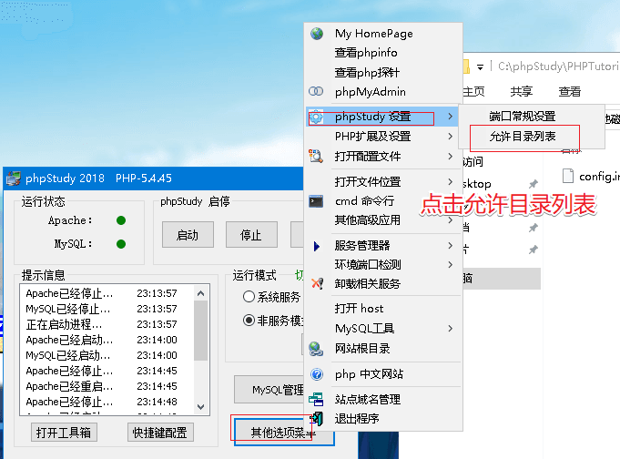
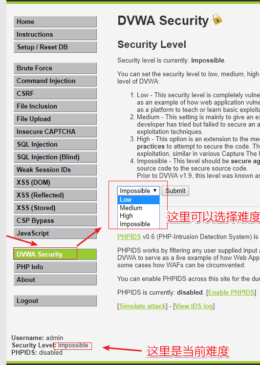

# DVWA Setup And Usage

## Sources

- GitHub WalkThrough: https://github.com/ffffffff0x/1earn/blob/master/1earn/Security/RedTeam/Web%E5%AE%89%E5%85%A8/%E9%9D%B6%E5%9C%BA/DVWA-WalkThrough.md
- CNBlogs guide: https://www.cnblogs.com/chadlas/p/15707475.html

## DVWA Route

`setup.php / login.php / security.php`

## Agent Notes

- Prefer phpStudy/XAMPP-style Windows labs; confirm DVWA login is reachable before module testing.
- Default lab credentials are commonly admin/password, but always use the user-provided values.
- Set security level through DVWA UI or `security.php` before each module run.

## Detailed Walkthrough Process

### Lab preparation

1. Start the local Windows web stack that hosts DVWA, for example phpStudy, XAMPP, WAMP, Docker Desktop, or a local VM.
2. Open the DVWA base URL in a browser and confirm `login.php` loads.
3. If DVWA has not been initialized, open `setup.php` and create/reset the database.
4. Log in with the user-provided account. Common public-lab defaults are `admin` / `password`, but never assume them when the user supplies different credentials.
5. Open `security.php`, set the requested difficulty, submit, and verify the selected level is reflected in the page/session.
6. For automated testing, keep the same base URL, cookies, `PHPSESSID`, and `security` cookie in one session.

### Source-code orientation

1. Locate the DVWA root, commonly under `D:\xampp\htdocs\DVWA`, `D:\phpstudy_pro\WWW\DVWA`, or a cloned `DVWA` repository.
2. Each module normally has a route under `vulnerabilities/<module>/` and source variants under `vulnerabilities/<module>/source/<level>.php`.
3. Read the matching source level before building payloads. Use it to understand validation and tokens, but still verify behavior through HTTP requests.

### Reporting baseline

Record target URL, login account name, selected difficulty, module route, source path, date, tool commands, proxy settings, and screenshots/images used as supporting evidence.

## Suggested Test Process

1. Log in to DVWA with the user-provided account.
2. Set the requested security level through `security.php`.
3. Open the module route and inspect visible forms, hidden fields, cookies, and response text.
4. Generate a small hypothesis-driven test set before using external tools.
5. Execute tests through an agent-generated harness, browser, Burp/ZAP proxy, or module-specific CLI tool.
6. Record request evidence, response indicators, and source-code observations in the report.

## Media From Public Guides

### GitHub WalkThrough

Source image: D:\WorkSpace\综合实践5\1earn\assets\img\Security\RedTeam\Web安全\靶场\dvwa\dvwa1.png

Source image: D:\WorkSpace\综合实践5\1earn\assets\img\Security\RedTeam\Web安全\靶场\dvwa\dvwa2.png

Source image: D:\WorkSpace\综合实践5\1earn\assets\img\Security\RedTeam\Web安全\靶场\dvwa\dvwa3.png

Source image: D:\WorkSpace\综合实践5\1earn\assets\img\Security\RedTeam\Web安全\靶场\dvwa\dvwa4.png

## Source-Specific Files

- [GitHub WalkThrough split notes](./sources/github.md)
- [CNBlogs page notes](./sources/cnblogs.md)
