# SQL Injection

## Sources

- GitHub WalkThrough: https://github.com/ffffffff0x/1earn/blob/master/1earn/Security/RedTeam/Web%E5%AE%89%E5%85%A8/%E9%9D%B6%E5%9C%BA/DVWA-WalkThrough.md
- CNBlogs guide: https://www.cnblogs.com/chadlas/articles/15724905.html

## DVWA Route

`vulnerabilities/sqli/`

## Agent Notes

- Map parameter behavior with boolean, union, and error-based probes before escalating tools.
- Use sqlmap only from an exported authenticated request and keep scope to the DVWA route.
- Classify whether defenses are escaping, prepared statements, token checks, or allowlisting.

## Detailed Walkthrough Process

### Low

1. Open `vulnerabilities/sqli/` and submit a normal ID value to learn baseline output.
2. Submit a single quote or quote-breaking probe and record error behavior.
3. Test boolean conditions, for example true/false variants, to prove query control.
4. Determine column count with ordered probes or union-null increments.
5. Use a union select to display controlled values in visible columns.
6. Enumerate DB version, database name, tables, columns, and target rows only inside DVWA.
7. Report every inference step, not only the final extracted data.

### Medium

1. Note that input may come from a select/dropdown and be submitted by POST.
2. Use Burp/ZAP to modify the parameter beyond visible UI values.
3. Check whether numeric context removes quote requirements.
4. Repeat boolean and union mapping with the correct syntax for numeric parameters.
5. Report UI constraints versus server-side validation.

### High

1. Observe whether the injection point is moved into a separate form/window or uses session variables.
2. Capture the exact request flow before testing payloads.
3. Apply the same mapping sequence: baseline, error/boolean, column count, union display, extraction.
4. Report flow requirements and any token/session considerations.

### Impossible

1. Confirm prepared statements or parameterized queries in source.
2. Send quote, boolean, union, and timing probes.
3. Report that injection is not exploitable when probes are treated as data.

### Tool process

Export an authenticated request and run sqlmap conservatively only against the DVWA route. Preserve cookies and security level. Include the sqlmap command and key findings in the report, but still explain the manual proof path.

## Suggested Test Process

1. Log in to DVWA with the user-provided account.
2. Set the requested security level through `security.php`.
3. Open the module route and inspect visible forms, hidden fields, cookies, and response text.
4. Generate a small hypothesis-driven test set before using external tools.
5. Execute tests through an agent-generated harness, browser, Burp/ZAP proxy, or module-specific CLI tool.
6. Record request evidence, response indicators, and source-code observations in the report.

## Media From Public Guides

### GitHub WalkThrough

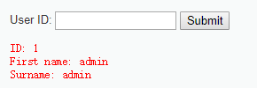

Source image: D:\WorkSpace\综合实践5\1earn\assets\img\Security\RedTeam\Web安全\靶场\dvwa\dvwa42.png

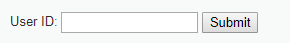

Source image: D:\WorkSpace\综合实践5\1earn\assets\img\Security\RedTeam\Web安全\靶场\dvwa\dvwa43.png

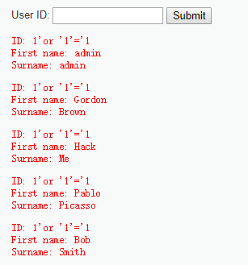

Source image: D:\WorkSpace\综合实践5\1earn\assets\img\Security\RedTeam\Web安全\靶场\dvwa\dvwa44.png

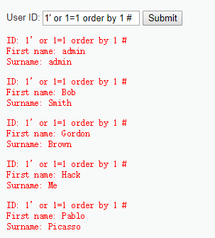

Source image: D:\WorkSpace\综合实践5\1earn\assets\img\Security\RedTeam\Web安全\靶场\dvwa\dvwa45.png

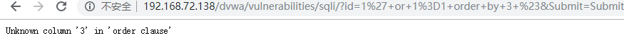

Source image: D:\WorkSpace\综合实践5\1earn\assets\img\Security\RedTeam\Web安全\靶场\dvwa\dvwa46.png

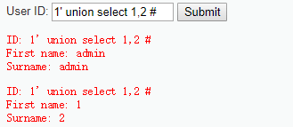

Source image: D:\WorkSpace\综合实践5\1earn\assets\img\Security\RedTeam\Web安全\靶场\dvwa\dvwa47.png

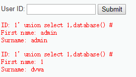

Source image: D:\WorkSpace\综合实践5\1earn\assets\img\Security\RedTeam\Web安全\靶场\dvwa\dvwa48.png

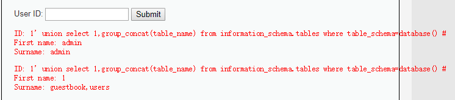

Source image: D:\WorkSpace\综合实践5\1earn\assets\img\Security\RedTeam\Web安全\靶场\dvwa\dvwa49.png

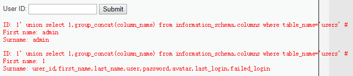

Source image: D:\WorkSpace\综合实践5\1earn\assets\img\Security\RedTeam\Web安全\靶场\dvwa\dvwa50.png

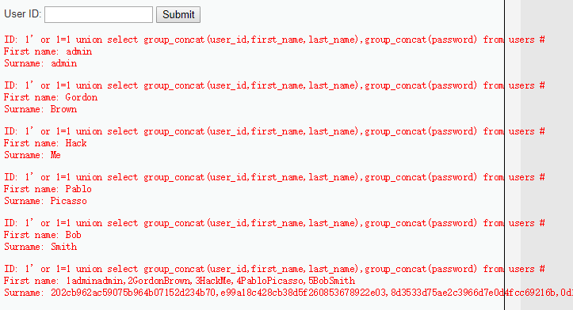

Source image: D:\WorkSpace\综合实践5\1earn\assets\img\Security\RedTeam\Web安全\靶场\dvwa\dvwa51.png

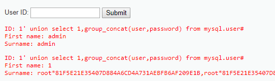

Source image: D:\WorkSpace\综合实践5\1earn\assets\img\Security\RedTeam\Web安全\靶场\dvwa\dvwa76.png

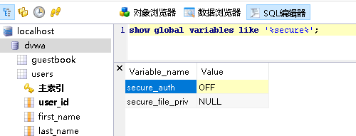

Source image: D:\WorkSpace\综合实践5\1earn\assets\img\Security\RedTeam\Web安全\靶场\dvwa\dvwa77.png

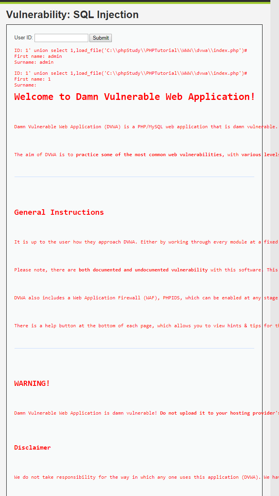

Source image: D:\WorkSpace\综合实践5\1earn\assets\img\Security\RedTeam\Web安全\靶场\dvwa\dvwa78.png

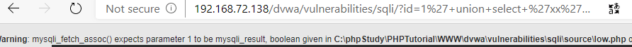

Source image: D:\WorkSpace\综合实践5\1earn\assets\img\Security\RedTeam\Web安全\靶场\dvwa\dvwa79.png

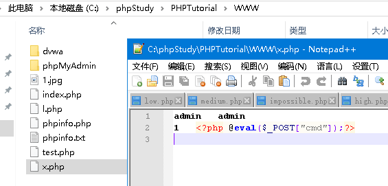

Source image: D:\WorkSpace\综合实践5\1earn\assets\img\Security\RedTeam\Web安全\靶场\dvwa\dvwa80.png

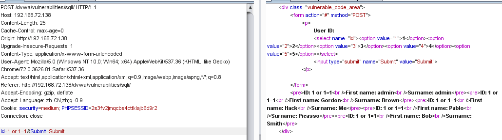

Source image: D:\WorkSpace\综合实践5\1earn\assets\img\Security\RedTeam\Web安全\靶场\dvwa\dvwa52.png

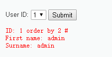

Source image: D:\WorkSpace\综合实践5\1earn\assets\img\Security\RedTeam\Web安全\靶场\dvwa\dvwa53.png

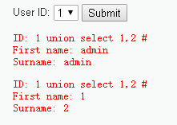

Source image: D:\WorkSpace\综合实践5\1earn\assets\img\Security\RedTeam\Web安全\靶场\dvwa\dvwa54.png

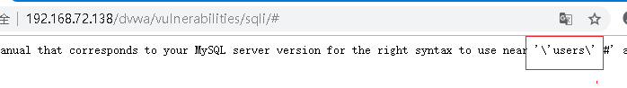

Source image: D:\WorkSpace\综合实践5\1earn\assets\img\Security\RedTeam\Web安全\靶场\dvwa\dvwa55.png

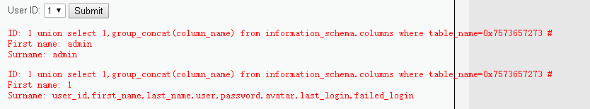

Source image: D:\WorkSpace\综合实践5\1earn\assets\img\Security\RedTeam\Web安全\靶场\dvwa\dvwa56.png

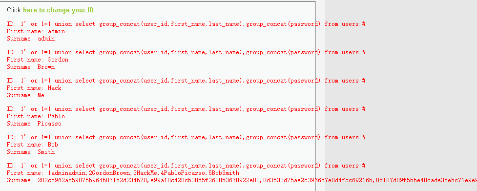

Source image: D:\WorkSpace\综合实践5\1earn\assets\img\Security\RedTeam\Web安全\靶场\dvwa\dvwa57.png

## Source-Specific Files

- [GitHub WalkThrough split notes](./sources/github.md)
- [CNBlogs page notes](./sources/cnblogs.md)
