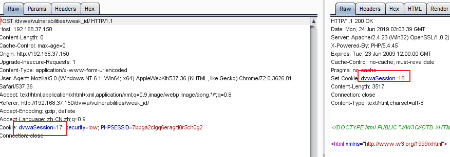
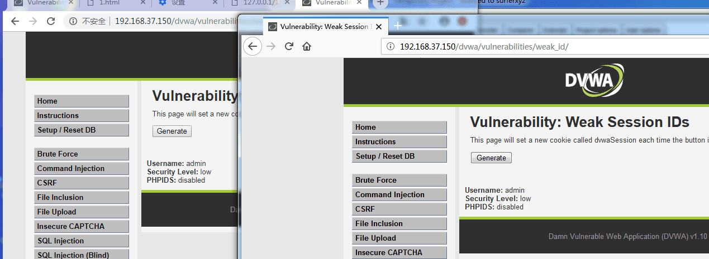
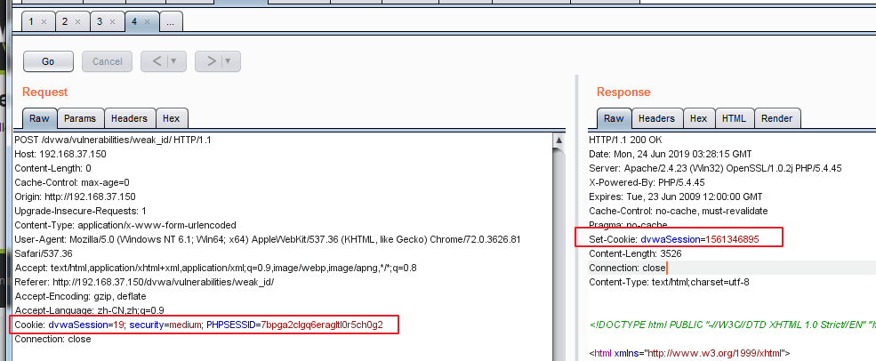
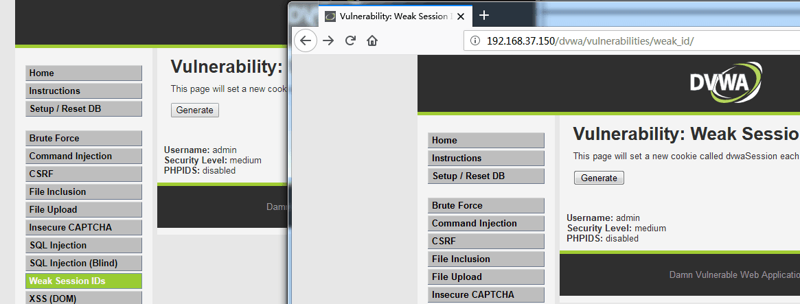
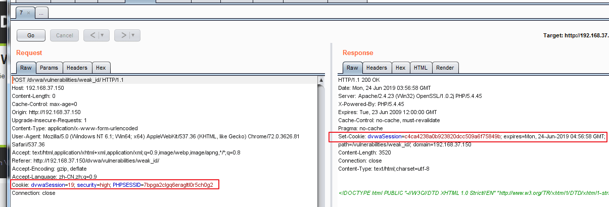
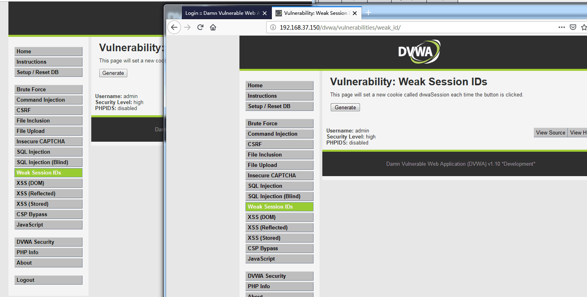

# Weak Session IDs

## Sources

- GitHub WalkThrough: https://github.com/ffffffff0x/1earn/blob/master/1earn/Security/RedTeam/Web%E5%AE%89%E5%85%A8/%E9%9D%B6%E5%9C%BA/DVWA-WalkThrough.md
- CNBlogs guide: https://www.cnblogs.com/chadlas/articles/15740487.html

## DVWA Route

`vulnerabilities/weak_id/`

## Agent Notes

- Collect multiple generated session IDs and analyze predictability, monotonicity, and entropy.
- Use tables or plots in reports for observed sequence behavior.
- Do not reuse discovered sessions outside the local DVWA lab.

## Detailed Walkthrough Process

### Low

1. Open `vulnerabilities/weak_id/`.
2. Click the generate button repeatedly and record each `dvwaSession` value.
3. Look for a simple incrementing sequence.
4. Predict the next value and verify after the next generation.
5. Report predictability and sample sequence.

### Medium

1. Generate multiple IDs and inspect whether values resemble timestamps.
2. Compare values with current Unix time or encoded time formats.
3. Predict a narrow next range and verify.
4. Report time dependency and entropy weakness.

### High

1. Generate many IDs and check whether hashes hide a predictable counter/source.
2. Test likely transforms such as MD5 of incrementing numbers if source review suggests it.
3. Report predictability only when the transform and source are demonstrated.

### Impossible

1. Collect a larger sample and check for strong randomness.
2. Report no practical prediction if values are generated from secure random bytes.
3. Include sample size and analysis method.

## Suggested Test Process

1. Log in to DVWA with the user-provided account.
2. Set the requested security level through `security.php`.
3. Open the module route and inspect visible forms, hidden fields, cookies, and response text.
4. Generate a small hypothesis-driven test set before using external tools.
5. Execute tests through an agent-generated harness, browser, Burp/ZAP proxy, or module-specific CLI tool.
6. Record request evidence, response indicators, and source-code observations in the report.

## Media From Public Guides

### GitHub WalkThrough

Source image: D:\WorkSpace\综合实践5\1earn\assets\img\Security\RedTeam\Web安全\靶场\dvwa\dvwa58.png

Source image: D:\WorkSpace\综合实践5\1earn\assets\img\Security\RedTeam\Web安全\靶场\dvwa\dvwa59.png

Source image: D:\WorkSpace\综合实践5\1earn\assets\img\Security\RedTeam\Web安全\靶场\dvwa\dvwa60.png

Source image: D:\WorkSpace\综合实践5\1earn\assets\img\Security\RedTeam\Web安全\靶场\dvwa\dvwa61.png

Source image: D:\WorkSpace\综合实践5\1earn\assets\img\Security\RedTeam\Web安全\靶场\dvwa\dvwa62.png

Source image: D:\WorkSpace\综合实践5\1earn\assets\img\Security\RedTeam\Web安全\靶场\dvwa\dvwa63.png

## Source-Specific Files

- [GitHub WalkThrough split notes](./sources/github.md)
- [CNBlogs page notes](./sources/cnblogs.md)
