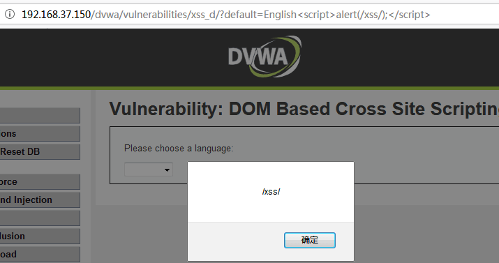
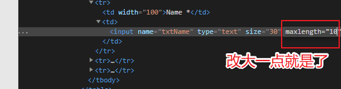

# XSS Reflected

## Sources

- GitHub WalkThrough: https://github.com/ffffffff0x/1earn/blob/master/1earn/Security/RedTeam/Web%E5%AE%89%E5%85%A8/%E9%9D%B6%E5%9C%BA/DVWA-WalkThrough.md
- CNBlogs guide: https://www.cnblogs.com/chadlas/articles/15756337.html

## DVWA Route

`vulnerabilities/xss_r/`

## Agent Notes

- Submit reflected input and inspect whether output encoding is absent, partial, or contextual.
- Vary payload context across HTML text, attributes, script blocks, and URL contexts.
- Use browser evidence plus response snippets in reports.

## Detailed Walkthrough Process

### Low

1. Submit a normal name/value and locate the reflection point in the response.
2. Submit a harmless script proof and confirm browser execution.
3. Capture both request and reflected response snippet.
4. Report missing output encoding.

### Medium

1. Identify filtering of obvious `<script>` strings.
2. Test case changes, broken-up tags, alternate tags, or event handlers according to the reflected context.
3. Confirm execution and report the bypassed blacklist condition.

### High

1. Expect regex or tag filtering.
2. Determine the output context first: HTML body, attribute, JavaScript, or URL.
3. Choose a payload that fits that context and avoids blocked tags.
4. Report context and encoding failure.

### Impossible

1. Confirm input is escaped before reflection.
2. Submit representative payloads and show they render as text.
3. Report the encoding function or defensive behavior.

## Suggested Test Process

1. Log in to DVWA with the user-provided account.
2. Set the requested security level through `security.php`.
3. Open the module route and inspect visible forms, hidden fields, cookies, and response text.
4. Generate a small hypothesis-driven test set before using external tools.
5. Execute tests through an agent-generated harness, browser, Burp/ZAP proxy, or module-specific CLI tool.
6. Record request evidence, response indicators, and source-code observations in the report.

## Media From Public Guides

### GitHub WalkThrough

Source image: D:\WorkSpace\综合实践5\1earn\assets\img\Security\RedTeam\Web安全\靶场\dvwa\dvwa64.png

Source image: D:\WorkSpace\综合实践5\1earn\assets\img\Security\RedTeam\Web安全\靶场\dvwa\dvwa81.png

Source image: D:\WorkSpace\综合实践5\1earn\assets\img\Security\RedTeam\Web安全\靶场\dvwa\dvwa65.png

## Source-Specific Files

- [GitHub WalkThrough split notes](./sources/github.md)
- [CNBlogs page notes](./sources/cnblogs.md)
