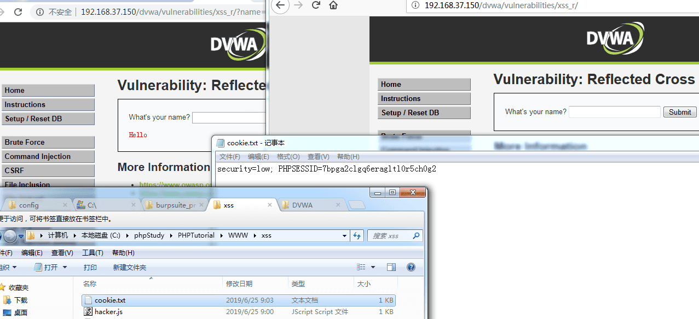

# XSS Stored

## Sources

- GitHub WalkThrough: https://github.com/ffffffff0x/1earn/blob/master/1earn/Security/RedTeam/Web%E5%AE%89%E5%85%A8/%E9%9D%B6%E5%9C%BA/DVWA-WalkThrough.md
- CNBlogs guide: https://www.cnblogs.com/chadlas/articles/15756338.html

## DVWA Route

`vulnerabilities/xss_s/`

## Agent Notes

- Create, reload, and revisit records to prove persistence.
- Use minimal harmless payloads and clean up test entries when possible.
- Track input length, server-side filtering, stored location, and execution context.

## Detailed Walkthrough Process

### Low

1. Open `vulnerabilities/xss_s/` and submit a normal guestbook entry.
2. Locate where name/message are stored and rendered after reload.
3. Submit a harmless script proof in the field that accepts enough length.
4. Reload or revisit the page to prove persistence.
5. Clean up test entries if the lab allows it and report storage location.

### Medium

1. Identify field length limits and filters.
2. Use Burp/ZAP to modify client-side length-limited fields when needed.
3. Test alternate tags/event handlers if `<script>` is filtered.
4. Report which field is vulnerable and whether client-side constraints were bypassed.

### High

1. Inspect stricter filters and output context.
2. Use a context-specific payload, often through an event handler or tag variant if allowed by the lab.
3. Prove persistence across reloads and sessions.
4. Report filter limitations and cleanup status.

### Impossible

1. Confirm stored output is escaped and length/format checks are server-side.
2. Submit representative payloads and show safe rendering.
3. Report effective output encoding.

## Suggested Test Process

1. Log in to DVWA with the user-provided account.
2. Set the requested security level through `security.php`.
3. Open the module route and inspect visible forms, hidden fields, cookies, and response text.
4. Generate a small hypothesis-driven test set before using external tools.
5. Execute tests through an agent-generated harness, browser, Burp/ZAP proxy, or module-specific CLI tool.
6. Record request evidence, response indicators, and source-code observations in the report.

## Media From Public Guides

### GitHub WalkThrough

Source image: D:\WorkSpace\综合实践5\1earn\assets\img\Security\RedTeam\Web安全\靶场\dvwa\dvwa64.png

Source image: D:\WorkSpace\综合实践5\1earn\assets\img\Security\RedTeam\Web安全\靶场\dvwa\dvwa81.png

Source image: D:\WorkSpace\综合实践5\1earn\assets\img\Security\RedTeam\Web安全\靶场\dvwa\dvwa65.png

## Source-Specific Files

- [GitHub WalkThrough split notes](./sources/github.md)
- [CNBlogs page notes](./sources/cnblogs.md)
